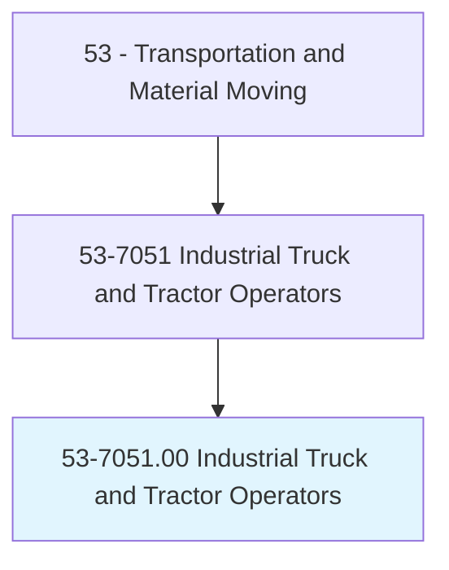
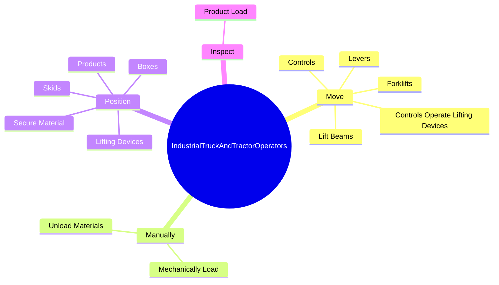
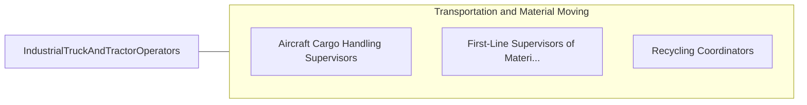

# Industrial Truck and Tractor Operators

> Operate industrial trucks or tractors equipped to move materials around a warehouse, storage yard, factory, construction site, or similar location.

## Overview

Industrial Truck and Tractor Operators is classified under Transportation and Material Moving (SOC 53). Operate industrial trucks or tractors equipped to move materials around a warehouse, storage yard, factory, construction site, or similar location.

## Classification Hierarchy

## Key Statistics

| Metric | Value |
|--------|-------|
| SOC Code | 53-7051.00 |
| Category | [Transportation and Material Moving](/occupations/Transportation/index) |
| Task Count | 81 |
| Source | O*NET |

## Core Tasks

### move.Levers

Industrial Truck and Tractor Operators move levers as part of their core responsibilities.

**Actions:**
- `move.Levers.with.SwivelHooks`
- `move.Levers.with.Hoists`
- `move.Levers.with.ElevatingPlatforms`
- `move.Levers.with.ToLoad`

### manually.MechanicallyLoad

Industrial Truck and Tractor Operators manually mechanically load as part of their core responsibilities.

**Actions:**
- `manually.MechanicallyLoad.from.Pallets`
- `manually.MechanicallyLoad.from.Skids`
- `manually.MechanicallyLoad.from.Platforms`
- `manually.MechanicallyLoad.from.Cars`

### position.LiftingDevices

Industrial Truck and Tractor Operators position lifting devices as part of their core responsibilities.

**Actions:**
- `position.LiftingDevices.under.ForTransport.to.designated.Areas`
- `position.Skids.for.Transport.to.designated.Areas`
- `position.Boxes.for.Transport.to.designated.Areas`
- `position.SecureMaterial.for.Transport.to.designated.Areas`

## Skills & Competencies

### Technical Skills
- **Vehicle Operation** - Advanced
- **Logistics** - Advanced
- **Safety Compliance** - Advanced

### Soft Skills
- **Communication** - Essential
- **Problem Solving** - Essential
- **Critical Thinking** - Important
- **Teamwork** - Important
- **Adaptability** - Important

## Related Occupations

## Industries

This occupation is found across multiple industries. See [Industries](/industries) for sector-specific employment data.

## Career Progression

---

*Source: O*NET 53-7051.00 - ONETOccupation*
