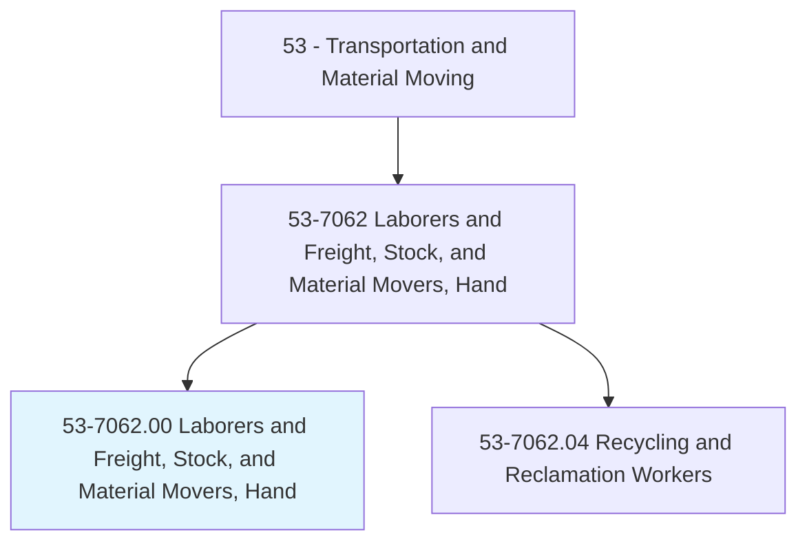
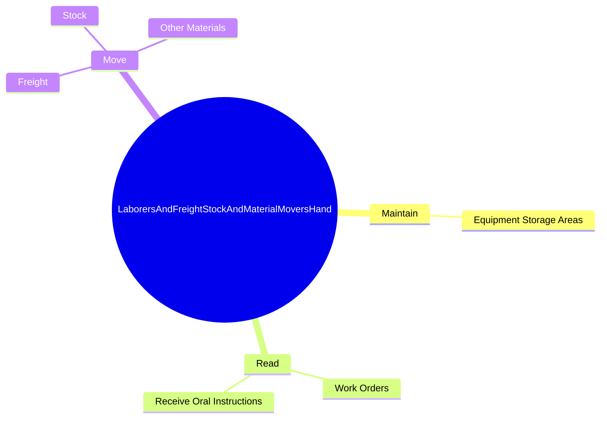
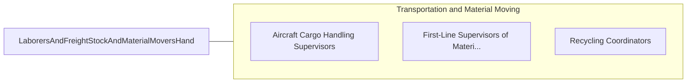

# Laborers and Freight, Stock, and Material Movers, Hand

> Manually move freight, stock, luggage, or other materials, or perform other general labor. Includes all manual laborers not elsewhere classified.

## Overview

Laborers and Freight, Stock, and Material Movers, Hand is an occupation within the Transportation and Material Moving category. Manually move freight, stock, luggage, or other materials, or perform other general labor. 

## Classification Hierarchy

## Key Statistics

| Metric | Value |
|--------|-------|
| SOC Code | 53-7062.00 |
| Category | [Transportation and Material Moving](/occupations/Transportation) |
| Task Count | 74 |
| Source | O*NET |

## Core Tasks

### maintain.EquipmentStorageAreas

Laborers and Freight, Stock, and Material Movers, Hand maintain equipment storage areas as part of their core responsibilities.

**Actions:**
- `maintain.EquipmentStorageAreas.to.ensure.InventoryIsProtected`

### read.WorkOrders

Laborers and Freight, Stock, and Material Movers, Hand read work orders as part of their core responsibilities.

**Actions:**
- `read.WorkOrders.to.determine.WorkAssignmentsEquipmentNeeds`
- `read.WorkOrders.to.MaterialEquipmentNeeds`
- `read.ReceiveOralInstructions.to.determine.WorkAssignmentsEquipmentNeeds`
- `read.ReceiveOralInstructions.to.MaterialEquipmentNeeds`

### move.Freight

Laborers and Freight, Stock, and Material Movers, Hand move freight as part of their core responsibilities.

**Actions:**
- `move.Freight.to.FromStorage`
- `move.Freight.to.production.Areas`
- `move.Freight.to.LoadingDocks`
- `move.Freight.to.DeliveryVehicles`

## Skills & Competencies

### Technical Skills
- **Vehicle Operation** - Advanced
- **Logistics** - Advanced
- **Safety Compliance** - Advanced

### Soft Skills
- **Communication** - Essential
- **Problem Solving** - Essential
- **Critical Thinking** - Important
- **Teamwork** - Important
- **Adaptability** - Important

## Related Occupations

## Industries

This occupation is found across multiple industries. See [Industries](/industries) for sector-specific employment data.

## Career Progression

---

*Source: O*NET 53-7062.00 - ONETOccupation*
