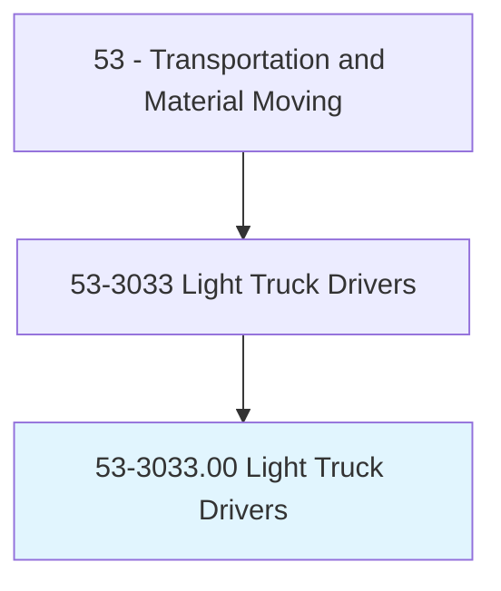
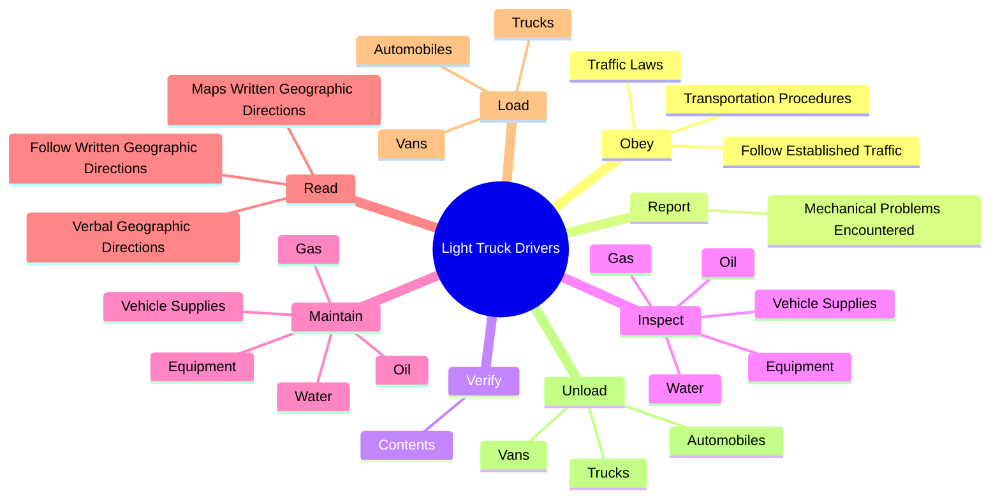
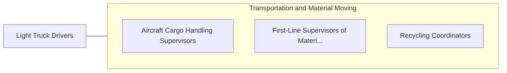

# Light Truck Drivers

> Drive a light vehicle, such as a truck or van, with a capacity of less than 26,001 pounds Gross Vehicle Weight (GVW), primarily to pick up merchandise or packages from a distribution center and deliver. May load and unload vehicle.

## Overview

Light Truck Drivers is an occupation within the Transportation and Material Moving category. Drive a light vehicle, such as a truck or van, with a capacity of less than 26,001 pounds Gross Vehicle Weight (GVW), primarily to pick up merchandise or packages from a distribution center and deliver. 

## Classification Hierarchy

## Key Statistics

| Metric | Value |
|--------|-------|
| SOC Code | 53-3033.00 |
| Category | [Transportation and Material Moving](/occupations/Transportation) |
| Task Count | 74 |
| Source | O*NET |

## Core Tasks

### obey.TrafficLaws

Light Truck Drivers obey traffic laws as part of their core responsibilities.

**Actions:**
- `obey.TrafficLaws`
- `obey.FollowEstablishedTraffic`
- `obey.TransportationProcedures`

### report.MechanicalProblemsEncountered

Light Truck Drivers report mechanical problems encountered as part of their core responsibilities.

**Actions:**
- `report.MechanicalProblemsEncountered.with.Vehicles`

### verify.Contents

Light Truck Drivers verify contents as part of their core responsibilities.

**Actions:**
- `verify.Contents.of.InventoryLoadsAgainstShippingPapers`

## Skills & Competencies

### Technical Skills
- **Vehicle Operation** - Advanced
- **Logistics** - Advanced
- **Safety Compliance** - Advanced

### Soft Skills
- **Communication** - Essential
- **Problem Solving** - Essential
- **Critical Thinking** - Important
- **Teamwork** - Important
- **Adaptability** - Important

## Related Occupations

## Industries

This occupation is found across multiple industries. See [Industries](/industries) for sector-specific employment data.

## Career Progression

---

*Source: O*NET 53-3033.00 - ONETOccupation*
