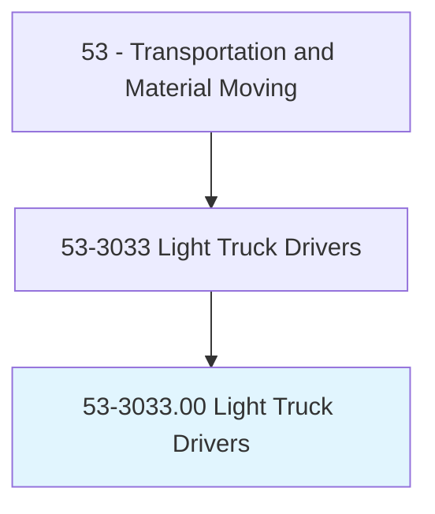
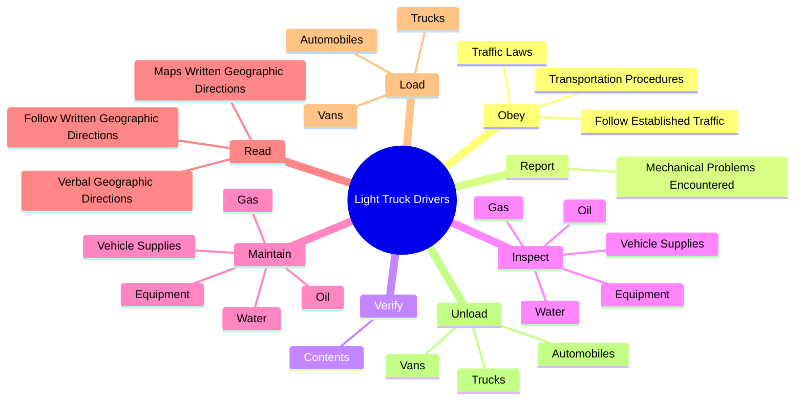
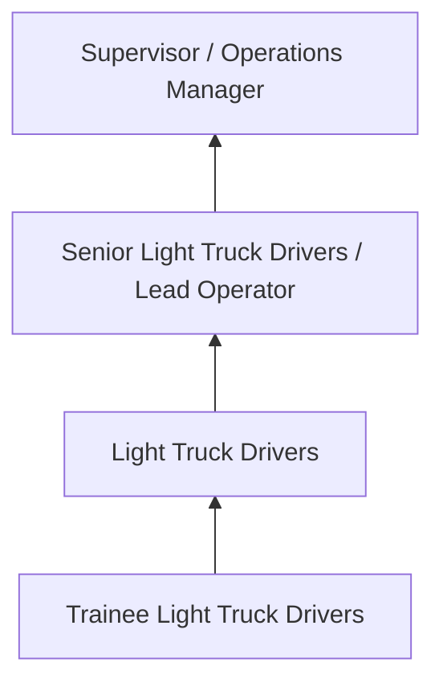
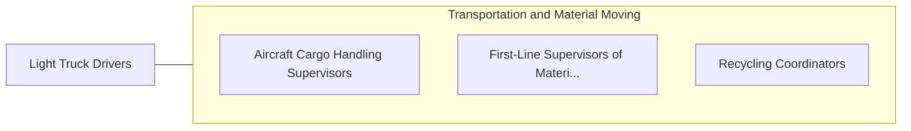

# Light Truck Drivers

> Drive a light vehicle, such as a truck or van, with a capacity of less than 26,001 pounds Gross Vehicle Weight (GVW), primarily to pick up merchandise or packages from a distribution center and deliver. May load and unload vehicle.

## Overview

Light Truck Drivers professionals drive a light vehicle, such as a truck or van, with a capacity of less than 26,001 pounds Gross Vehicle Weight (GVW), primarily to pick up merchandise or packages from a distribution center and deliver. This occupation falls within the Transportation and Material Moving category and requires a combination of specialized knowledge, technical skills, and practical experience.

These professionals work across diverse settings and organizational contexts, applying their expertise to meet the demands of their field. They must stay current with industry standards, emerging practices, and regulatory requirements that affect their work. The role demands both independent judgment and collaborative skills, as practitioners regularly interact with colleagues, stakeholders, and the public.

As the field continues to evolve, Light Truck Drivers professionals increasingly leverage technology and data-driven approaches to enhance their effectiveness. Career opportunities span the public and private sectors, with demand influenced by economic conditions, demographic shifts, and technological advancement.

## Classification Hierarchy



## Key Statistics

| Metric | Value |
|--------|-------|
| SOC Code | 53-3033.00 |
| Job Zone | N/A |
| Category | [Transportation and Material Moving](/occupations/Transportation/index) |
| Core Tasks | 74+ |
| Salary Range | $30,000 - $75,000 |
| Median Salary | $45,000 |
| Growth Outlook | 6% (As fast as average) |
| Source | O*NET |

## Core Tasks



### maintain.VehicleSupplies

Light Truck Drivers maintain vehicle supplies as part of their core responsibilities.

**Actions:**
- `maintain.VehicleSupplies.to.ensure.VehiclesAreInProperWorkingCondition` - Inspect and maintain vehicle supplies and equipment, such as gas, oil, water,...
- `maintain.Equipment.to.ensure.VehiclesAreInProperWorkingCondition` - Inspect and maintain vehicle supplies and equipment, such as gas, oil, water,...
- `maintain.Gas.to.ensure.VehiclesAreInProperWorkingCondition` - Inspect and maintain vehicle supplies and equipment, such as gas, oil, water,...
- `maintain.Oil.to.ensure.VehiclesAreInProperWorkingCondition` - Inspect and maintain vehicle supplies and equipment, such as gas, oil, water,...
- `maintain.Water.to.ensure.VehiclesAreInProperWorkingCondition` - Inspect and maintain vehicle supplies and equipment, such as gas, oil, water,...

### report.MechanicalProblemsEncountered

Light Truck Drivers report mechanical problems encountered as part of their core responsibilities.

**Actions:**
- `report.MechanicalProblemsEncountered.with.Vehicles` - Report any mechanical problems encountered with vehicles.
- `report.Delays.to.BasesVehicles` - Report delays, accidents, or other traffic and transportation situations to b...
- `report.Delays.to.OtherVehicles` - Report delays, accidents, or other traffic and transportation situations to b...
- `report.Delays.to.UsingTelephones` - Report delays, accidents, or other traffic and transportation situations to b...
- `report.Accidents.to.BasesVehicles` - Report delays, accidents, or other traffic and transportation situations to b...

### inspect.VehicleSupplies

Light Truck Drivers inspect vehicle supplies as part of their core responsibilities.

**Actions:**
- `inspect.VehicleSupplies.to.ensure.VehiclesAreInProperWorkingCondition` - Inspect and maintain vehicle supplies and equipment, such as gas, oil, water,...
- `inspect.Equipment.to.ensure.VehiclesAreInProperWorkingCondition` - Inspect and maintain vehicle supplies and equipment, such as gas, oil, water,...
- `inspect.Gas.to.ensure.VehiclesAreInProperWorkingCondition` - Inspect and maintain vehicle supplies and equipment, such as gas, oil, water,...
- `inspect.Oil.to.ensure.VehiclesAreInProperWorkingCondition` - Inspect and maintain vehicle supplies and equipment, such as gas, oil, water,...
- `inspect.Water.to.ensure.VehiclesAreInProperWorkingCondition` - Inspect and maintain vehicle supplies and equipment, such as gas, oil, water,...

### drive.Vehicles

Light Truck Drivers drive vehicles as part of their core responsibilities.

**Actions:**
- `drive.Vehicles.with.CapacitiesUnderThreeTons.to.transport.MaterialsToSpecifiedDestinations` - Drive vehicles with capacities under three tons to transport materials to and...
- `drive.Vehicles.with.FromSpecifiedDestinations` - Drive vehicles with capacities under three tons to transport materials to and...
- `drive.Vehicles.with.RailroadStations` - Drive vehicles with capacities under three tons to transport materials to and...
- `drive.Vehicles.with.Plants` - Drive vehicles with capacities under three tons to transport materials to and...
- `drive.Vehicles.with.Residences` - Drive vehicles with capacities under three tons to transport materials to and...


## Skills & Competencies

### Technical Skills
- **Equipment Operation** - Advanced
- **Safety Procedures** - Advanced
- **Navigation Systems** - Proficient
- **Load Management** - Proficient
- **Vehicle Inspection** - Proficient
- **Regulatory Compliance** - Proficient

### Soft Skills
- **Situational Awareness** - Critical
- **Reliability** - Critical
- **Time Management** - Essential
- **Communication** - Essential
- **Physical Stamina** - Essential

## Education & Certifications

| Requirement | Details |
|-------------|---------|
| Typical Education | High school diploma or equivalent; some positions require post-secondary training |
| Work Experience | 0-2 years on-the-job experience |
| On-the-Job Training | Moderate - safety and equipment operation training |
| Certifications | CDL, hazmat endorsements, or transportation-specific licenses |

## Career Progression



## Industry Variations

### Freight and Logistics
Commercial transportation of goods. Light Truck Drivers professionals focus on efficiency, safety, and timely delivery across supply chains.

### Public Transit
Passenger transportation services. Emphasis on schedules, safety, and customer service in public-facing roles.

### Warehousing and Distribution
Material handling and storage operations. Focus on inventory management and order fulfillment efficiency.

### Specialized Transport
Hazardous materials, oversized loads, or temperature-controlled transport requiring additional certifications and safety protocols.

## Technology & Tools

- **GPS and navigation systems**
- **Fleet management software**
- **Electronic logging devices (ELD)**
- **Warehouse management systems (WMS)**
- **Transportation management systems (TMS)**

## Related Occupations



## Industries

- [Trucking and Freight](/industries/Trucking) - High Employment
- [Warehousing and Storage](/industries/Warehousing) - High Employment
- [Air Transportation](/industries/AirTransportation) - Moderate Employment
- [Rail Transportation](/industries/RailTransportation) - Moderate Employment

## Departments

This occupation typically works in:
- [Operations](/departments/Operations/index)
- [Logistics](/departments/SupplyChain)
- Fleet Management

## GraphDL Semantic Structure

```graphdl
Light Truck Drivers perform:
- obey.TrafficLaws
- obey.FollowEstablishedTraffic
- obey.TransportationProcedures
- report.MechanicalProblemsEncountered.with.Vehicles
- verify.Contents.of.InventoryLoadsAgainstShippingPapers
- inspect.VehicleSupplies.to.ensure.VehiclesAreInProperWorkingCondition
```

---

*Source: O*NET 53-3033.00 - ONETOccupation*
