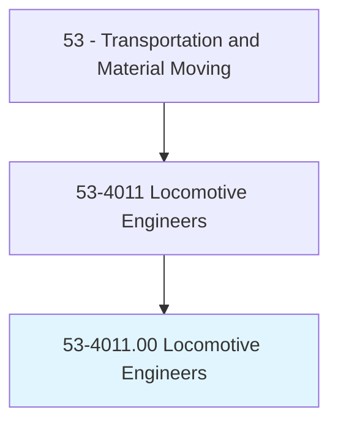
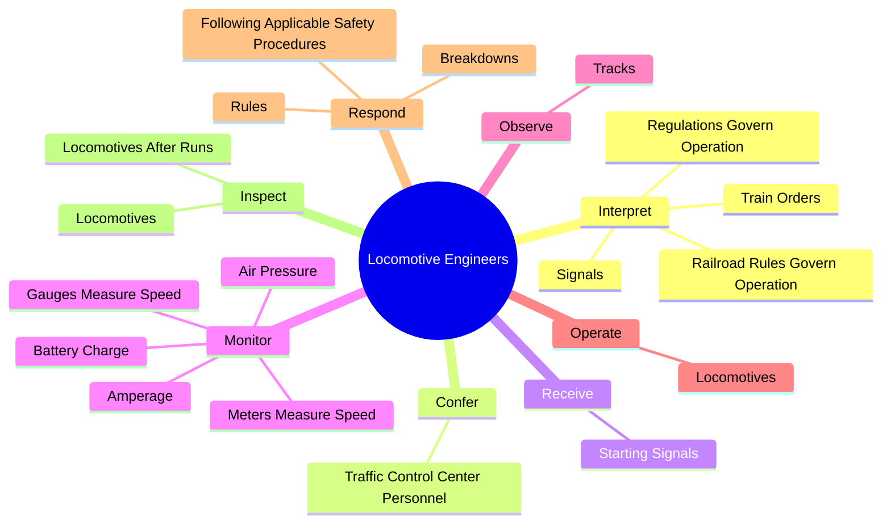
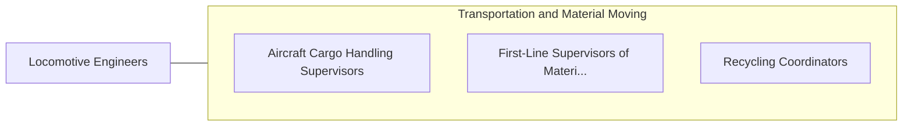

# Locomotive Engineers

> Drive electric, diesel-electric, steam, or gas-turbine-electric locomotives to transport passengers or freight. Interpret train orders, electronic or manual signals, and railroad rules and regulations.

## Overview

Locomotive Engineers is an occupation within the Transportation and Material Moving category. Drive electric, diesel-electric, steam, or gas-turbine-electric locomotives to transport passengers or freight. 

## Classification Hierarchy

## Key Statistics

| Metric | Value |
|--------|-------|
| SOC Code | 53-4011.00 |
| Category | [Transportation and Material Moving](/occupations/Transportation/index) |
| Task Count | 52 |
| Source | O*NET |

## Core Tasks

### interpret.TrainOrders

Locomotive Engineers interpret train orders as part of their core responsibilities.

**Actions:**
- `interpret.TrainOrders.of.Locomotives`
- `interpret.Signals.of.Locomotives`
- `interpret.RailroadRulesGovernOperation.of.Locomotives`
- `interpret.RegulationsGovernOperation.of.Locomotives`

### confer.TrafficControlCenterPersonnel

Locomotive Engineers confer traffic control center personnel as part of their core responsibilities.

**Actions:**
- `confer.TrafficControlCenterPersonnel.via.Radiophones.to.issue.InformationConcerningStops`
- `confer.TrafficControlCenterPersonnel.via.Radiophones.to.receive.InformationConcerningStops`
- `confer.TrafficControlCenterPersonnel.via.Radiophones.to.Delays`
- `confer.TrafficControlCenterPersonnel.via.RadiophonesToOncomingTrains`

### receive.StartingSignals

Locomotive Engineers receive starting signals as part of their core responsibilities.

**Actions:**
- `receive.StartingSignals.from.Conductors`
- `receive.StartingSignals.from.UseControls`
- `receive.StartingSignals.from.Throttles`
- `receive.StartingSignals.from.AirBrakes.to.drive.Electric`

## Skills & Competencies

### Technical Skills
- **Vehicle Operation** - Advanced
- **Logistics** - Advanced
- **Safety Compliance** - Advanced

### Soft Skills
- **Communication** - Essential
- **Problem Solving** - Essential
- **Critical Thinking** - Important
- **Teamwork** - Important
- **Adaptability** - Important

## Related Occupations

## Industries

This occupation is found across multiple industries. See [Industries](/industries) for sector-specific employment data.

## Career Progression

---

*Source: O*NET 53-4011.00 - ONETOccupation*
