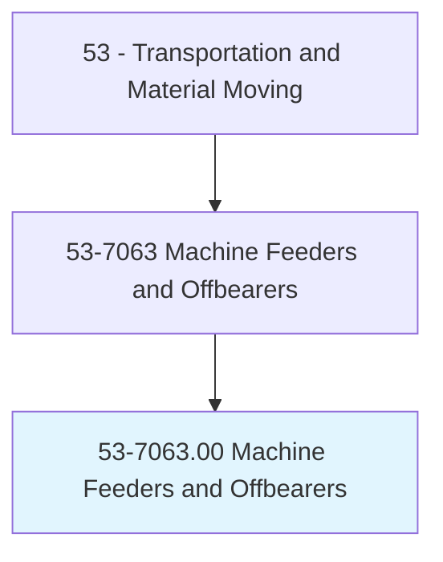
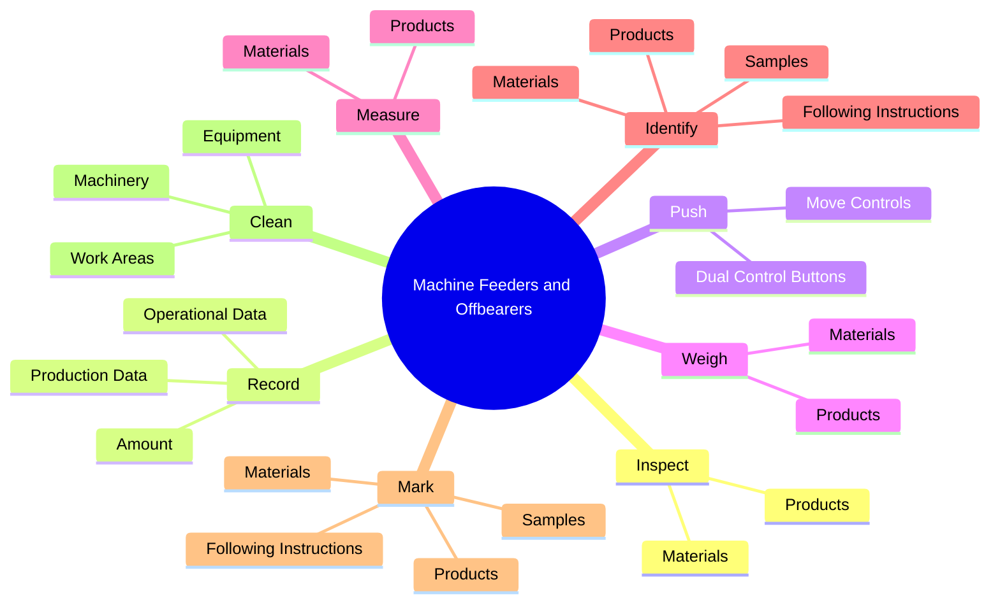
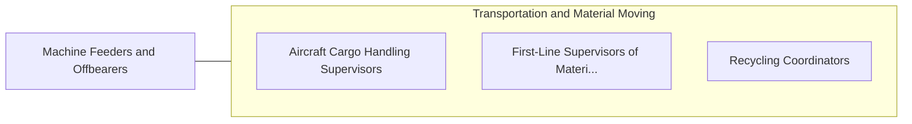

# Machine Feeders and Offbearers

> Feed materials into or remove materials from machines or equipment that is automatic or tended by other workers.

## Overview

Machine Feeders and Offbearers is classified under Transportation and Material Moving (SOC 53). Feed materials into or remove materials from machines or equipment that is automatic or tended by other workers.

## Classification Hierarchy

## Key Statistics

| Metric | Value |
|--------|-------|
| SOC Code | 53-7063.00 |
| Category | [Transportation and Material Moving](/occupations/Transportation) |
| Task Count | 97 |
| Source | O*NET |

## Core Tasks

### inspect.Materials

Machine Feeders and Offbearers inspect materials as part of their core responsibilities.

**Actions:**
- `inspect.Materials.for.Defects`
- `inspect.Materials.for.ensure.ConformanceToSpecifications`
- `inspect.Products.for.Defects`
- `inspect.Products.for.ensure.ConformanceToSpecifications`

### record.ProductionData

Machine Feeders and Offbearers record production data as part of their core responsibilities.

**Actions:**
- `record.ProductionData.of.MaterialsProcessed`
- `record.OperationalData.of.MaterialsProcessed`
- `record.Amount.of.MaterialsProcessed`

### push.DualControlButtons

Machine Feeders and Offbearers push dual control buttons as part of their core responsibilities.

**Actions:**
- `push.DualControlButtons.to.start`
- `push.DualControlButtons.to.stop`
- `push.DualControlButtons.to.adjust.Machinery`
- `push.DualControlButtons.to.Equipment`

## Skills & Competencies

### Technical Skills
- **Vehicle Operation** - Advanced
- **Logistics** - Advanced
- **Safety Compliance** - Advanced

### Soft Skills
- **Communication** - Essential
- **Problem Solving** - Essential
- **Critical Thinking** - Important
- **Teamwork** - Important
- **Adaptability** - Important

## Related Occupations

## Industries

This occupation is found across multiple industries. See [Industries](/industries) for sector-specific employment data.

## Career Progression

---

*Source: O*NET 53-7063.00 - ONETOccupation*
