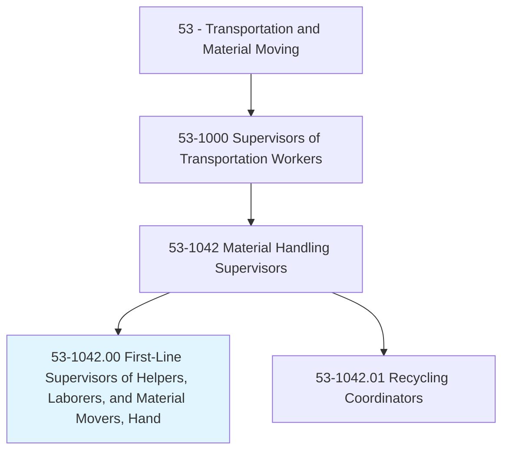
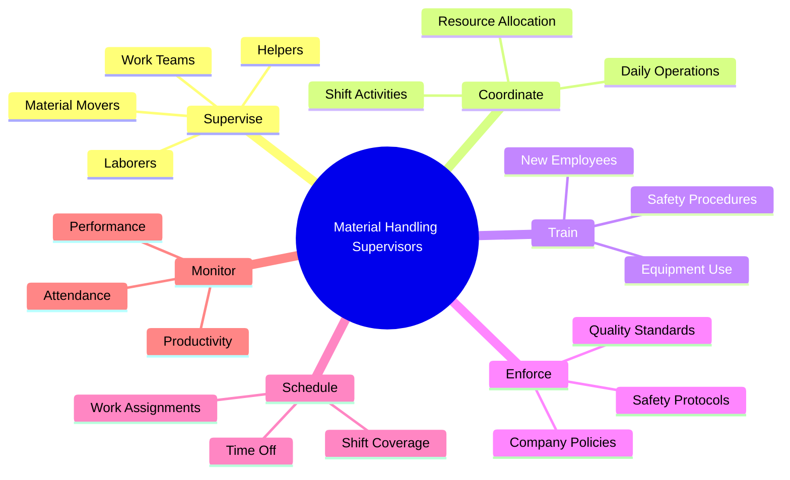
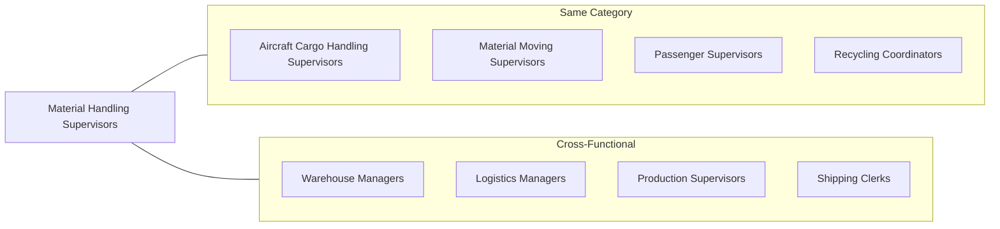
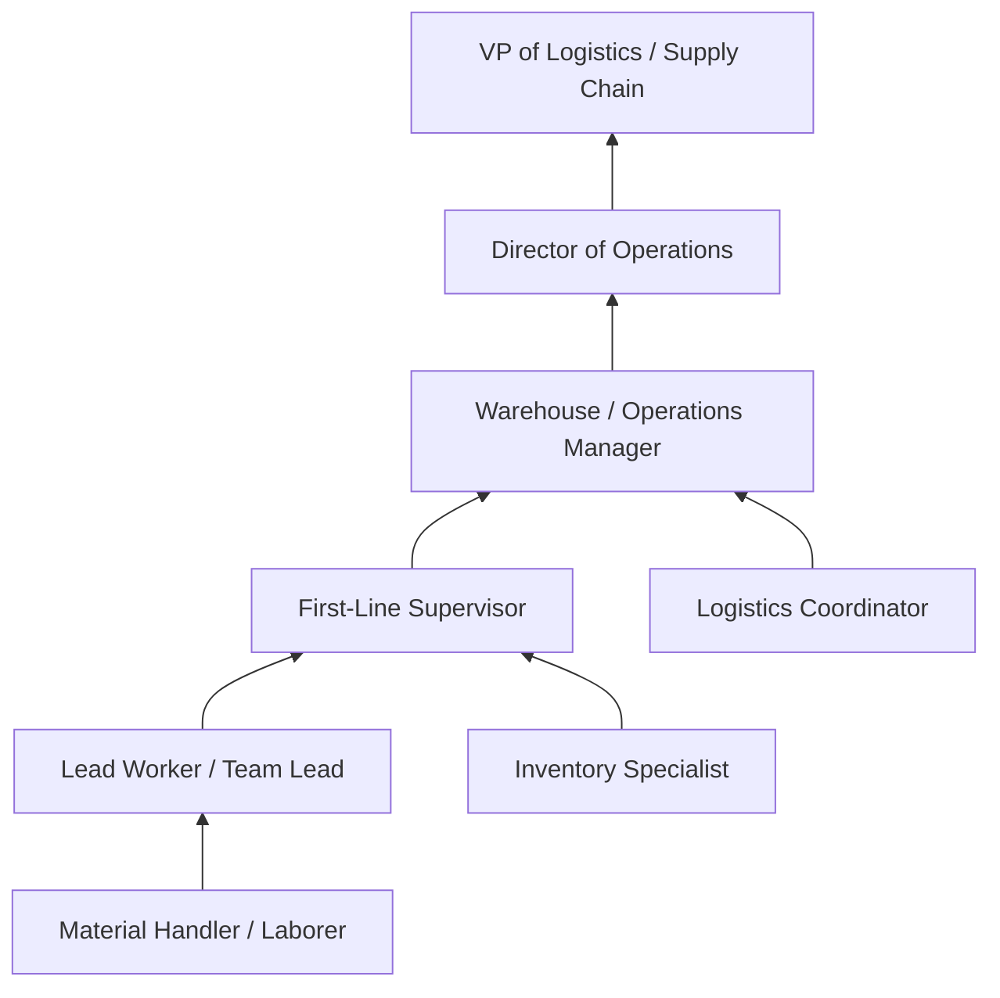

# First-Line Supervisors of Helpers, Laborers, and Material Movers, Hand

> Directly supervise and coordinate the activities of helpers, laborers, or material movers, hand.

## Overview

First-Line Supervisors of Helpers, Laborers, and Material Movers, Hand are responsible for overseeing workers who manually move materials, load and unload cargo, and perform general labor tasks in warehouses, distribution centers, manufacturing facilities, and various other work environments. These supervisors coordinate daily operations, assign tasks, train new employees, enforce safety protocols, and ensure productivity targets are met. They serve as the critical link between management and front-line workers, translating operational goals into actionable daily tasks while maintaining workplace safety and team morale.

## Classification Hierarchy

## Key Statistics

| Metric | Value |
|--------|-------|
| SOC Code | 53-1042.00 |
| Job Zone | 3 (Medium Preparation) |
| Category | [Transportation](/occupations/Transportation/index) |
| Variant Occupations | 1 (Recycling Coordinators) |
| Source | O*NET |

## Core Tasks

### supervise.Workers

Material Handling Supervisors directly oversee the work activities of manual laborers and material handlers.

**Actions:**
- `supervise.Helpers.in.DailyTasks` - Oversee helper activities and task completion
- `supervise.Laborers.in.Operations` - Direct laborer work across facility operations
- `supervise.MaterialMovers.in.Handling` - Coordinate material mover activities for efficiency
- `supervise.WorkTeams.for.Productivity` - Manage team output and performance metrics

### coordinate.Operations

Material Handling Supervisors organize and align daily work activities to meet operational objectives.

**Actions:**
- `coordinate.DailyOperations.for.Efficiency` - Plan and execute daily workflow
- `coordinate.ShiftActivities.across.Teams` - Synchronize activities between shifts
- `coordinate.ResourceAllocation.to.meet.Deadlines` - Assign resources to priority tasks

### train.Employees

Material Handling Supervisors develop worker capabilities through training and mentorship.

**Actions:**
- `train.NewEmployees.on.JobDuties` - Onboard new hires with job-specific training
- `train.Workers.on.SafetyProcedures` - Ensure safety protocol compliance through training
- `train.Staff.on.EquipmentOperation` - Provide equipment handling instruction

### enforce.Standards

Material Handling Supervisors ensure compliance with safety, quality, and company policies.

**Actions:**
- `enforce.SafetyProtocols.in.Workplace` - Monitor and enforce safety compliance
- `enforce.CompanyPolicies.across.Team` - Apply organizational rules consistently
- `enforce.QualityStandards.in.Operations` - Maintain work quality expectations

### schedule.Assignments

Material Handling Supervisors plan and allocate work assignments to team members.

**Actions:**
- `schedule.WorkAssignments.for.Shift` - Create daily work assignments
- `schedule.ShiftCoverage.to.ensure.Operations` - Manage staffing levels
- `schedule.TimeOff.to.maintain.Coverage` - Approve leave while ensuring operational continuity

### monitor.Performance

Material Handling Supervisors track and evaluate worker performance and productivity.

**Actions:**
- `monitor.Productivity.against.Targets` - Track output against established metrics
- `monitor.Performance.of.Individuals` - Evaluate individual worker contributions
- `monitor.Attendance.for.Compliance` - Track and address attendance issues

## Skills & Competencies

### Technical Skills
- **Material Handling Equipment** - Intermediate
- **Inventory Management** - Intermediate
- **Warehouse Management Systems (WMS)** - Intermediate
- **Safety Regulations (OSHA)** - Advanced
- **Quality Control** - Intermediate
- **Scheduling Software** - Basic

### Soft Skills
- **Leadership** - Critical
- **Communication** - Critical
- **Problem Solving** - Essential
- **Conflict Resolution** - Essential
- **Time Management** - Essential
- **Motivation** - Essential

## Related Occupations

## Industries

- Warehousing and Storage - Highest Employment
- [Manufacturing](/industries/Manufacturing/index) - High Employment
- [Retail Trade](/industries/Retail/index) - High Employment
- [Wholesale Trade](/industries/Wholesale/index) - High Employment
- Transportation and Warehousing - Moderate Employment
- [Construction](/industries/Construction/index) - Moderate Employment

## Career Progression

## Education & Training

| Requirement | Details |
|-------------|---------|
| Typical Education | High school diploma or equivalent |
| Work Experience | 1-4 years as a material handler or laborer |
| On-the-Job Training | Moderate - company-specific procedures and systems |
| Common Certifications | OSHA safety certification, Forklift certification, First Aid/CPR |

## Departments

This occupation typically works in:
- Warehouse Operations
- Distribution
- Receiving
- Shipping
- Production Support

## Industry Variations

### E-commerce and Fulfillment Centers
- High volume, fast-paced operations
- Peak season staffing fluctuations
- Technology integration (robotics, automation)
- Emphasis on order accuracy and speed

### Manufacturing
- Integration with production schedules
- Just-in-time material delivery
- Quality control at receiving
- Safety in industrial environments

### Retail Distribution
- Seasonal demand variations
- Multi-channel fulfillment
- Returns processing
- Store replenishment coordination

### Construction Sites
- Variable work locations
- Weather-dependent operations
- Heavy materials handling
- Coordination with trades

### Food and Beverage
- Temperature-controlled environments
- HACCP and food safety compliance
- Product rotation (FIFO)
- Sanitation requirements

## Workplace Environment

Material Handling Supervisors typically work in:
- **Warehouses** - Climate-controlled or ambient storage facilities
- **Distribution Centers** - High-volume shipping operations
- **Manufacturing Plants** - Production support areas
- **Loading Docks** - Shipping and receiving zones
- **Construction Sites** - Material staging areas

### Physical Demands
- Standing and walking for extended periods
- Occasional lifting and physical activity
- Exposure to warehouse conditions (temperature, noise)
- Use of personal protective equipment (PPE)

## Technology & Tools

### Equipment Supervised
- Hand trucks and pallet jacks
- Conveyor systems
- Sorting equipment
- Packaging stations
- Loading dock equipment

### Software Systems
- Warehouse Management Systems (WMS)
- Labor Management Systems (LMS)
- Time and attendance systems
- Inventory tracking software
- Communication devices (radios, mobile devices)

## Key Performance Indicators

Material Handling Supervisors are typically evaluated on:
- **Productivity metrics** - Units handled per hour, orders processed
- **Safety record** - Incident rates, near-miss reports
- **Attendance management** - Team attendance rates
- **Quality metrics** - Error rates, damage rates
- **Labor utilization** - Staffing efficiency, overtime management

---

*Source: O*NET 53-1042.00 - ONETOccupation*
