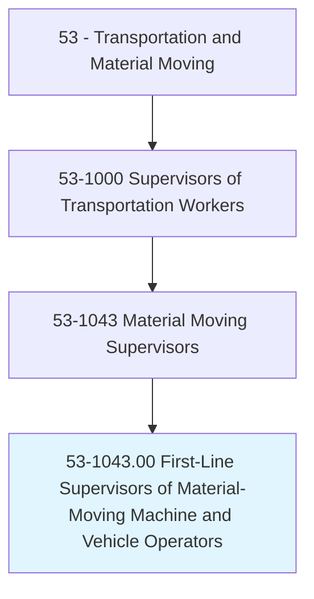
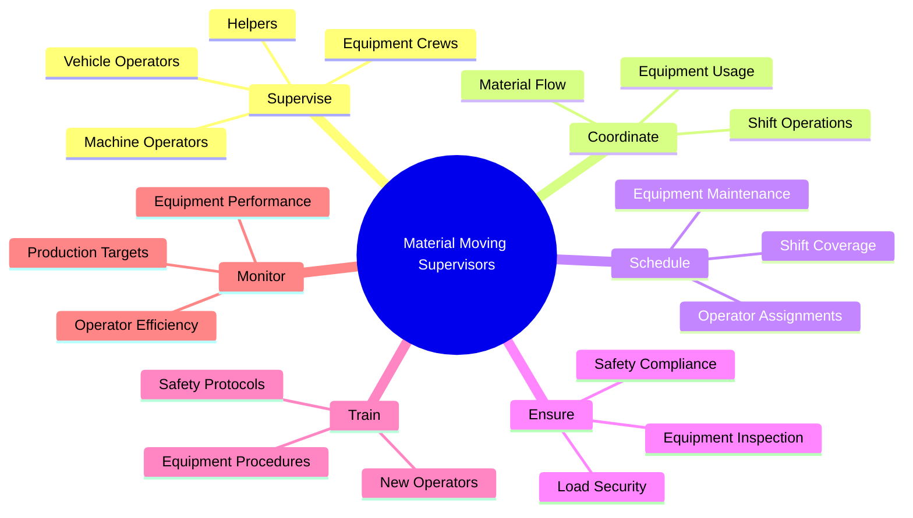
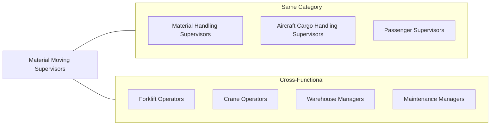
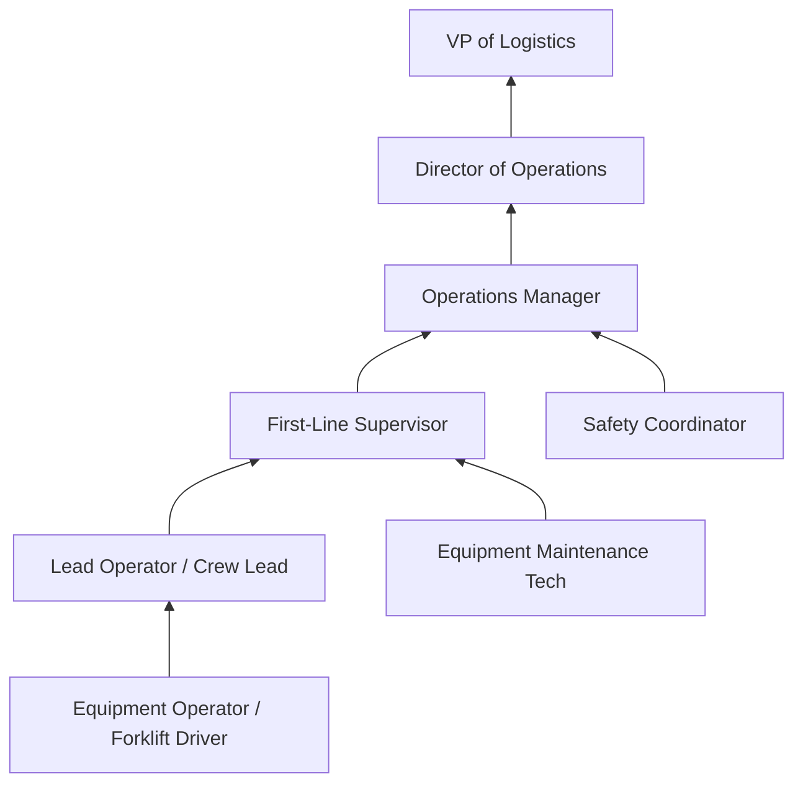

# First-Line Supervisors of Material-Moving Machine and Vehicle Operators

> Directly supervise and coordinate activities of material-moving machine and vehicle operators and helpers.

## Overview

First-Line Supervisors of Material-Moving Machine and Vehicle Operators oversee workers who operate equipment such as forklifts, cranes, hoists, conveyors, and other material-moving machinery and vehicles. These supervisors coordinate equipment operations, manage operator schedules, ensure safety compliance, and maintain equipment utilization across warehouses, manufacturing plants, ports, and distribution facilities. They play a vital role in maintaining efficient material flow while preventing accidents and equipment damage in potentially hazardous operating environments.

## Classification Hierarchy

## Key Statistics

| Metric | Value |
|--------|-------|
| SOC Code | 53-1043.00 |
| Job Zone | 3 (Medium Preparation) |
| Category | [Transportation](/occupations/Transportation/index) |
| Alternative Titles | Forklift Supervisor, Equipment Operations Supervisor |
| Source | O*NET |

## Core Tasks

### supervise.Operators

Material Moving Supervisors directly oversee machine and vehicle operators to ensure safe and efficient operations.

**Actions:**
- `supervise.MachineOperators.in.DailyOperations` - Direct activities of crane, hoist, and conveyor operators
- `supervise.VehicleOperators.in.MaterialMovement` - Oversee forklift, tow motor, and AGV operators
- `supervise.Helpers.in.SupportTasks` - Coordinate helper activities supporting equipment operators
- `supervise.EquipmentCrews.for.Productivity` - Manage team performance and output

### coordinate.Operations

Material Moving Supervisors organize equipment usage and material flow to meet operational objectives.

**Actions:**
- `coordinate.EquipmentUsage.for.Efficiency` - Optimize equipment utilization across operations
- `coordinate.MaterialFlow.through.Facility` - Manage material movement patterns and routes
- `coordinate.ShiftOperations.with.Production` - Align material moving with production schedules

### schedule.Resources

Material Moving Supervisors plan operator assignments and equipment maintenance.

**Actions:**
- `schedule.OperatorAssignments.for.Coverage` - Assign operators to equipment and zones
- `schedule.EquipmentMaintenance.to.minimize.Downtime` - Coordinate preventive maintenance schedules
- `schedule.ShiftCoverage.to.ensure.Operations` - Manage staffing across shifts

### ensure.Compliance

Material Moving Supervisors maintain safety and regulatory compliance in equipment operations.

**Actions:**
- `ensure.SafetyCompliance.in.Operations` - Enforce OSHA and company safety standards
- `ensure.EquipmentInspection.before.Use` - Verify pre-operation equipment checks are completed
- `ensure.LoadSecurity.during.Transport` - Confirm proper load securing procedures

### train.Personnel

Material Moving Supervisors develop operator capabilities through training and certification.

**Actions:**
- `train.NewOperators.on.EquipmentUse` - Provide initial equipment operation training
- `train.Staff.on.SafetyProcedures` - Instruct on safety protocols and emergency procedures
- `train.Operators.for.Certification` - Prepare operators for equipment certifications

### monitor.Performance

Material Moving Supervisors track equipment and operator performance metrics.

**Actions:**
- `monitor.EquipmentPerformance.for.Issues` - Track equipment uptime and performance
- `monitor.OperatorEfficiency.against.Standards` - Evaluate operator productivity
- `monitor.ProductionTargets.for.Achievement` - Ensure material moving supports production goals

## Skills & Competencies

### Technical Skills
- **Forklift Operations** - Expert
- **Crane and Hoist Operations** - Advanced
- **Equipment Maintenance Knowledge** - Advanced
- **Safety Regulations (OSHA)** - Advanced
- **Warehouse Management Systems** - Intermediate
- **Load Planning** - Intermediate

### Soft Skills
- **Leadership** - Critical
- **Decision Making** - Critical
- **Communication** - Essential
- **Attention to Detail** - Essential
- **Problem Solving** - Essential
- **Spatial Awareness** - Essential

## Related Occupations

## Industries

- Warehousing and Storage - Highest Employment
- [Manufacturing](/industries/Manufacturing/index) - High Employment
- [Wholesale Trade](/industries/Wholesale/index) - High Employment
- Transportation and Warehousing - High Employment
- [Construction](/industries/Construction/index) - Moderate Employment
- [Mining](/industries/Mining/index) - Moderate Employment

## Career Progression

## Education & Training

| Requirement | Details |
|-------------|---------|
| Typical Education | High school diploma or equivalent |
| Work Experience | 2-5 years as an equipment operator |
| On-the-Job Training | Moderate - equipment-specific and site-specific training |
| Common Certifications | Forklift certification (OSHA), Crane operator certification, Rigging certification |

## Departments

This occupation typically works in:
- Warehouse Operations
- Production Support
- Shipping and Receiving
- Yard Operations
- Material Handling

## Industry Variations

### Warehousing and Distribution
- High-volume forklift operations
- Racking systems and narrow-aisle equipment
- Inventory accuracy focus
- Pick-and-pack support operations

### Manufacturing
- Production line material supply
- Just-in-time delivery requirements
- Heavy equipment for raw materials
- Integration with production schedules

### Ports and Terminals
- Container handling equipment (reach stackers, RTGs)
- Ship loading/unloading coordination
- 24/7 operations
- International safety standards

### Construction
- Mobile equipment on job sites
- Variable terrain operations
- Heavy lifting and rigging
- Site-specific safety protocols

### Mining and Extraction
- Heavy-duty equipment operations
- Harsh environment considerations
- Extended shift operations
- Specialized safety requirements

## Equipment Types Supervised

### Industrial Trucks
- **Forklifts** - Sit-down, stand-up, reach trucks
- **Order Pickers** - High-level stock retrieval
- **Pallet Jacks** - Powered pallet movers
- **Tow Tractors** - Trailer and cart movers

### Cranes and Hoists
- **Overhead Cranes** - Bridge and gantry cranes
- **Jib Cranes** - Workstation lifting
- **Hoists** - Chain and wire rope hoists

### Conveyors and AGVs
- **Belt Conveyors** - Material transport systems
- **Roller Conveyors** - Gravity and powered rollers
- **AGVs/AMRs** - Automated guided vehicles

## Technology & Tools

### Equipment Management
- Fleet management software
- Equipment telematics systems
- Maintenance tracking systems
- Operator performance monitoring

### Operations Software
- Warehouse Management Systems (WMS)
- Yard Management Systems (YMS)
- Labor Management Systems (LMS)
- Radio frequency (RF) devices

### Safety Systems
- Proximity detection systems
- Pedestrian awareness systems
- Speed limiters and geofencing
- Video monitoring systems

## Safety Responsibilities

Material Moving Supervisors are accountable for:

### Pre-Operation
- Equipment inspection verification
- Operator fitness for duty checks
- Zone hazard assessment
- Load and route planning

### During Operations
- Traffic pattern enforcement
- Speed compliance monitoring
- Load securing verification
- Pedestrian safety management

### Incident Management
- Near-miss investigation
- Accident response and reporting
- Root cause analysis participation
- Corrective action implementation

## Key Performance Indicators

Material Moving Supervisors are typically evaluated on:
- **Equipment utilization** - Uptime percentage, hours of productive use
- **Safety metrics** - Incident rates, near-miss reports, inspection compliance
- **Productivity** - Units moved per hour, cycle times
- **Maintenance** - Preventive maintenance completion, unplanned downtime
- **Damage rates** - Product damage, equipment damage incidents

---

*Source: O*NET 53-1043.00 - ONETOccupation*
