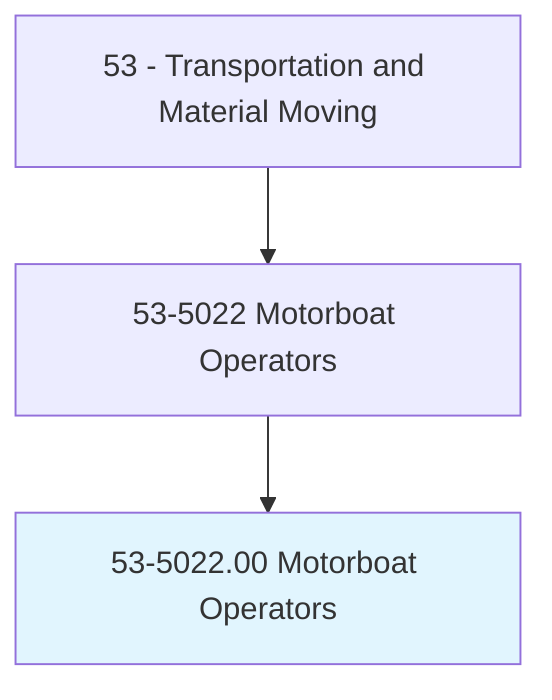
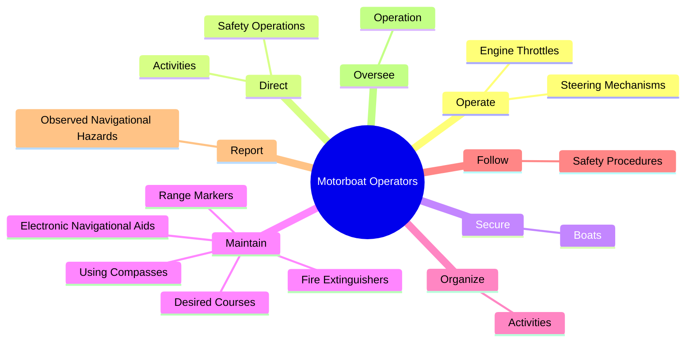
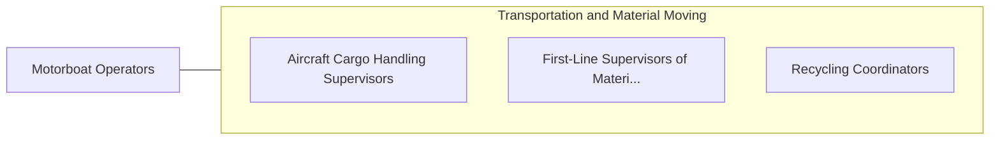

# Motorboat Operators

> Operate small motor-driven boats. May assist in navigational activities.

## Overview

Motorboat Operators is an occupation within the Transportation and Material Moving category. Operate small motor-driven boats. 

## Classification Hierarchy

## Key Statistics

| Metric | Value |
|--------|-------|
| SOC Code | 53-5022.00 |
| Category | [Transportation and Material Moving](/occupations/Transportation) |
| Task Count | 53 |
| Source | O*NET |

## Core Tasks

### operate.EngineThrottles

Motorboat Operators operate engine throttles as part of their core responsibilities.

**Actions:**
- `operate.EngineThrottles.to.guide.BoatsOnDesiredCourses`
- `operate.SteeringMechanisms.to.guide.BoatsOnDesiredCourses`

### direct.SafetyOperations

Motorboat Operators direct safety operations as part of their core responsibilities.

**Actions:**
- `direct.SafetyOperations.in.EmergencySituations`
- `direct.Activities.of.CrewMembers`

### secure.Boats

Motorboat Operators secure boats as part of their core responsibilities.

**Actions:**
- `secure.Boats.to.docks.WithMooringLines`
- `secure.Boats.to.CastOffLinesToEnableDeparture`

## Skills & Competencies

### Technical Skills
- **Vehicle Operation** - Advanced
- **Logistics** - Advanced
- **Safety Compliance** - Advanced

### Soft Skills
- **Communication** - Essential
- **Problem Solving** - Essential
- **Critical Thinking** - Important
- **Teamwork** - Important
- **Adaptability** - Important

## Related Occupations

## Industries

This occupation is found across multiple industries. See [Industries](/industries) for sector-specific employment data.

## Career Progression

---

*Source: O*NET 53-5022.00 - ONETOccupation*
