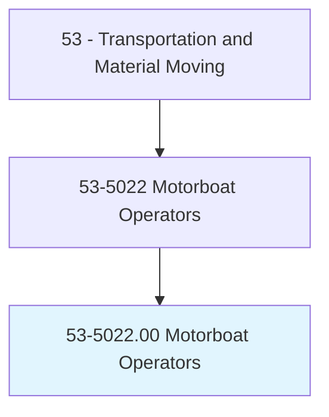
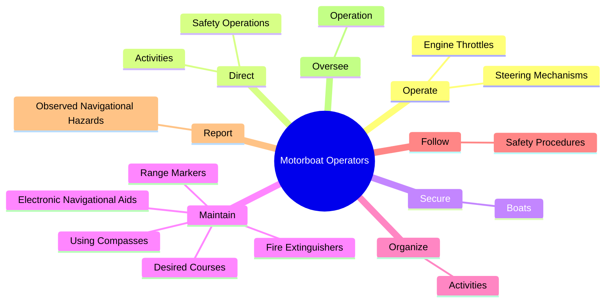
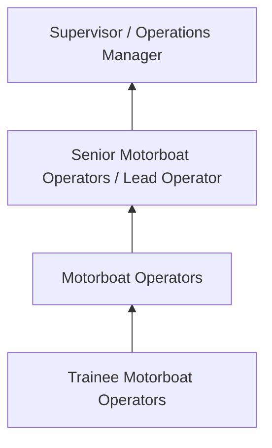
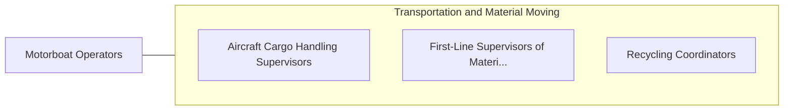

# Motorboat Operators

> Operate small motor-driven boats. May assist in navigational activities.

## Overview

Motorboat Operators professionals operate small motor-driven boats. This occupation falls within the Transportation and Material Moving category and requires a combination of specialized knowledge, technical skills, and practical experience.

These professionals work across diverse settings and organizational contexts, applying their expertise to meet the demands of their field. They must stay current with industry standards, emerging practices, and regulatory requirements that affect their work. The role demands both independent judgment and collaborative skills, as practitioners regularly interact with colleagues, stakeholders, and the public.

As the field continues to evolve, Motorboat Operators professionals increasingly leverage technology and data-driven approaches to enhance their effectiveness. Career opportunities span the public and private sectors, with demand influenced by economic conditions, demographic shifts, and technological advancement.

## Classification Hierarchy



## Key Statistics

| Metric | Value |
|--------|-------|
| SOC Code | 53-5022.00 |
| Job Zone | N/A |
| Category | [Transportation and Material Moving](/occupations/Transportation/index) |
| Core Tasks | 53+ |
| Salary Range | $30,000 - $75,000 |
| Median Salary | $45,000 |
| Growth Outlook | 6% (As fast as average) |
| Source | O*NET |

## Core Tasks



### maintain.DesiredCourses

Motorboat Operators maintain desired courses as part of their core responsibilities.

**Actions:**
- `maintain.DesiredCourses` - Maintain desired courses, using compasses or electronic navigational aids.
- `maintain.UsingCompasses` - Maintain desired courses, using compasses or electronic navigational aids.
- `maintain.ElectronicNavigationalAids` - Maintain desired courses, using compasses or electronic navigational aids.
- `maintain.RangeMarkers` - Maintain equipment such as range markers, fire extinguishers, boat fenders, l...
- `maintain.FireExtinguishers` - Maintain equipment such as range markers, fire extinguishers, boat fenders, l...

### oversee.Operation

Motorboat Operators oversee operation as part of their core responsibilities.

**Actions:**
- `oversee.Operation.of.VesselsUsed.for.CarryingPassengers` - Oversee operation of vessels used for carrying passengers, motor vehicles, or...
- `oversee.Operation.of.Mot` - Oversee operation of vessels used for carrying passengers, motor vehicles, or...
- `oversee.Operation.of.Vehicles` - Oversee operation of vessels used for carrying passengers, motor vehicles, or...
- `oversee.Operation.of.GoodsAcrossRivers` - Oversee operation of vessels used for carrying passengers, motor vehicles, or...
- `oversee.Operation.of.Harbors` - Oversee operation of vessels used for carrying passengers, motor vehicles, or...

### clean.Boats

Motorboat Operators clean boats as part of their core responsibilities.

**Actions:**
- `clean.Boats` - Clean boats and repair hulls and superstructures, using hand tools, paint, an...
- `clean.RepairHulls` - Clean boats and repair hulls and superstructures, using hand tools, paint, an...
- `clean.Superstructures` - Clean boats and repair hulls and superstructures, using hand tools, paint, an...
- `clean.Paint` - Clean boats and repair hulls and superstructures, using hand tools, paint, an...

### tow.OtherBoats

Motorboat Operators tow other boats as part of their core responsibilities.

**Actions:**
- `tow.OtherBoats` - Tow, push, or guide other boats, barges, logs, or rafts.
- `tow.Barges` - Tow, push, or guide other boats, barges, logs, or rafts.
- `tow.Logs` - Tow, push, or guide other boats, barges, logs, or rafts.
- `tow.Rafts` - Tow, push, or guide other boats, barges, logs, or rafts.


## Skills & Competencies

### Technical Skills
- **Equipment Operation** - Advanced
- **Safety Procedures** - Advanced
- **Navigation Systems** - Proficient
- **Load Management** - Proficient
- **Vehicle Inspection** - Proficient
- **Regulatory Compliance** - Proficient

### Soft Skills
- **Situational Awareness** - Critical
- **Reliability** - Critical
- **Time Management** - Essential
- **Communication** - Essential
- **Physical Stamina** - Essential

## Education & Certifications

| Requirement | Details |
|-------------|---------|
| Typical Education | High school diploma or equivalent; some positions require post-secondary training |
| Work Experience | 0-2 years on-the-job experience |
| On-the-Job Training | Moderate - safety and equipment operation training |
| Certifications | CDL, hazmat endorsements, or transportation-specific licenses |

## Career Progression



## Industry Variations

### Freight and Logistics
Commercial transportation of goods. Motorboat Operators professionals focus on efficiency, safety, and timely delivery across supply chains.

### Public Transit
Passenger transportation services. Emphasis on schedules, safety, and customer service in public-facing roles.

### Warehousing and Distribution
Material handling and storage operations. Focus on inventory management and order fulfillment efficiency.

### Specialized Transport
Hazardous materials, oversized loads, or temperature-controlled transport requiring additional certifications and safety protocols.

## Technology & Tools

- **GPS and navigation systems**
- **Fleet management software**
- **Electronic logging devices (ELD)**
- **Warehouse management systems (WMS)**
- **Transportation management systems (TMS)**

## Related Occupations



## Industries

- [Trucking and Freight](/industries/Trucking) - High Employment
- [Warehousing and Storage](/industries/Warehousing) - High Employment
- [Air Transportation](/industries/AirTransportation) - Moderate Employment
- [Rail Transportation](/industries/RailTransportation) - Moderate Employment

## Departments

This occupation typically works in:
- [Operations](/departments/Operations/index)
- [Logistics](/departments/SupplyChain)
- Fleet Management

## GraphDL Semantic Structure

```graphdl
Motorboat Operators perform:
- operate.EngineThrottles.to.guide.BoatsOnDesiredCourses
- operate.SteeringMechanisms.to.guide.BoatsOnDesiredCourses
- direct.SafetyOperations.in.EmergencySituations
- secure.Boats.to.docks.WithMooringLines
- secure.Boats.to.CastOffLinesToEnableDeparture
- maintain.DesiredCourses
```

---

*Source: O*NET 53-5022.00 - ONETOccupation*
