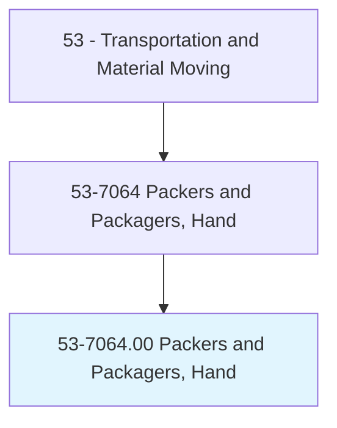
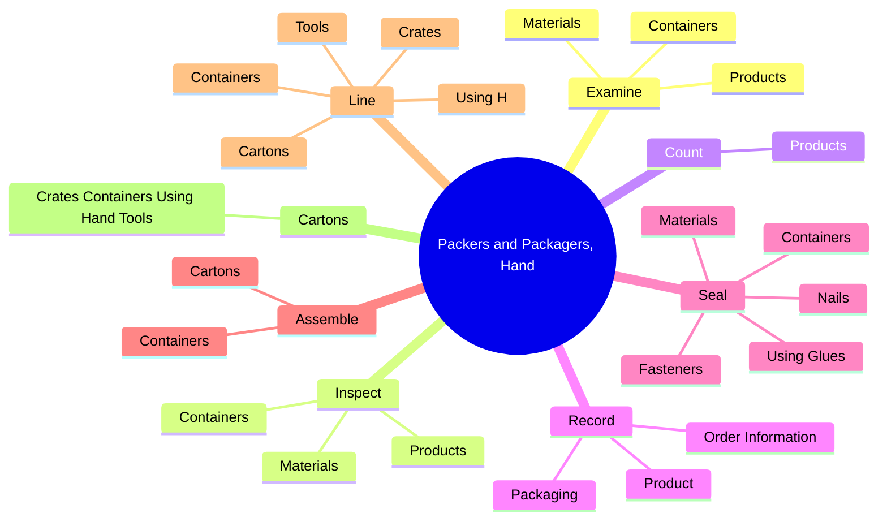
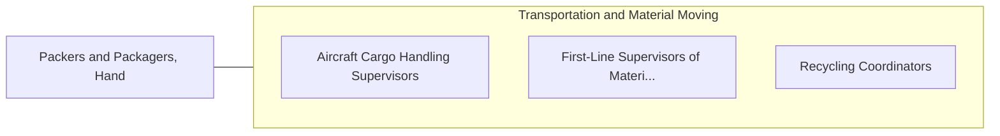

# Packers and Packagers, Hand

> Pack or package by hand a wide variety of products and materials.

## Overview

Packers and Packagers, Hand is classified under Transportation and Material Moving (SOC 53). Pack or package by hand a wide variety of products and materials.

## Classification Hierarchy

## Key Statistics

| Metric | Value |
|--------|-------|
| SOC Code | 53-7064.00 |
| Category | [Transportation and Material Moving](/occupations/Transportation/index) |
| Task Count | 91 |
| Source | O*NET |

## Core Tasks

### examine.Containers

Packers and Packagers, Hand examine containers as part of their core responsibilities.

**Actions:**
- `examine.Containers.to.ensure.ProductQuality`
- `examine.Containers.to.PackingSpecificationsAreMet`
- `examine.Materials.to.ensure.ProductQuality`
- `examine.Materials.to.PackingSpecificationsAreMet`

### inspect.Containers

Packers and Packagers, Hand inspect containers as part of their core responsibilities.

**Actions:**
- `inspect.Containers.to.ensure.ProductQuality`
- `inspect.Containers.to.PackingSpecificationsAreMet`
- `inspect.Materials.to.ensure.ProductQuality`
- `inspect.Materials.to.PackingSpecificationsAreMet`

### count.Products

Packers and Packagers, Hand count products as part of their core responsibilities.

**Actions:**
- `count.Products`

## Skills & Competencies

### Technical Skills
- **Vehicle Operation** - Advanced
- **Logistics** - Advanced
- **Safety Compliance** - Advanced

### Soft Skills
- **Communication** - Essential
- **Problem Solving** - Essential
- **Critical Thinking** - Important
- **Teamwork** - Important
- **Adaptability** - Important

## Related Occupations

## Industries

This occupation is found across multiple industries. See [Industries](/industries) for sector-specific employment data.

## Career Progression

---

*Source: O*NET 53-7064.00 - ONETOccupation*
