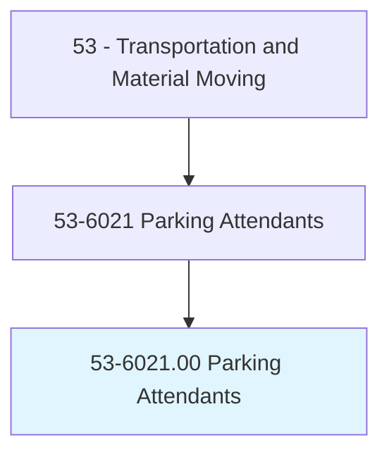
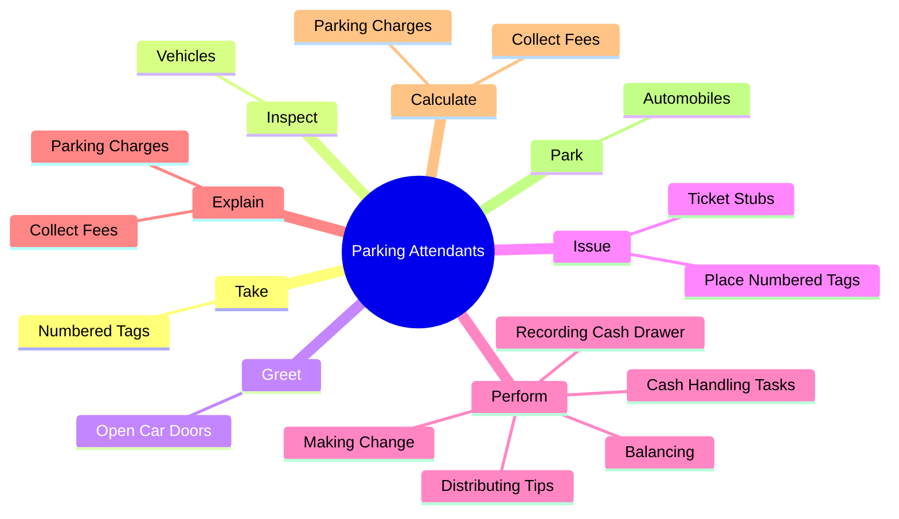
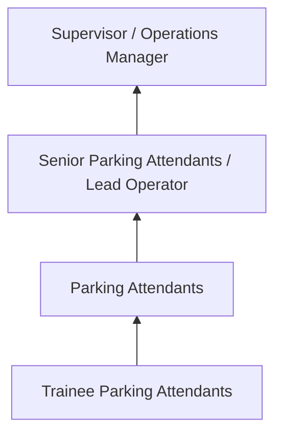
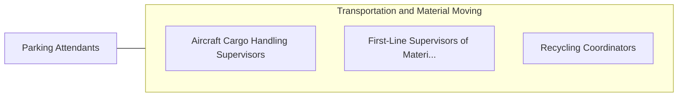

# Parking Attendants

> Park vehicles or issue tickets for customers in a parking lot or garage. May park or tend vehicles in environments such as a car dealership or rental car facility. May collect fee.

## Overview

Parking Attendants professionals park vehicles or issue tickets for customers in a parking lot or garage. This occupation falls within the Transportation and Material Moving category and requires a combination of specialized knowledge, technical skills, and practical experience.

These professionals work across diverse settings and organizational contexts, applying their expertise to meet the demands of their field. They must stay current with industry standards, emerging practices, and regulatory requirements that affect their work. The role demands both independent judgment and collaborative skills, as practitioners regularly interact with colleagues, stakeholders, and the public.

As the field continues to evolve, Parking Attendants professionals increasingly leverage technology and data-driven approaches to enhance their effectiveness. Career opportunities span the public and private sectors, with demand influenced by economic conditions, demographic shifts, and technological advancement.

## Classification Hierarchy



## Key Statistics

| Metric | Value |
|--------|-------|
| SOC Code | 53-6021.00 |
| Job Zone | N/A |
| Category | [Transportation and Material Moving](/occupations/Transportation/index) |
| Core Tasks | 63+ |
| Salary Range | $30,000 - $75,000 |
| Median Salary | $45,000 |
| Growth Outlook | 6% (As fast as average) |
| Source | O*NET |

## Core Tasks



### issue.TicketStubs

Parking Attendants issue ticket stubs as part of their core responsibilities.

**Actions:**
- `issue.TicketStubs.on.Windshields` - Issue ticket stubs or place numbered tags on windshields, log tags or attach ...
- `issue.TicketStubs.on.LogTags` - Issue ticket stubs or place numbered tags on windshields, log tags or attach ...
- `issue.TicketStubs.on.AttachTagToCustomersKeys` - Issue ticket stubs or place numbered tags on windshields, log tags or attach ...
- `issue.TicketStubs.on.GiveCustomersMatchingTagsF` - Issue ticket stubs or place numbered tags on windshields, log tags or attach ...
- `issue.TicketStubs.on.LocatingParkedVehicles` - Issue ticket stubs or place numbered tags on windshields, log tags or attach ...

### perform.CashHandlingTasks

Parking Attendants perform cash handling tasks as part of their core responsibilities.

**Actions:**
- `perform.CashHandlingTasks` - Perform cash handling tasks, such as making change, balancing and recording c...
- `perform.MakingChange` - Perform cash handling tasks, such as making change, balancing and recording c...
- `perform.Balancing` - Perform cash handling tasks, such as making change, balancing and recording c...
- `perform.RecordingCashDrawer` - Perform cash handling tasks, such as making change, balancing and recording c...
- `perform.DistributingTips` - Perform cash handling tasks, such as making change, balancing and recording c...

### take.NumberedTags

Parking Attendants take numbered tags as part of their core responsibilities.

**Actions:**
- `take.NumberedTags.from.Customers` - Take numbered tags from customers, locate vehicles, and deliver vehicles, or ...
- `take.NumberedTags.from.LocateVehicles` - Take numbered tags from customers, locate vehicles, and deliver vehicles, or ...
- `take.NumberedTags.from.DeliverVehicles` - Take numbered tags from customers, locate vehicles, and deliver vehicles, or ...
- `take.NumberedTags.from.ProvideCustomers.with.InstructionsF` - Take numbered tags from customers, locate vehicles, and deliver vehicles, or ...
- `take.NumberedTags.from.LocatingVehicles` - Take numbered tags from customers, locate vehicles, and deliver vehicles, or ...

### call.EmergencyResponders

Parking Attendants call emergency responders as part of their core responsibilities.

**Actions:**
- `call.EmergencyResponders` - Call emergency responders or the proper authorities and provide motorist assi...
- `call.ProperAuthorities` - Call emergency responders or the proper authorities and provide motorist assi...
- `call.ProvideMotoristAssistance` - Call emergency responders or the proper authorities and provide motorist assi...
- `call.GivingDirections` - Call emergency responders or the proper authorities and provide motorist assi...
- `call.HelpingJumpStartStalledVehicle` - Call emergency responders or the proper authorities and provide motorist assi...


## Skills & Competencies

### Technical Skills
- **Equipment Operation** - Advanced
- **Safety Procedures** - Advanced
- **Navigation Systems** - Proficient
- **Load Management** - Proficient
- **Vehicle Inspection** - Proficient
- **Regulatory Compliance** - Proficient

### Soft Skills
- **Situational Awareness** - Critical
- **Reliability** - Critical
- **Time Management** - Essential
- **Communication** - Essential
- **Physical Stamina** - Essential

## Education & Certifications

| Requirement | Details |
|-------------|---------|
| Typical Education | High school diploma or equivalent; some positions require post-secondary training |
| Work Experience | 0-2 years on-the-job experience |
| On-the-Job Training | Moderate - safety and equipment operation training |
| Certifications | CDL, hazmat endorsements, or transportation-specific licenses |

## Career Progression



## Industry Variations

### Freight and Logistics
Commercial transportation of goods. Parking Attendants professionals focus on efficiency, safety, and timely delivery across supply chains.

### Public Transit
Passenger transportation services. Emphasis on schedules, safety, and customer service in public-facing roles.

### Warehousing and Distribution
Material handling and storage operations. Focus on inventory management and order fulfillment efficiency.

### Specialized Transport
Hazardous materials, oversized loads, or temperature-controlled transport requiring additional certifications and safety protocols.

## Technology & Tools

- **GPS and navigation systems**
- **Fleet management software**
- **Electronic logging devices (ELD)**
- **Warehouse management systems (WMS)**
- **Transportation management systems (TMS)**

## Related Occupations



## Industries

- [Trucking and Freight](/industries/Trucking) - High Employment
- [Warehousing and Storage](/industries/Warehousing) - High Employment
- [Air Transportation](/industries/AirTransportation) - Moderate Employment
- [Rail Transportation](/industries/RailTransportation) - Moderate Employment

## Departments

This occupation typically works in:
- [Operations](/departments/Operations/index)
- [Logistics](/departments/SupplyChain)
- Fleet Management

## GraphDL Semantic Structure

```graphdl
Parking Attendants perform:
- take.NumberedTags.from.Customers
- take.NumberedTags.from.LocateVehicles
- take.NumberedTags.from.DeliverVehicles
- take.NumberedTags.from.ProvideCustomers.with.InstructionsF
- take.NumberedTags.from.LocatingVehicles
- inspect.Vehicles.to.detect.Damage
```

---

*Source: O*NET 53-6021.00 - ONETOccupation*
