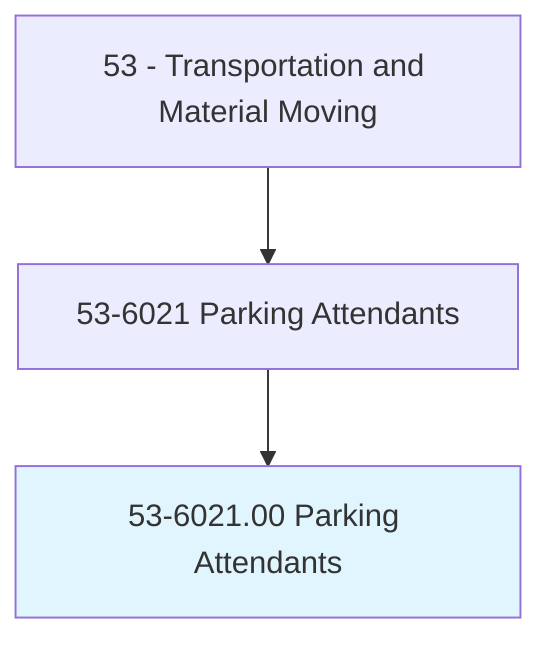
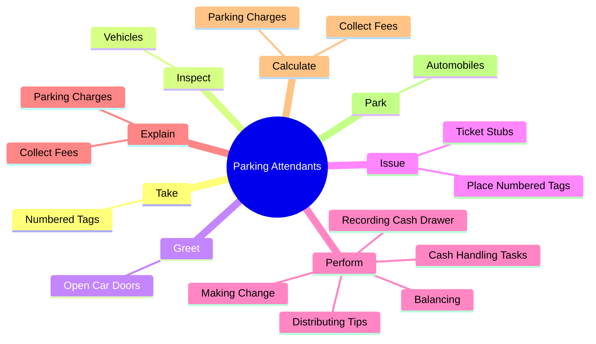
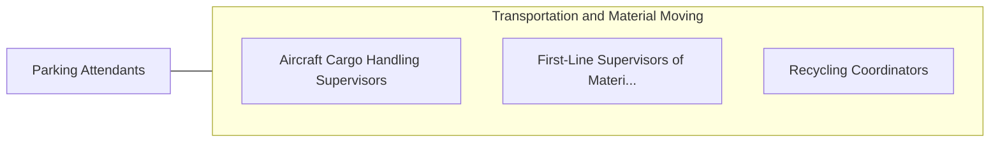

# Parking Attendants

> Park vehicles or issue tickets for customers in a parking lot or garage. May park or tend vehicles in environments such as a car dealership or rental car facility. May collect fee.

## Overview

Parking Attendants is an occupation within the Transportation and Material Moving category. Park vehicles or issue tickets for customers in a parking lot or garage. May park or tend vehicles in environments such as a car dealership or rental car facility.

## Classification Hierarchy

## Key Statistics

| Metric | Value |
|--------|-------|
| SOC Code | 53-6021.00 |
| Category | [Transportation and Material Moving](/occupations/Transportation) |
| Task Count | 63 |
| Source | O*NET |

## Core Tasks

### take.NumberedTags

Parking Attendants take numbered tags as part of their core responsibilities.

**Actions:**
- `take.NumberedTags.from.Customers`
- `take.NumberedTags.from.LocateVehicles`
- `take.NumberedTags.from.DeliverVehicles`
- `take.NumberedTags.from.ProvideCustomers.with.InstructionsF`

### inspect.Vehicles

Parking Attendants inspect vehicles as part of their core responsibilities.

**Actions:**
- `inspect.Vehicles.to.detect.Damage`

### greet.OpenCarDoors

Parking Attendants greet open car doors as part of their core responsibilities.

**Actions:**
- `greet.OpenCarDoors`

## Skills & Competencies

### Technical Skills
- **Vehicle Operation** - Advanced
- **Logistics** - Advanced
- **Safety Compliance** - Advanced

### Soft Skills
- **Communication** - Essential
- **Problem Solving** - Essential
- **Critical Thinking** - Important
- **Teamwork** - Important
- **Adaptability** - Important

## Related Occupations

## Industries

This occupation is found across multiple industries. See [Industries](/industries) for sector-specific employment data.

## Career Progression

---

*Source: O*NET 53-6021.00 - ONETOccupation*
