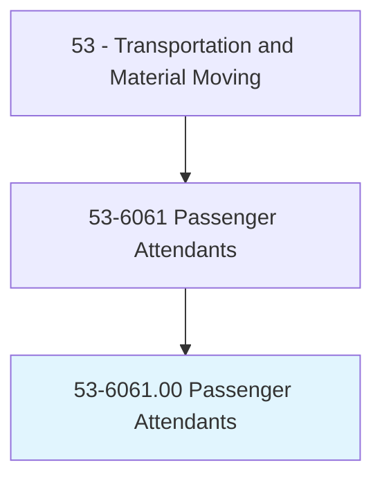
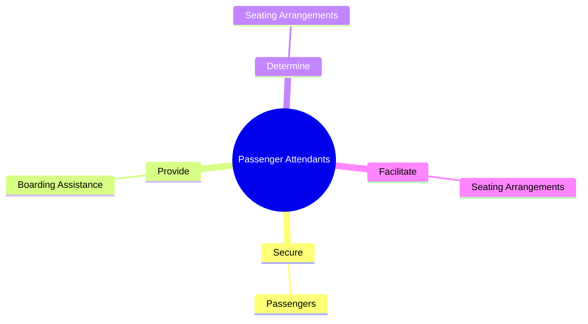
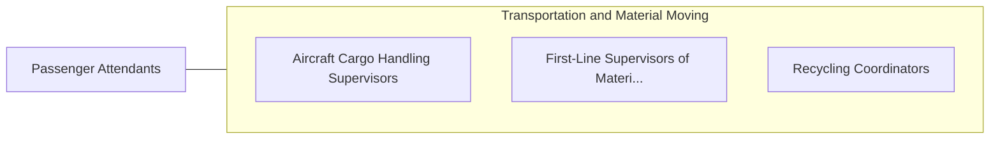

# Passenger Attendants

> Provide services to ensure the safety of passengers aboard ships, buses, trains, or within the station or terminal. Perform duties such as explaining the use of safety equipment, serving meals or beverages, or answering questions related to travel.

## Overview

Passenger Attendants is an occupation within the Transportation and Material Moving category. Provide services to ensure the safety of passengers aboard ships, buses, trains, or within the station or terminal. 

## Classification Hierarchy

## Key Statistics

| Metric | Value |
|--------|-------|
| SOC Code | 53-6061.00 |
| Category | [Transportation and Material Moving](/occupations/Transportation/index) |
| Task Count | 35 |
| Source | O*NET |

## Core Tasks

### secure.Passengers

Passenger Attendants secure passengers as part of their core responsibilities.

**Actions:**
- `secure.Passengers.for.Transportation.by.BucklingSeatbeltsWheelchairsWithTieDownStraps`
- `secure.Passengers.for.FasteningWheelchairs.with.TieDownStraps`

### provide.BoardingAssistance

Passenger Attendants provide boarding assistance as part of their core responsibilities.

**Actions:**
- `provide.BoardingAssistance.to.Elderly`
- `provide.BoardingAssistance.to.Sick`
- `provide.BoardingAssistance.to.InjuredPeople`

### determine.SeatingArrangements

Passenger Attendants determine seating arrangements as part of their core responsibilities.

**Actions:**
- `determine.SeatingArrangements`

## Skills & Competencies

### Technical Skills
- **Vehicle Operation** - Advanced
- **Logistics** - Advanced
- **Safety Compliance** - Advanced

### Soft Skills
- **Communication** - Essential
- **Problem Solving** - Essential
- **Critical Thinking** - Important
- **Teamwork** - Important
- **Adaptability** - Important

## Related Occupations

## Industries

This occupation is found across multiple industries. See [Industries](/industries) for sector-specific employment data.

## Career Progression

---

*Source: O*NET 53-6061.00 - ONETOccupation*
