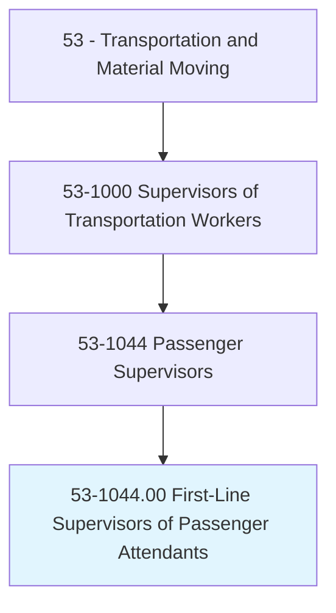
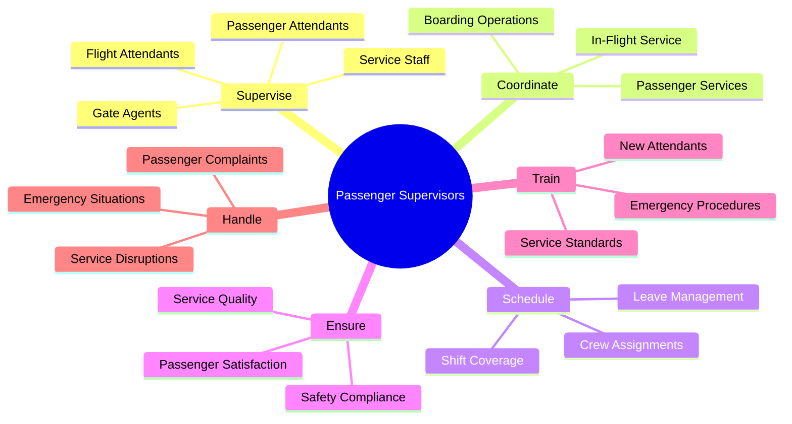
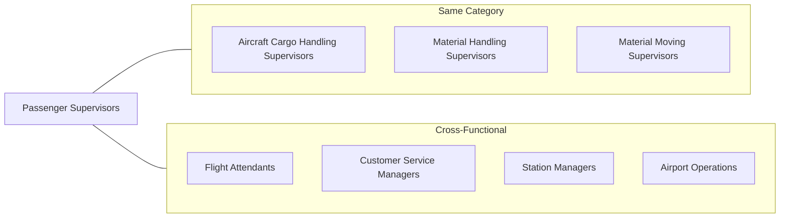
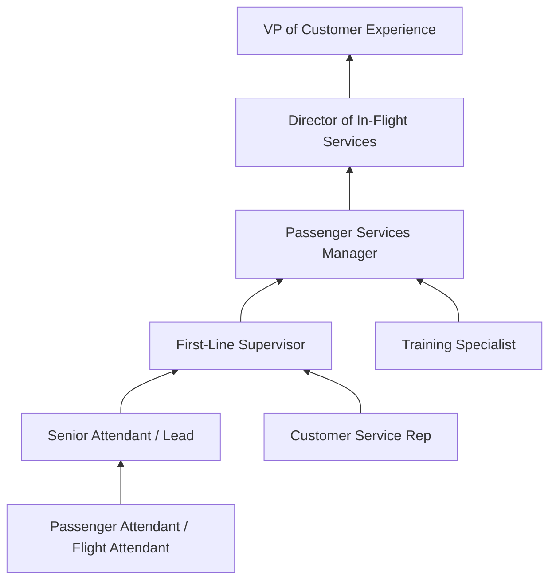

# First-Line Supervisors of Passenger Attendants

> Supervise and coordinate activities of passenger attendants.

## Overview

First-Line Supervisors of Passenger Attendants oversee workers who assist passengers in various transportation settings, including airlines, railways, cruise ships, and bus services. These supervisors coordinate passenger service operations, manage attendant schedules, ensure service quality standards, and handle escalated passenger concerns. They balance operational efficiency with exceptional customer experience, ensuring that passenger-facing staff deliver safe, professional, and courteous service across all touchpoints of the passenger journey.

## Classification Hierarchy

## Key Statistics

| Metric | Value |
|--------|-------|
| SOC Code | 53-1044.00 |
| Job Zone | 3 (Medium Preparation) |
| Category | [Transportation](/occupations/Transportation/index) |
| Alternative Titles | In-Flight Supervisor, Passenger Services Supervisor, Station Manager |
| Source | O*NET |

## Core Tasks

### supervise.Attendants

Passenger Supervisors directly oversee passenger-facing staff to ensure high-quality service delivery.

**Actions:**
- `supervise.FlightAttendants.in.ServiceDelivery` - Oversee cabin crew service performance
- `supervise.PassengerAttendants.in.Operations` - Direct passenger assistance activities
- `supervise.GateAgents.in.BoardingProcesses` - Coordinate boarding and deplaning operations
- `supervise.ServiceStaff.for.Quality` - Monitor overall service quality and performance

### coordinate.Services

Passenger Supervisors organize passenger service operations across all service touchpoints.

**Actions:**
- `coordinate.PassengerServices.for.Excellence` - Align all passenger touchpoints for consistent service
- `coordinate.BoardingOperations.for.Efficiency` - Streamline passenger boarding processes
- `coordinate.InFlightService.with.Standards` - Ensure in-flight service meets company standards

### schedule.Crew

Passenger Supervisors manage attendant scheduling and crew assignments.

**Actions:**
- `schedule.CrewAssignments.for.Routes` - Assign attendants to flights or service routes
- `schedule.ShiftCoverage.to.maintain.Service` - Ensure adequate staffing for all operations
- `schedule.LeaveManagement.while.maintaining.Operations` - Process leave requests while ensuring coverage

### ensure.Standards

Passenger Supervisors maintain service quality, safety, and compliance standards.

**Actions:**
- `ensure.ServiceQuality.meets.Standards` - Verify service delivery meets company standards
- `ensure.SafetyCompliance.in.AllOperations` - Enforce safety regulations and procedures
- `ensure.PassengerSatisfaction.through.Excellence` - Drive customer satisfaction outcomes

### train.Staff

Passenger Supervisors develop attendant capabilities through training and coaching.

**Actions:**
- `train.NewAttendants.on.ServiceProcedures` - Onboard new staff with service training
- `train.Staff.on.ServiceStandards` - Reinforce company service standards
- `train.Crew.on.EmergencyProcedures` - Ensure proficiency in safety and emergency protocols

### handle.Issues

Passenger Supervisors resolve escalated concerns and manage service disruptions.

**Actions:**
- `handle.PassengerComplaints.with.Resolution` - Address and resolve escalated passenger issues
- `handle.ServiceDisruptions.to.minimize.Impact` - Manage delays, cancellations, and irregularities
- `handle.EmergencySituations.with.Protocol` - Lead response to safety and medical emergencies

## Skills & Competencies

### Technical Skills
- **Aviation Safety Regulations** - Advanced (for airline settings)
- **Customer Relationship Management** - Advanced
- **Crew Resource Management** - Advanced
- **Emergency Response Procedures** - Advanced
- **Scheduling Systems** - Intermediate
- **Service Quality Metrics** - Intermediate

### Soft Skills
- **Leadership** - Critical
- **Customer Service** - Critical
- **Communication** - Critical
- **Problem Solving** - Essential
- **Emotional Intelligence** - Essential
- **Conflict Resolution** - Essential

## Related Occupations

## Industries

- [Air Transportation](/industries/AirTransportation) - Highest Employment
- [Rail Transportation](/industries/TransportationAndWarehousing/RailTransportation) - High Employment
- [Water Transportation](/industries/TransportationAndWarehousing/WaterTransportation/index) - Moderate Employment
- [Transit and Ground Passenger Transportation](/industries/GroundTransportation) - Moderate Employment
- [Scenic and Sightseeing Transportation](/industries/ScenicTransportation) - Lower Employment

## Career Progression

## Education & Training

| Requirement | Details |
|-------------|---------|
| Typical Education | High school diploma; some college preferred |
| Work Experience | 2-5 years as a passenger attendant or related role |
| On-the-Job Training | Moderate - company-specific service and safety training |
| Common Certifications | FAA certification (airlines), First Aid/CPR, Customer service certifications |

## Departments

This occupation typically works in:
- [In-Flight Services](/departments/InFlightServices)
- [Passenger Services](/departments/PassengerServices)
- [Customer Experience](/departments/CustomerExperience)
- [Station Operations](/departments/StationOperations)
- [Crew Scheduling](/departments/CrewScheduling)

## Industry Variations

### Commercial Airlines
- FAA regulatory compliance
- International service standards
- Multi-cultural passenger interactions
- Hub and spoke crew management
- Premium cabin service oversight

### Regional Airlines
- Smaller crew teams
- High flight frequency
- Diverse route responsibilities
- Hands-on operational involvement
- Customer intimacy focus

### Rail Transportation
- Long-haul service management
- Multi-car service coordination
- Station stop service timing
- Dining car supervision
- Sleeper service oversight

### Cruise Lines
- Extended voyage supervision
- Multi-department coordination
- Entertainment integration
- International crew management
- Guest experience continuity

### Bus and Coach Services
- Single-attendant operations
- Tour group management
- Long-distance service comfort
- Safety at rest stops
- Luggage service coordination

## Service Quality Management

Passenger Supervisors are responsible for maintaining excellence in:

### Pre-Journey
- Boarding process efficiency
- Pre-departure passenger communication
- Special needs accommodation
- Cabin preparation verification

### During Journey
- In-transit service delivery
- Safety demonstration compliance
- Meal and beverage service quality
- Cabin comfort management

### Post-Journey
- Deplaning coordination
- Lost item handling
- Connection assistance
- Feedback collection

## Technology & Tools

### Scheduling and Crew Management
- Crew management systems (AIMS, CrewTrac)
- Roster optimization software
- Mobile crew communication apps
- Irregular operations (IROPS) systems

### Service Delivery
- In-flight entertainment systems
- Point-of-sale systems
- Passenger information displays
- Communication headsets

### Customer Management
- Customer relationship management (CRM)
- Feedback and survey platforms
- Social media monitoring
- Service recovery systems

## Emergency Response

Passenger Supervisors must be proficient in:

### Safety Emergencies
- Evacuation procedure leadership
- Fire and smoke response
- Decompression procedures
- Security threat response

### Medical Emergencies
- First aid coordination
- Medical equipment deployment
- Medical professional identification
- Emergency landing coordination

### Service Disruptions
- Irregular operations management
- Delay communication
- Rebooking assistance
- Customer recovery protocols

## Key Performance Indicators

Passenger Supervisors are typically evaluated on:
- **Customer satisfaction scores** - Survey results, NPS, feedback ratings
- **Service delivery metrics** - On-time performance, service completion
- **Safety compliance** - Audit scores, incident rates, drill performance
- **Team performance** - Crew attendance, certification currency
- **Complaint resolution** - Response time, resolution rate, escalation rate

## Regulatory Environment

Passenger Supervisors must ensure compliance with:
- **FAA Regulations** (for aviation) - Cabin crew requirements, safety standards
- **DOT Requirements** - Accessibility, consumer protection
- **TSA Security** - Security procedures, prohibited items
- **ADA Compliance** - Accessibility accommodations
- **International Standards** - IATA, foreign regulatory requirements

---

*Source: O*NET 53-1044.00 - ONETOccupation*
