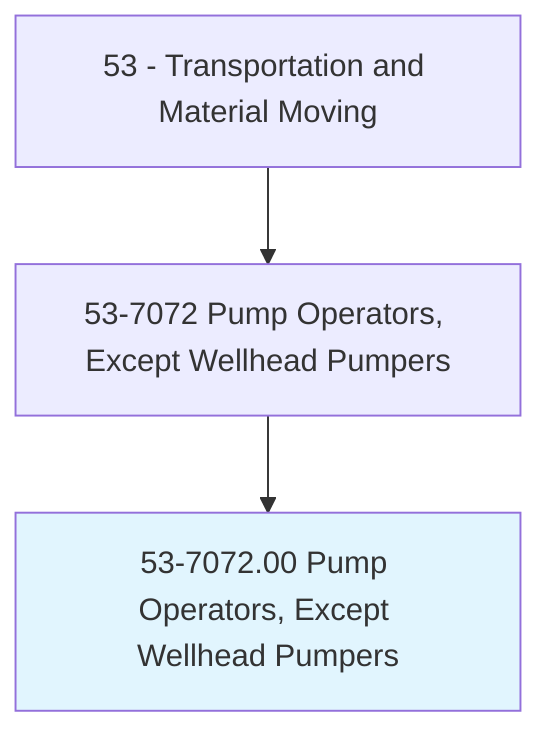
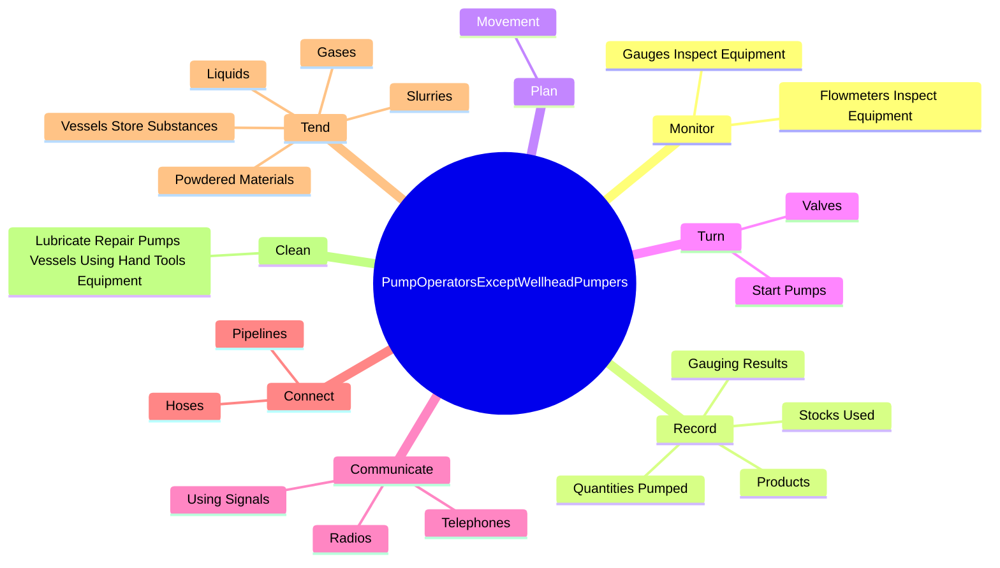
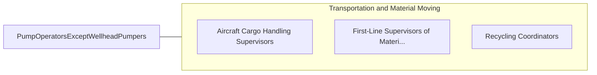

# Pump Operators, Except Wellhead Pumpers

> Tend, control, or operate power-driven, stationary, or portable pumps and manifold systems to transfer gases, oil, other liquids, slurries, or powdered materials to and from various vessels and processes.

## Overview

Pump Operators, Except Wellhead Pumpers is classified under Transportation and Material Moving (SOC 53). Tend, control, or operate power-driven, stationary, or portable pumps and manifold systems to transfer gases, oil, other liquids, slurries, or powdered materials to and from various vessels and processes.

## Classification Hierarchy

## Key Statistics

| Metric | Value |
|--------|-------|
| SOC Code | 53-7072.00 |
| Category | [Transportation and Material Moving](/occupations/Transportation) |
| Task Count | 72 |
| Source | O*NET |

## Core Tasks

### monitor.GaugesInspectEquipment

Pump Operators, Except Wellhead Pumpers monitor gauges inspect equipment as part of their core responsibilities.

**Actions:**
- `monitor.GaugesInspectEquipment.to.ensure.TankLevels`
- `monitor.GaugesInspectEquipment.to.Temperatures`
- `monitor.GaugesInspectEquipment.to.ChemicalAmounts`
- `monitor.GaugesInspectEquipment.to.PressuresAreAtSpecifiedLevels`

### record.Products

Pump Operators, Except Wellhead Pumpers record products as part of their core responsibilities.

**Actions:**
- `record.Products`
- `record.QuantitiesPumped`
- `record.StocksUsed`
- `record.GaugingResults`

### plan.Movement

Pump Operators, Except Wellhead Pumpers plan movement as part of their core responsibilities.

**Actions:**
- `plan.Movement.of.UsingKnowledge.of.Interconnections`
- `plan.Movement.of.Capacities.of.Pipelines`
- `plan.Movement.of.ValveManifolds`
- `plan.Movement.of.Pumps`

## Skills & Competencies

### Technical Skills
- **Vehicle Operation** - Advanced
- **Logistics** - Advanced
- **Safety Compliance** - Advanced

### Soft Skills
- **Communication** - Essential
- **Problem Solving** - Essential
- **Critical Thinking** - Important
- **Teamwork** - Important
- **Adaptability** - Important

## Related Occupations

## Industries

This occupation is found across multiple industries. See [Industries](/industries) for sector-specific employment data.

## Career Progression

---

*Source: O*NET 53-7072.00 - ONETOccupation*
