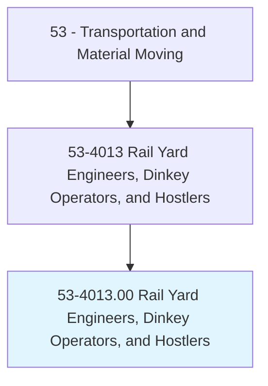
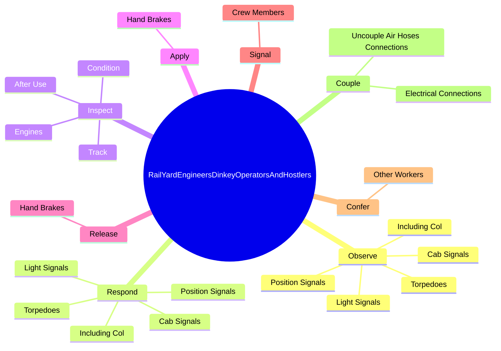
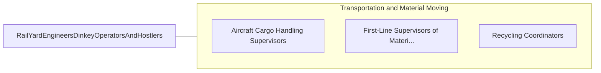

# Rail Yard Engineers, Dinkey Operators, and Hostlers

> Drive switching or other locomotive or dinkey engines within railroad yard, industrial plant, quarry, construction project, or similar location.

## Overview

Rail Yard Engineers, Dinkey Operators, and Hostlers is classified under Transportation and Material Moving (SOC 53). Drive switching or other locomotive or dinkey engines within railroad yard, industrial plant, quarry, construction project, or similar location.

## Classification Hierarchy

## Key Statistics

| Metric | Value |
|--------|-------|
| SOC Code | 53-4013.00 |
| Category | [Transportation and Material Moving](/occupations/Transportation) |
| Task Count | 87 |
| Source | O*NET |

## Core Tasks

### observe.CabSignals

Rail Yard Engineers, Dinkey Operators, and Hostlers observe cab signals as part of their core responsibilities.

**Actions:**
- `observe.CabSignals`
- `observe.IncludingCol`
- `observe.LightSignals`
- `observe.PositionSignals`

### respond.CabSignals

Rail Yard Engineers, Dinkey Operators, and Hostlers respond cab signals as part of their core responsibilities.

**Actions:**
- `respond.CabSignals`
- `respond.IncludingCol`
- `respond.LightSignals`
- `respond.PositionSignals`

### inspect.Engines

Rail Yard Engineers, Dinkey Operators, and Hostlers inspect engines as part of their core responsibilities.

**Actions:**
- `inspect.Engines.before.ensure.ProperOperation`
- `inspect.AfterUse.to.ensure.ProperOperation`
- `inspect.Track.for.Defects`
- `inspect.Track.for.BrokenRails`

## Skills & Competencies

### Technical Skills
- **Vehicle Operation** - Advanced
- **Logistics** - Advanced
- **Safety Compliance** - Advanced

### Soft Skills
- **Communication** - Essential
- **Problem Solving** - Essential
- **Critical Thinking** - Important
- **Teamwork** - Important
- **Adaptability** - Important

## Related Occupations

## Industries

This occupation is found across multiple industries. See [Industries](/industries) for sector-specific employment data.

## Career Progression

---

*Source: O*NET 53-4013.00 - ONETOccupation*
