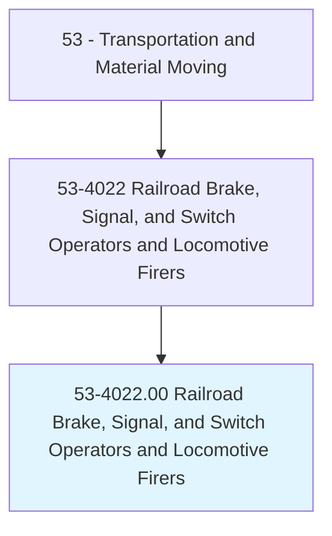
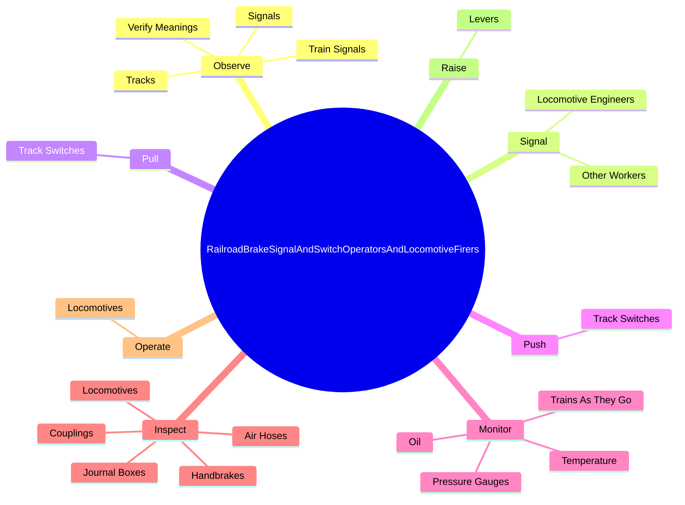
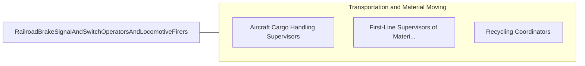

# Railroad Brake, Signal, and Switch Operators and Locomotive Firers

> Operate or monitor railroad track switches or locomotive instruments. May couple or uncouple rolling stock to make up or break up trains. Watch for and relay traffic signals. May inspect couplings, air hoses, journal boxes, and hand brakes. May watch for dragging equipment or obstacles on rights-of-way.

## Overview

Railroad Brake, Signal, and Switch Operators and Locomotive Firers is an occupation within the Transportation and Material Moving category. Operate or monitor railroad track switches or locomotive instruments. May couple or uncouple rolling stock to make up or break up trains.

## Classification Hierarchy

## Key Statistics

| Metric | Value |
|--------|-------|
| SOC Code | 53-4022.00 |
| Category | [Transportation and Material Moving](/occupations/Transportation/index) |
| Task Count | 96 |
| Source | O*NET |

## Core Tasks

### observe.TrainSignals

Railroad Brake, Signal, and Switch Operators and Locomotive Firers observe train signals as part of their core responsibilities.

**Actions:**
- `observe.TrainSignals.along.Routes.for.Engineers`
- `observe.VerifyMeanings.for.Engineers`
- `observe.Signals.from.OtherCrewMembersSoWorkActivitiesCanBeCoordinated`
- `observe.Tracks.from.LeftSidesOfLocomotives.to.detect.ObstructionsOnTracks`

### signal.LocomotiveEngineers

Railroad Brake, Signal, and Switch Operators and Locomotive Firers signal locomotive engineers as part of their core responsibilities.

**Actions:**
- `signal.LocomotiveEngineers.to.start.TrainsWhenCouplingUncouplingCars`
- `signal.LocomotiveEngineers.to.stop.TrainsWhenCouplingUncouplingCars`
- `signal.LocomotiveEngineers.to.UsingH`
- `signal.LocomotiveEngineers.to.signals`

### pull.TrackSwitches

Railroad Brake, Signal, and Switch Operators and Locomotive Firers pull track switches as part of their core responsibilities.

**Actions:**
- `pull.TrackSwitches.to.reroute.Cars`

## Skills & Competencies

### Technical Skills
- **Vehicle Operation** - Advanced
- **Logistics** - Advanced
- **Safety Compliance** - Advanced

### Soft Skills
- **Communication** - Essential
- **Problem Solving** - Essential
- **Critical Thinking** - Important
- **Teamwork** - Important
- **Adaptability** - Important

## Related Occupations

## Industries

This occupation is found across multiple industries. See [Industries](/industries) for sector-specific employment data.

## Career Progression

---

*Source: O*NET 53-4022.00 - ONETOccupation*
