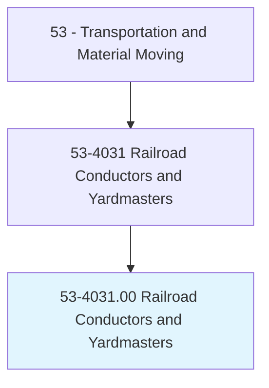
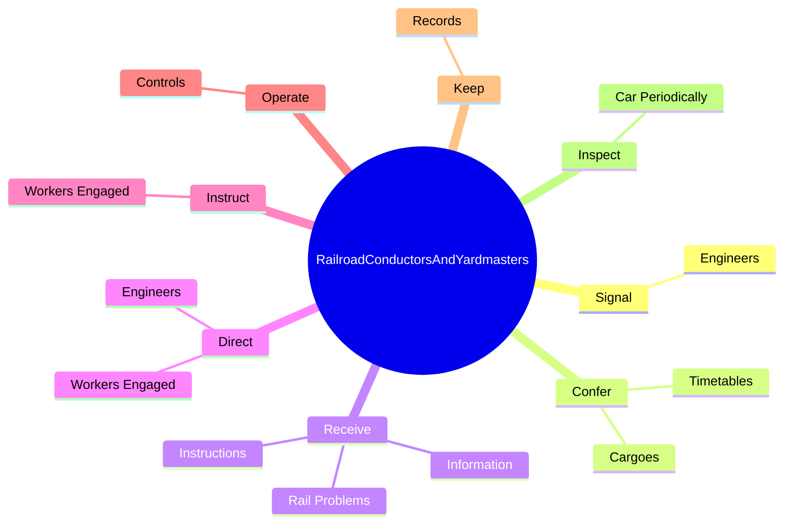
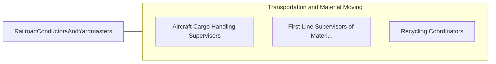

# Railroad Conductors and Yardmasters

> Coordinate activities of switch-engine crew within railroad yard, industrial plant, or similar location. Conductors coordinate activities of train crew on passenger or freight trains. Yardmasters review train schedules and switching orders and coordinate activities of workers engaged in railroad traffic operations, such as the makeup or breakup of trains and yard switching.

## Overview

Railroad Conductors and Yardmasters is an occupation within the Transportation and Material Moving category. Coordinate activities of switch-engine crew within railroad yard, industrial plant, or similar location. Conductors coordinate activities of train crew on passenger or freight trains.

## Classification Hierarchy

## Key Statistics

| Metric | Value |
|--------|-------|
| SOC Code | 53-4031.00 |
| Category | [Transportation and Material Moving](/occupations/Transportation/index) |
| Task Count | 88 |
| Source | O*NET |

## Core Tasks

### signal.Engineers

Railroad Conductors and Yardmasters signal engineers as part of their core responsibilities.

**Actions:**
- `signal.Engineers.to.begin.TrainRuns`
- `signal.Engineers.to.stop.Trains`
- `signal.Engineers.to.change.Speed`
- `signal.Engineers.to.UsingTelecommunicationsEquipment`

### confer.Timetables

Railroad Conductors and Yardmasters confer timetables as part of their core responsibilities.

**Actions:**
- `confer.Timetables.to.discuss.AlternativeRoutesWhenThereAreRailDefects`
- `confer.Timetables.to.Obstructions`
- `confer.Cargoes.to.discuss.AlternativeRoutesWhenThereAreRailDefects`
- `confer.Cargoes.to.Obstructions`

### receive.Information

Railroad Conductors and Yardmasters receive information as part of their core responsibilities.

**Actions:**
- `receive.Information.regarding.TrainProblems.from.DispatchersElectronicMonitoringDevices`
- `receive.Information.regarding.TrainProblems.from.FromElectronicMonitoringDevices`
- `receive.RailProblems.from.DispatchersElectronicMonitoringDevices`
- `receive.RailProblems.from.FromElectronicMonitoringDevices`

## Skills & Competencies

### Technical Skills
- **Vehicle Operation** - Advanced
- **Logistics** - Advanced
- **Safety Compliance** - Advanced

### Soft Skills
- **Communication** - Essential
- **Problem Solving** - Essential
- **Critical Thinking** - Important
- **Teamwork** - Important
- **Adaptability** - Important

## Related Occupations

## Industries

This occupation is found across multiple industries. See [Industries](/industries) for sector-specific employment data.

## Career Progression

---

*Source: O*NET 53-4031.00 - ONETOccupation*
