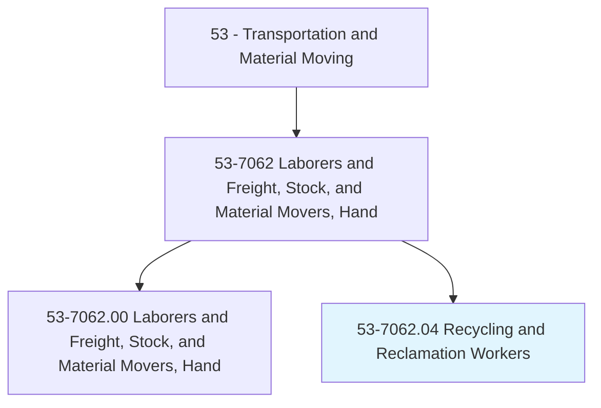
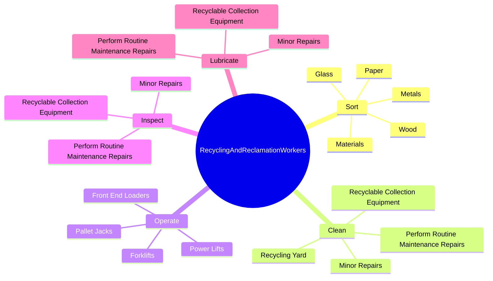
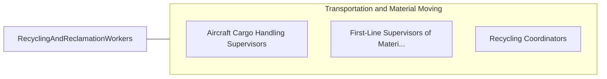

# Recycling and Reclamation Workers

> Prepare and sort materials or products for recycling. Identify and remove hazardous substances. Dismantle components of products such as appliances.

## Overview

Recycling and Reclamation Workers is a specialized variant within the Transportation and Material Moving category. Prepare and sort materials or products for recycling. Identify and remove hazardous substances.

## Classification Hierarchy

## Key Statistics

| Metric | Value |
|--------|-------|
| SOC Code | 53-7062.04 |
| Category | [Transportation and Material Moving](/occupations/Transportation/index) |
| Task Count | 123 |
| Source | O*NET |

## Core Tasks

### sort.Materials

Recycling and Reclamation Workers sort materials as part of their core responsibilities.

**Actions:**
- `sort.Materials.for.Recycling`
- `sort.Metals.for.Recycling`
- `sort.Glass.for.Recycling`
- `sort.Wood.for.Recycling`

### clean.RecyclingYard

Recycling and Reclamation Workers clean recycling yard as part of their core responsibilities.

**Actions:**
- `clean.RecyclingYard.by.Sweeping`
- `clean.RecyclingYard.by.Raking`
- `clean.RecyclingYard.by.PickingUpBrokenGlass`
- `clean.RecyclingYard.by.LoosePaperDebris`

### operate.Forklifts

Recycling and Reclamation Workers operate forklifts as part of their core responsibilities.

**Actions:**
- `operate.Forklifts.to.load.Bales`
- `operate.Forklifts.to.bundles`
- `operate.Forklifts.to.OtherHeavyItemsOntoTrucksForShippingToSmeltersRecycledMaterialsProcessingFacilities`
- `operate.Forklifts.to.OtherRecycledMaterialsProcessingFacilities`

## Skills & Competencies

### Technical Skills
- **Vehicle Operation** - Advanced
- **Logistics** - Advanced
- **Safety Compliance** - Advanced

### Soft Skills
- **Communication** - Essential
- **Problem Solving** - Essential
- **Critical Thinking** - Important
- **Teamwork** - Important
- **Adaptability** - Important

## Related Occupations

## Industries

This occupation is found across multiple industries. See [Industries](/industries) for sector-specific employment data.

## Career Progression

---

*Source: O*NET 53-7062.04 - ONETOccupation*
