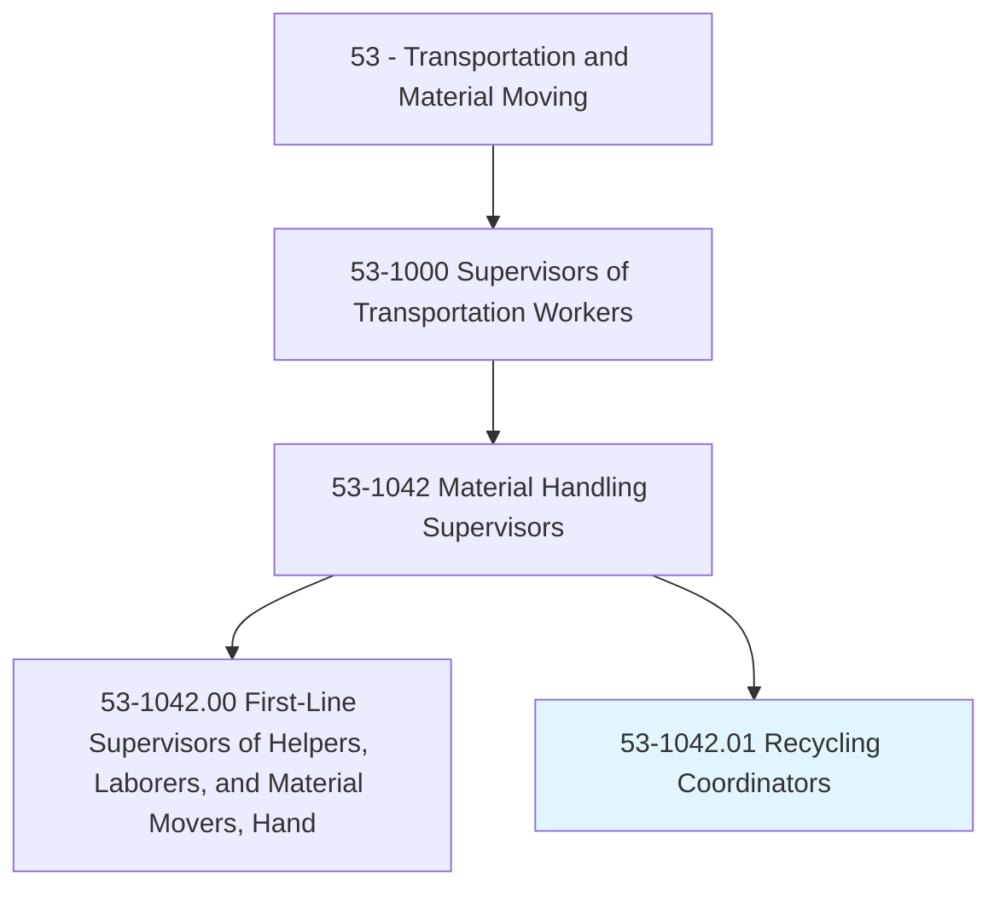
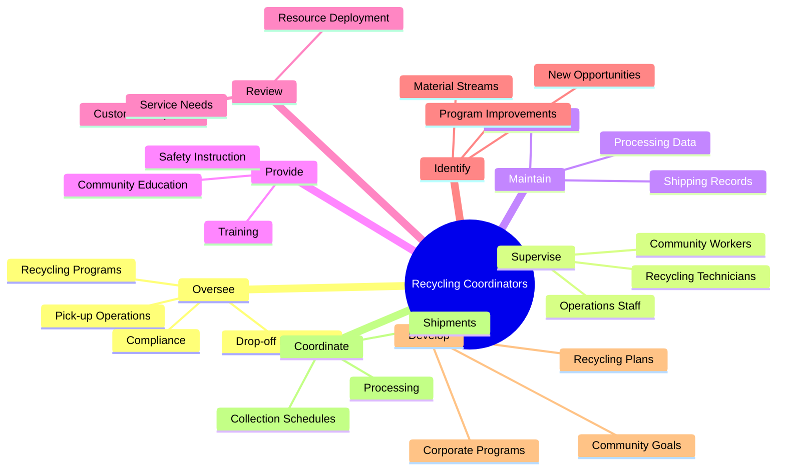
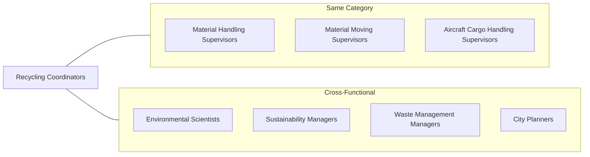
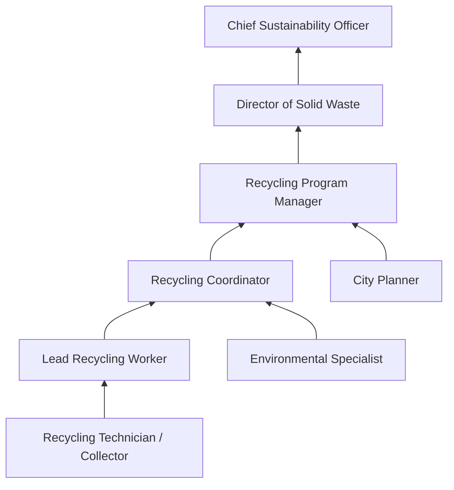

# Recycling Coordinators

> Supervise curbside and drop-off recycling programs for municipal governments or private firms.

## Overview

Recycling Coordinators manage and oversee recycling programs for municipalities, waste management companies, and private organizations. These professionals supervise recycling technicians, coordinate collection schedules, ensure regulatory compliance, and work to expand recycling participation and diversion rates. They serve at the intersection of environmental stewardship, public service, and operations management, developing programs that reduce waste, conserve resources, and promote sustainability within communities and organizations.

## Classification Hierarchy

## Key Statistics

| Metric | Value |
|--------|-------|
| SOC Code | 53-1042.01 |
| Job Zone | 3 (Medium Preparation) |
| Category | [Transportation](/occupations/Transportation) |
| Parent Occupation | [Material Handling Supervisors](./MaterialHandlingSupervisors.mdx) |
| Core Tasks | 8 |
| Supplemental Tasks | 15 |
| Source | O*NET |

## Core Tasks

### oversee.RecyclingPrograms

Recycling Coordinators manage curbside and drop-off recycling programs to ensure compliance and effectiveness.

**Actions:**
- `oversee.RecyclingPick.up.Programs.to.ensure.ComplianceWithCommunityOrdinances` - Manage curbside collection compliance
- `oversee.Drop.off.Programs.to.ensure.ComplianceWithCommunityOrdinances` - Supervise drop-off site operations
- `oversee.Campaigns.to.promote.RecyclingReductionProgramsInCommunitiesPrivateCompanies` - Lead outreach campaigns

### supervise.Staff

Recycling Coordinators supervise recycling technicians and community service workers.

**Actions:**
- `supervise.RecyclingTechnicians` - Direct recycling processing staff
- `supervise.CommunityServiceWorkers` - Coordinate community worker activities
- `supervise.OtherRecyclingOperationsEmployees` - Manage overall recycling operations team

### maintain.Records

Recycling Coordinators maintain comprehensive logs of materials and operations.

**Actions:**
- `maintain.Logs.of.RecyclingMaterialsReceived` - Track incoming recyclable materials
- `maintain.Logs.of.ShippedToProcessingCompanies` - Document outbound material shipments

### provide.Training

Recycling Coordinators develop and deliver training programs for staff and community.

**Actions:**
- `provide.Training.to.RecyclingTechniciansServiceWorkersOnTopics` - Train staff on recycling operations
- `provide.Training.to.Safety` - Instruct on safety protocols
- `provide.Training.to.SolidWasteProcessing` - Train on waste processing procedures
- `provide.Training.to.GeneralRecyclingOperations` - Provide comprehensive operations training

### review.ServiceRequests

Recycling Coordinators evaluate service needs and deploy appropriate resources.

**Actions:**
- `review.CustomerRequests.for.Service.to.determine.ServiceNeeds` - Assess customer service requirements
- `review.CustomerRequests.for.DeployAppropriateResources.to.provide.Service` - Allocate resources for service delivery

### identify.Opportunities

Recycling Coordinators discover and develop new recycling opportunities.

**Actions:**
- `identify.NewOpportunities.for.MaterialsToBeCollected` - Find new recyclable material streams
- `identify.NewOpportunities.for.Recycled` - Explore expanded recycling possibilities
- `investigate.NewOpportunities.for.MaterialsToBeCollected` - Research new material recovery options

### develop.Programs

Recycling Coordinators create recycling plans and set program goals.

**Actions:**
- `develop.CommunityRecyclingPlansGoals.to.minimize.Waste` - Create community waste reduction plans
- `develop.CommunityRecyclingPlansGoals.to.conform.ToResourceConstraints` - Design resource-appropriate programs
- `develop.CorporateRecyclingPlansGoals.to.minimize.Waste` - Develop corporate sustainability programs

### coordinate.Operations

Recycling Coordinators organize collection schedules and material shipments.

**Actions:**
- `coordinate.RecyclingCollectionSchedules.to.optimize.Service` - Plan efficient collection routes
- `coordinate.RecyclingCollectionSchedules.to.Efficiency` - Optimize collection operations
- `coordinate.Shipments.of.RecyclingMaterials.with.ShippingBrokers` - Arrange material transportation
- `coordinate.Shipments.of.ProcessingCompanies` - Coordinate with recycling processors

## Supplemental Tasks

### assign.Routes

Recycling Coordinators allocate collection routes to drivers and technicians.

**Actions:**
- `assign.TruckDrivers.to.routes` - Assign drivers to collection routes
- `assign.RecyclingTechnicians.to.routes` - Deploy technicians to service areas

### manage.Budgets

Recycling Coordinators create and manage recycling operations budgets.

**Actions:**
- `create.RecyclingOperationsBudgets` - Develop program budgets
- `manage.RecyclingOperationsBudgets` - Control budget expenditures

### prepare.Documentation

Recycling Coordinators prepare shipping and customer documentation.

**Actions:**
- `prepare.Bills.of.Statements.of.ShippingRecords` - Create shipping documentation
- `prepare.Bills.of.CustomerReceiptsRelatedToRecyclingMaterialServices` - Process customer receipts
- `prepare.GrantApplications.to.fund.RecyclingPrograms` - Write grant proposals

### inspect.Facilities

Recycling Coordinators inspect facilities for compliance with standards.

**Actions:**
- `inspect.PhysicalCondition.of.RecyclingWasteFacility.for.ComplianceWithSafety` - Audit recycling facilities
- `inspect.PhysicalCondition.of.HazardousWasteFacility.for.ComplianceWithSafety` - Inspect hazardous waste areas
- `inspect.PhysicalCondition.of.Quality` - Verify quality standards

### negotiate.Contracts

Recycling Coordinators negotiate agreements with service providers.

**Actions:**
- `negotiate.Contracts.with.WasteManagementFirms` - Establish waste management agreements
- `negotiate.Contracts.with.OtherFirms` - Secure vendor contracts

### operate.Equipment

Recycling Coordinators may operate processing and handling equipment.

**Actions:**
- `operate.RecyclingProcessingEquipment.to.sort.Materials` - Run sorting equipment
- `operate.Sorters.to.sort.Materials` - Operate material sorters
- `operate.Balers.to.process.Materials` - Operate baling equipment
- `operate.ForkLifts.to.move.RecyclableMaterials` - Move materials with forklifts

### investigate.Violations

Recycling Coordinators investigate ordinance violations and compliance issues.

**Actions:**
- `investigate.Violations.of.SolidWaste` - Investigate solid waste violations
- `investigate.Violations.of.RecyclingOrdinances` - Address recycling ordinance non-compliance

### educate.Public

Recycling Coordinators make presentations and conduct public outreach.

**Actions:**
- `make.Presentations.to.educate.PublicOnHowToRecycleEnvironmentalAdvantagesOfRecycling` - Deliver public education
- `make.Presentations.to.OnEnvironmentalAdvantagesOfRecycling` - Promote environmental benefits

### design.Programs

Recycling Coordinators design waste management programs.

**Actions:**
- `design.CommunitySolidWasteManagementPrograms` - Create solid waste programs
- `design.HazardousWasteManagementPrograms` - Develop hazardous waste handling programs

## Skills & Competencies

### Technical Skills
- **Recycling Regulations** - Advanced
- **Environmental Compliance** - Advanced
- **Waste Management Operations** - Advanced
- **Materials Processing** - Intermediate
- **Fleet Management** - Intermediate
- **Grant Writing** - Intermediate
- **Budget Management** - Intermediate

### Soft Skills
- **Leadership** - Critical
- **Communication** - Critical
- **Community Engagement** - Critical
- **Problem Solving** - Essential
- **Negotiation** - Essential
- **Public Speaking** - Essential

## Related Occupations

## Industries

- [Waste Management and Remediation Services](/industries/WasteManagement) - Highest Employment
- [Local Government](/industries/LocalGovernment) - High Employment
- [Administrative Support Services](/industries/AdministrativeServices) - Moderate Employment
- [Manufacturing](/industries/Manufacturing) - Moderate Employment (corporate recycling)
- [Educational Services](/industries/Education) - Lower Employment (campus recycling)

## Career Progression

## Education & Training

| Requirement | Details |
|-------------|---------|
| Typical Education | Associate's or Bachelor's degree preferred; environmental science, public administration |
| Work Experience | 2-4 years in recycling operations or waste management |
| On-the-Job Training | Moderate - regulatory requirements and local ordinances |
| Common Certifications | SWANA certifications, Hazmat handling, CDL (for some positions) |

## Departments

This occupation typically works in:
- [Public Works](/departments/PublicWorks)
- [Environmental Services](/departments/EnvironmentalServices)
- [Sustainability](/departments/Sustainability)
- [Solid Waste Management](/departments/SolidWaste)
- [Facilities Management](/departments/Facilities)

## Industry Variations

### Municipal Government
- Curbside collection management
- Drop-off center operations
- Community outreach and education
- Ordinance enforcement
- Grant-funded program management

### Private Waste Management Companies
- Commercial recycling services
- Industrial recycling programs
- Profit-driven efficiency focus
- Multi-client service delivery
- Market-rate material sales

### Corporate Sustainability Programs
- Internal waste reduction
- Zero-waste initiatives
- Employee engagement programs
- Sustainability reporting
- Supply chain recycling coordination

### Educational Institutions
- Campus-wide recycling
- Student engagement programs
- Research integration
- Event waste management
- Sustainability curriculum support

### Healthcare Facilities
- Regulated medical waste coordination
- Pharmaceutical recycling
- Confidential document destruction
- Single-use device recycling
- Infection control compliance

## Materials Management

Recycling Coordinators work with various material streams:

### Traditional Recyclables
- Paper and cardboard
- Plastics (by resin type)
- Glass containers
- Aluminum and steel cans
- Mixed metals

### Special Materials
- Electronics (e-waste)
- Textiles and clothing
- Construction debris
- Yard waste and organics
- Hazardous household waste

### Industrial Materials
- Scrap metal
- Industrial plastics
- Pallets and packaging
- Manufacturing byproducts
- Commercial food waste

## Technology & Tools

### Operations Management
- Route optimization software
- Fleet tracking systems
- Weighing and tracking systems
- Inventory management software

### Data and Reporting
- Recycling rate calculators
- Environmental impact tracking
- Grant management systems
- GIS mapping tools

### Processing Equipment
- Material Recovery Facilities (MRF) systems
- Sorting equipment and conveyors
- Balers and compactors
- Shredders and granulators

## Regulatory Compliance

Recycling Coordinators must ensure compliance with:
- **EPA Regulations** - Resource Conservation and Recovery Act (RCRA)
- **State Environmental Laws** - Recycling mandates and diversion goals
- **Local Ordinances** - Municipal recycling requirements
- **OSHA Standards** - Workplace safety in recycling operations
- **DOT Requirements** - Hazardous material transportation

## Key Performance Indicators

Recycling Coordinators are typically evaluated on:
- **Diversion rate** - Percentage of waste diverted from landfill
- **Contamination rate** - Quality of collected recyclables
- **Participation rate** - Community or employee participation
- **Cost per ton** - Operational efficiency metrics
- **Revenue generation** - Material sales income
- **Safety metrics** - Incident rates, compliance scores
- **Customer satisfaction** - Service quality feedback

## Environmental Impact

Recycling Coordinators contribute to sustainability through:
- **Landfill diversion** - Reducing waste sent to landfills
- **Resource conservation** - Preserving natural resources
- **Energy savings** - Reducing energy needed for virgin material production
- **Greenhouse gas reduction** - Lowering emissions from waste decomposition
- **Economic development** - Creating green jobs and circular economy opportunities

---

*Source: O*NET 53-1042.01 - ONETOccupation*
