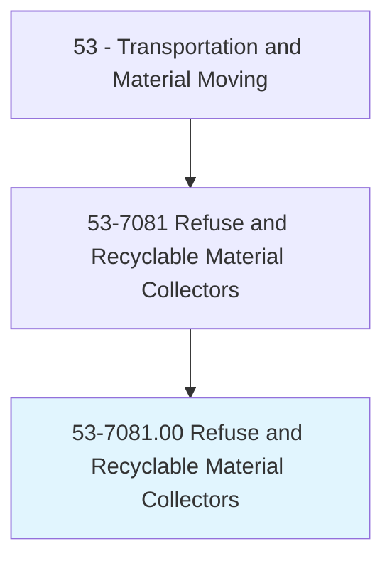
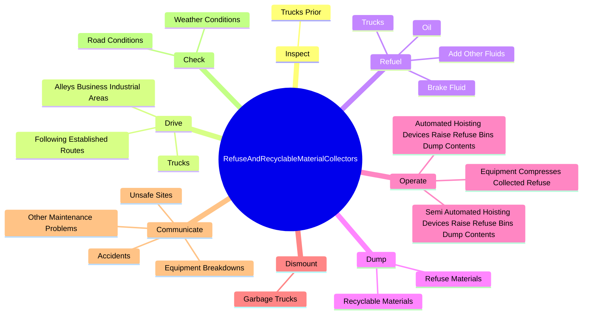
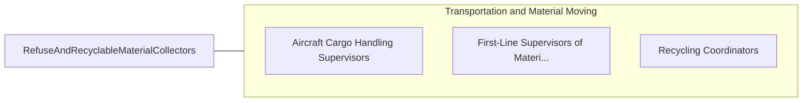

# Refuse and Recyclable Material Collectors

> Collect and dump refuse or recyclable materials from containers into truck. May drive truck.

## Overview

Refuse and Recyclable Material Collectors is an occupation within the Transportation and Material Moving category. Collect and dump refuse or recyclable materials from containers into truck. 

## Classification Hierarchy

## Key Statistics

| Metric | Value |
|--------|-------|
| SOC Code | 53-7081.00 |
| Category | [Transportation and Material Moving](/occupations/Transportation) |
| Task Count | 35 |
| Source | O*NET |

## Core Tasks

### inspect.TrucksPrior

Refuse and Recyclable Material Collectors inspect trucks prior as part of their core responsibilities.

**Actions:**
- `inspect.TrucksPrior.to.BeginningRoutesToEnsureSafeOperatingCondition`

### drive.Trucks

Refuse and Recyclable Material Collectors drive trucks as part of their core responsibilities.

**Actions:**
- `drive.Trucks`
- `drive.FollowingEstablishedRoutes`
- `drive.AlleysBusinessIndustrialAreas`

### refuel.Trucks

Refuse and Recyclable Material Collectors refuel trucks as part of their core responsibilities.

**Actions:**
- `refuel.Trucks`
- `refuel.AddOtherFluids`
- `refuel.Oil`
- `refuel.BrakeFluid`

## Skills & Competencies

### Technical Skills
- **Vehicle Operation** - Advanced
- **Logistics** - Advanced
- **Safety Compliance** - Advanced

### Soft Skills
- **Communication** - Essential
- **Problem Solving** - Essential
- **Critical Thinking** - Important
- **Teamwork** - Important
- **Adaptability** - Important

## Related Occupations

## Industries

This occupation is found across multiple industries. See [Industries](/industries) for sector-specific employment data.

## Career Progression

---

*Source: O*NET 53-7081.00 - ONETOccupation*
