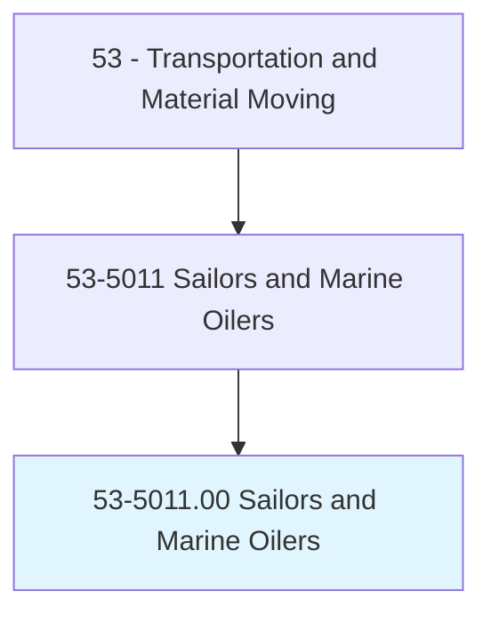
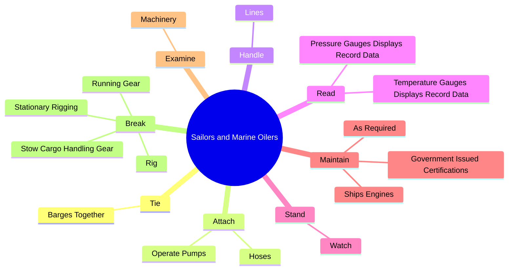
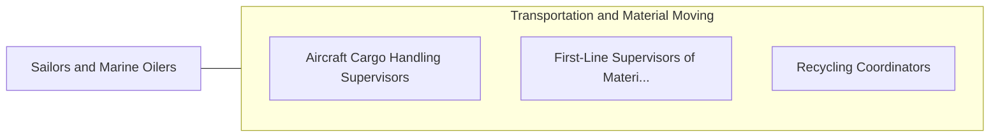

# Sailors and Marine Oilers

> Stand watch to look for obstructions in path of vessel, measure water depth, turn wheel on bridge, or use emergency equipment as directed by captain, mate, or pilot. Break out, rig, overhaul, and store cargo-handling gear, stationary rigging, and running gear. Perform a variety of maintenance tasks to preserve the painted surface of the ship and to maintain line and ship equipment. Must hold government-issued certification and tankerman certification when working aboard liquid-carrying vessels. Includes able seamen and ordinary seamen.

## Overview

Sailors and Marine Oilers is an occupation within the Transportation and Material Moving category. Stand watch to look for obstructions in path of vessel, measure water depth, turn wheel on bridge, or use emergency equipment as directed by captain, mate, or pilot. Break out, rig, overhaul, and store cargo-handling gear, stationary rigging, and running gear.

## Classification Hierarchy

## Key Statistics

| Metric | Value |
|--------|-------|
| SOC Code | 53-5011.00 |
| Category | [Transportation and Material Moving](/occupations/Transportation) |
| Task Count | 94 |
| Source | O*NET |

## Core Tasks

### tie.BargesTogether

Sailors and Marine Oilers tie barges together as part of their core responsibilities.

**Actions:**
- `tie.BargesTogether.into.TowUnits.for.TugboatsToHandle`
- `tie.BargesTogether.into.TowUnits.for.InspectingBargesPeriodicallyDuringVoyages`
- `tie.BargesTogether.into.TowUnits.for.DisconnectingThemWhenDestinationsAreReached`

### attach.Hoses

Sailors and Marine Oilers attach hoses as part of their core responsibilities.

**Actions:**
- `attach.Hoses.to.transfer.SubstancesToLiquidCargoTanks`
- `attach.Hoses.to.FromLiquidCargoTanks`
- `attach.OperatePumps.to.transfer.SubstancesToLiquidCargoTanks`
- `attach.OperatePumps.to.FromLiquidCargoTanks`

### handle.Lines

Sailors and Marine Oilers handle lines as part of their core responsibilities.

**Actions:**
- `handle.Lines.to.MoorVesselsToWharfs`
- `handle.Lines.to.ToTieUpVesselsToOtherVessels`
- `handle.Lines.to.ToRigTowingLines`

## Skills & Competencies

### Technical Skills
- **Vehicle Operation** - Advanced
- **Logistics** - Advanced
- **Safety Compliance** - Advanced

### Soft Skills
- **Communication** - Essential
- **Problem Solving** - Essential
- **Critical Thinking** - Important
- **Teamwork** - Important
- **Adaptability** - Important

## Related Occupations

## Industries

This occupation is found across multiple industries. See [Industries](/industries) for sector-specific employment data.

## Career Progression

---

*Source: O*NET 53-5011.00 - ONETOccupation*
