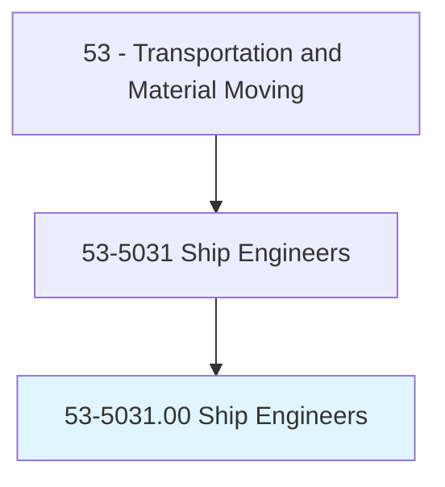
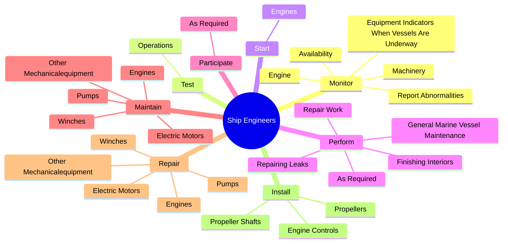
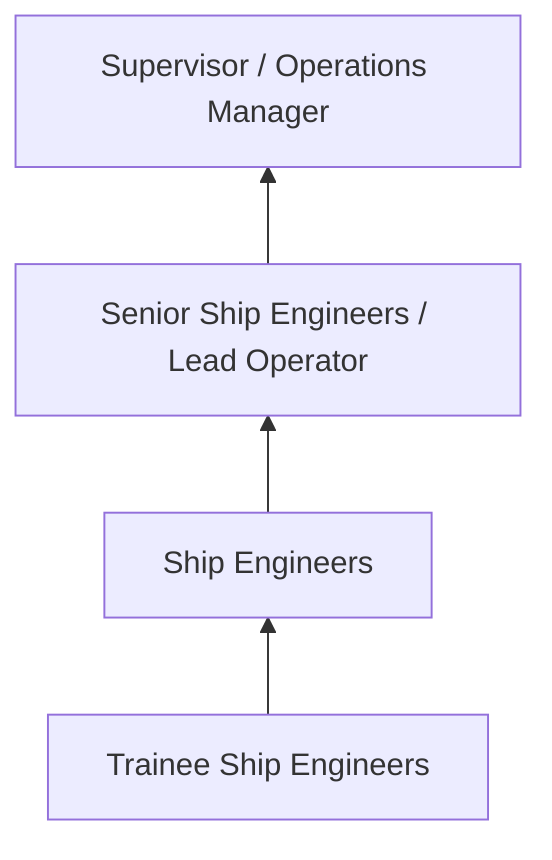
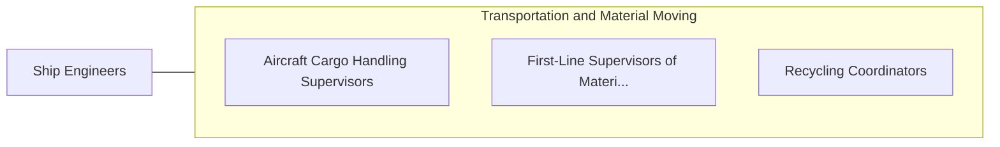

# Ship Engineers

> Supervise and coordinate activities of crew engaged in operating and maintaining engines, boilers, deck machinery, and electrical, sanitary, and refrigeration equipment aboard ship.

## Overview

Ship Engineers professionals supervise and coordinate activities of crew engaged in operating and maintaining engines, boilers, deck machinery, and electrical, sanitary, and refrigeration equipment aboard ship.. This occupation falls within the Transportation and Material Moving category and requires a combination of specialized knowledge, technical skills, and practical experience.

These professionals work across diverse settings and organizational contexts, applying their expertise to meet the demands of their field. They must stay current with industry standards, emerging practices, and regulatory requirements that affect their work. The role demands both independent judgment and collaborative skills, as practitioners regularly interact with colleagues, stakeholders, and the public.

As the field continues to evolve, Ship Engineers professionals increasingly leverage technology and data-driven approaches to enhance their effectiveness. Career opportunities span the public and private sectors, with demand influenced by economic conditions, demographic shifts, and technological advancement.

## Classification Hierarchy



## Key Statistics

| Metric | Value |
|--------|-------|
| SOC Code | 53-5031.00 |
| Job Zone | N/A |
| Category | [Transportation and Material Moving](/occupations/Transportation/index) |
| Core Tasks | 100+ |
| Salary Range | $30,000 - $75,000 |
| Median Salary | $45,000 |
| Growth Outlook | 6% (As fast as average) |
| Source | O*NET |

## Core Tasks



### maintain.Engines

Ship Engineers maintain engines as part of their core responsibilities.

**Actions:**
- `maintain.Engines.with.Maintenance` - Maintain or repair engines, electric motors, pumps, winches, or other mechani...
- `maintain.Engines.with.RepairDuties` - Maintain or repair engines, electric motors, pumps, winches, or other mechani...
- `maintain.ElectricMotors.with.Maintenance` - Maintain or repair engines, electric motors, pumps, winches, or other mechani...
- `maintain.ElectricMotors.with.RepairDuties` - Maintain or repair engines, electric motors, pumps, winches, or other mechani...
- `maintain.Pumps.with.Maintenance` - Maintain or repair engines, electric motors, pumps, winches, or other mechani...

### repair.Engines

Ship Engineers repair engines as part of their core responsibilities.

**Actions:**
- `repair.Engines.with.Maintenance` - Maintain or repair engines, electric motors, pumps, winches, or other mechani...
- `repair.Engines.with.RepairDuties` - Maintain or repair engines, electric motors, pumps, winches, or other mechani...
- `repair.ElectricMotors.with.Maintenance` - Maintain or repair engines, electric motors, pumps, winches, or other mechani...
- `repair.ElectricMotors.with.RepairDuties` - Maintain or repair engines, electric motors, pumps, winches, or other mechani...
- `repair.Pumps.with.Maintenance` - Maintain or repair engines, electric motors, pumps, winches, or other mechani...

### monitor.Engine

Ship Engineers monitor engine as part of their core responsibilities.

**Actions:**
- `monitor.Engine.to.appropriate.ShipboardStaff` - Monitor engine, machinery, or equipment indicators when vessels are underway,...
- `monitor.Machinery.to.appropriate.ShipboardStaff` - Monitor engine, machinery, or equipment indicators when vessels are underway,...
- `monitor.EquipmentIndicatorsWhenVesselsAreUnderway.to.appropriate.ShipboardStaff` - Monitor engine, machinery, or equipment indicators when vessels are underway,...
- `monitor.ReportAbnormalities.to.appropriate.ShipboardStaff` - Monitor engine, machinery, or equipment indicators when vessels are underway,...
- `monitor.Availability.of.LifesavingEquipmentPreventatives.to.ensure.InternationalRegulationsAreFollowed` - Monitor the availability, use, or condition of lifesaving equipment or pollut...

### record.Orders

Ship Engineers record orders as part of their core responsibilities.

**Actions:**
- `record.Orders.for.Changes.in.ShipSpeed` - Record orders for changes in ship speed or direction, and note gauge readings...
- `record.Orders.for.Direction` - Record orders for changes in ship speed or direction, and note gauge readings...
- `record.Orders.for.NoteGaugeReadings` - Record orders for changes in ship speed or direction, and note gauge readings...
- `record.Orders.for.TestData` - Record orders for changes in ship speed or direction, and note gauge readings...
- `record.Orders.for.RevolutionsPerMinute` - Record orders for changes in ship speed or direction, and note gauge readings...


## Skills & Competencies

### Technical Skills
- **Equipment Operation** - Advanced
- **Safety Procedures** - Advanced
- **Navigation Systems** - Proficient
- **Load Management** - Proficient
- **Vehicle Inspection** - Proficient
- **Regulatory Compliance** - Proficient

### Soft Skills
- **Situational Awareness** - Critical
- **Reliability** - Critical
- **Time Management** - Essential
- **Communication** - Essential
- **Physical Stamina** - Essential

## Education & Certifications

| Requirement | Details |
|-------------|---------|
| Typical Education | High school diploma or equivalent; some positions require post-secondary training |
| Work Experience | 0-2 years on-the-job experience |
| On-the-Job Training | Moderate - safety and equipment operation training |
| Certifications | CDL, hazmat endorsements, or transportation-specific licenses |

## Career Progression



## Industry Variations

### Freight and Logistics
Commercial transportation of goods. Ship Engineers professionals focus on efficiency, safety, and timely delivery across supply chains.

### Public Transit
Passenger transportation services. Emphasis on schedules, safety, and customer service in public-facing roles.

### Warehousing and Distribution
Material handling and storage operations. Focus on inventory management and order fulfillment efficiency.

### Specialized Transport
Hazardous materials, oversized loads, or temperature-controlled transport requiring additional certifications and safety protocols.

## Technology & Tools

- **GPS and navigation systems**
- **Fleet management software**
- **Electronic logging devices (ELD)**
- **Warehouse management systems (WMS)**
- **Transportation management systems (TMS)**

## Related Occupations



## Industries

- [Trucking and Freight](/industries/Trucking) - High Employment
- [Warehousing and Storage](/industries/Warehousing) - High Employment
- [Air Transportation](/industries/AirTransportation) - Moderate Employment
- [Rail Transportation](/industries/RailTransportation) - Moderate Employment

## Departments

This occupation typically works in:
- [Operations](/departments/Operations/index)
- [Logistics](/departments/SupplyChain)
- Fleet Management

## GraphDL Semantic Structure

```graphdl
Ship Engineers perform:
- monitor.Engine.to.appropriate.ShipboardStaff
- monitor.Machinery.to.appropriate.ShipboardStaff
- monitor.EquipmentIndicatorsWhenVesselsAreUnderway.to.appropriate.ShipboardStaff
- monitor.ReportAbnormalities.to.appropriate.ShipboardStaff
- monitor.Availability.of.LifesavingEquipmentPreventatives.to.ensure.InternationalRegulationsAreFollowed
- monitor.Availability.of.PollutionPreventatives.to.ensure.InternationalRegulationsAreFollowed
```

---

*Source: O*NET 53-5031.00 - ONETOccupation*
