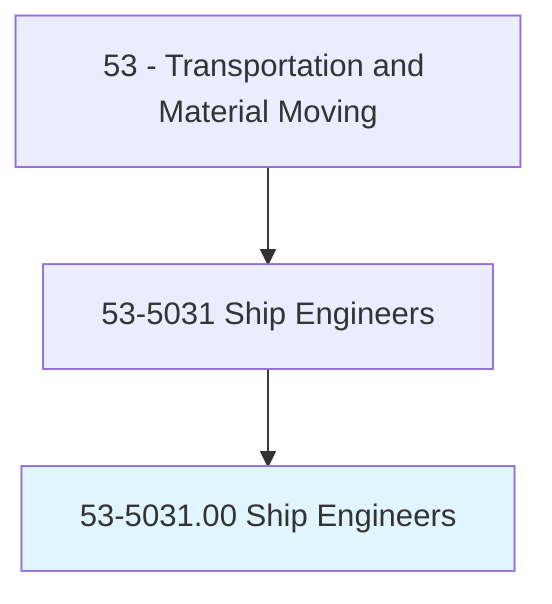
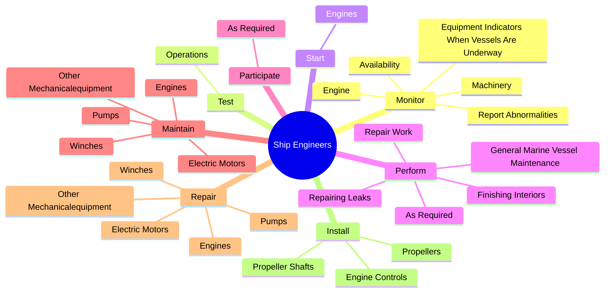
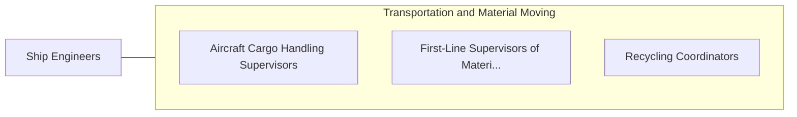

# Ship Engineers

> Supervise and coordinate activities of crew engaged in operating and maintaining engines, boilers, deck machinery, and electrical, sanitary, and refrigeration equipment aboard ship.

## Overview

Ship Engineers is classified under Transportation and Material Moving (SOC 53). Supervise and coordinate activities of crew engaged in operating and maintaining engines, boilers, deck machinery, and electrical, sanitary, and refrigeration equipment aboard ship.

## Classification Hierarchy

## Key Statistics

| Metric | Value |
|--------|-------|
| SOC Code | 53-5031.00 |
| Category | [Transportation and Material Moving](/occupations/Transportation/index) |
| Task Count | 100 |
| Source | O*NET |

## Core Tasks

### monitor.Engine

Ship Engineers monitor engine as part of their core responsibilities.

**Actions:**
- `monitor.Engine.to.appropriate.ShipboardStaff`
- `monitor.Machinery.to.appropriate.ShipboardStaff`
- `monitor.EquipmentIndicatorsWhenVesselsAreUnderway.to.appropriate.ShipboardStaff`
- `monitor.ReportAbnormalities.to.appropriate.ShipboardStaff`

### test.Operations

Ship Engineers test operations as part of their core responsibilities.

**Actions:**
- `test.Operations.of.EnginesEquipmentSoMalfunctionsCausesCanBeIdentified`
- `test.Operations.of.OtherEquipmentSoMalfunctionsCausesCanBeIdentified`

### start.Engines

Ship Engineers start engines as part of their core responsibilities.

**Actions:**
- `start.Engines.to.PropelShips`
- `start.Engines.to.RegulateEngines`
- `start.Engines.to.PowerTransmissionsToControlSpeedsOfShips`
- `start.Engines.to.AccordingToDirectionsFromCaptains`

## Skills & Competencies

### Technical Skills
- **Vehicle Operation** - Advanced
- **Logistics** - Advanced
- **Safety Compliance** - Advanced

### Soft Skills
- **Communication** - Essential
- **Problem Solving** - Essential
- **Critical Thinking** - Important
- **Teamwork** - Important
- **Adaptability** - Important

## Related Occupations

## Industries

This occupation is found across multiple industries. See [Industries](/industries) for sector-specific employment data.

## Career Progression

---

*Source: O*NET 53-5031.00 - ONETOccupation*
