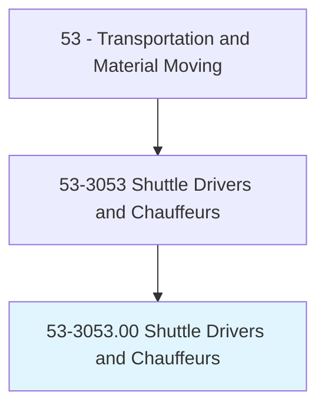
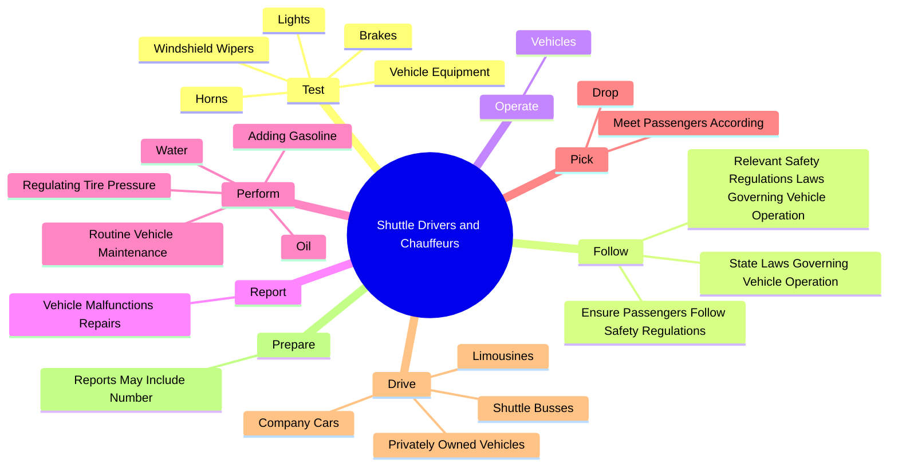
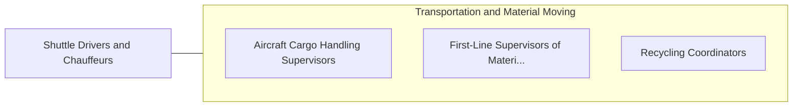

# Shuttle Drivers and Chauffeurs

> Drive a motor vehicle to transport passengers on a planned or scheduled basis. May collect a fare. Includes nonemergency medical transporters and hearse drivers.

## Overview

Shuttle Drivers and Chauffeurs is an occupation within the Transportation and Material Moving category. Drive a motor vehicle to transport passengers on a planned or scheduled basis. May collect a fare.

## Classification Hierarchy

## Key Statistics

| Metric | Value |
|--------|-------|
| SOC Code | 53-3053.00 |
| Category | [Transportation and Material Moving](/occupations/Transportation/index) |
| Task Count | 67 |
| Source | O*NET |

## Core Tasks

### test.VehicleEquipment

Shuttle Drivers and Chauffeurs test vehicle equipment as part of their core responsibilities.

**Actions:**
- `test.VehicleEquipment.to.ensure.ProperOperation`
- `test.Lights.to.ensure.ProperOperation`
- `test.Brakes.to.ensure.ProperOperation`
- `test.Horns.to.ensure.ProperOperation`

### follow.RelevantSafetyRegulationsLawsGoverningVehicleOperation

Shuttle Drivers and Chauffeurs follow relevant safety regulations laws governing vehicle operation as part of their core responsibilities.

**Actions:**
- `follow.RelevantSafetyRegulationsLawsGoverningVehicleOperation`
- `follow.StateLawsGoverningVehicleOperation`
- `follow.EnsurePassengersFollowSafetyRegulations`

### operate.Vehicles

Shuttle Drivers and Chauffeurs operate vehicles as part of their core responsibilities.

**Actions:**
- `operate.Vehicles.with.SpecializedEquipment`
- `operate.Vehicles.with.WheelchairLifts`
- `operate.Vehicles.with.ToTransport`
- `operate.Vehicles.with.SecurePassengers.with.SpecialNeeds`

## Skills & Competencies

### Technical Skills
- **Vehicle Operation** - Advanced
- **Logistics** - Advanced
- **Safety Compliance** - Advanced

### Soft Skills
- **Communication** - Essential
- **Problem Solving** - Essential
- **Critical Thinking** - Important
- **Teamwork** - Important
- **Adaptability** - Important

## Related Occupations

## Industries

This occupation is found across multiple industries. See [Industries](/industries) for sector-specific employment data.

## Career Progression

---

*Source: O*NET 53-3053.00 - ONETOccupation*
