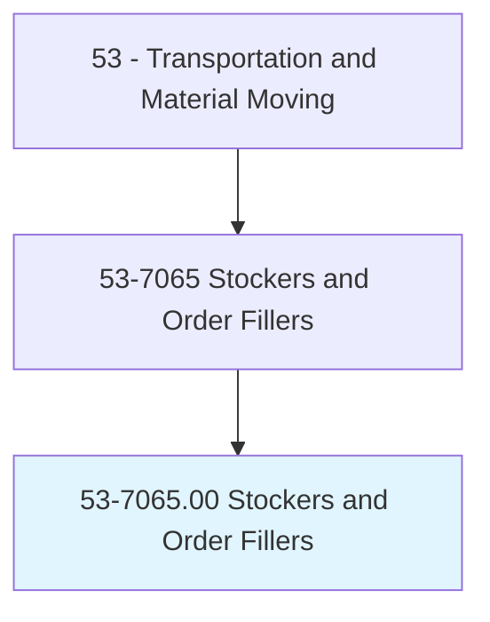
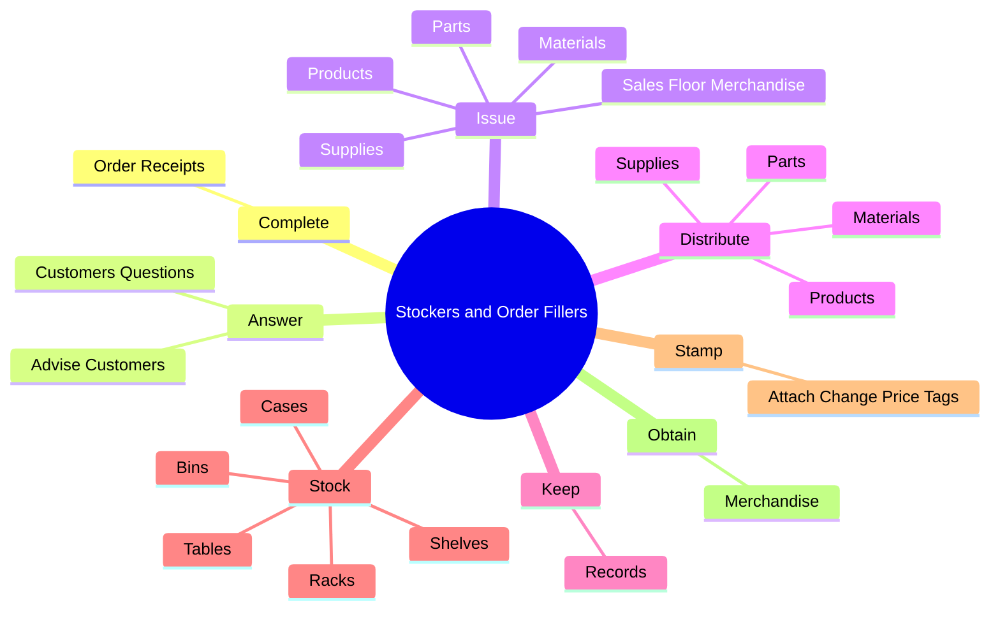
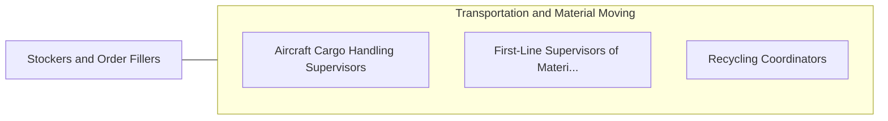

# Stockers and Order Fillers

> Receive, store, and issue merchandise, materials, equipment, and other items from stockroom, warehouse, or storage yard to fill shelves, racks, tables, or customers' orders. May operate power equipment to fill orders. May mark prices on merchandise and set up sales displays.

## Overview

Stockers and Order Fillers is an occupation within the Transportation and Material Moving category. Receive, store, and issue merchandise, materials, equipment, and other items from stockroom, warehouse, or storage yard to fill shelves, racks, tables, or customers' orders. May operate power equipment to fill orders.

## Classification Hierarchy

## Key Statistics

| Metric | Value |
|--------|-------|
| SOC Code | 53-7065.00 |
| Category | [Transportation and Material Moving](/occupations/Transportation) |
| Task Count | 130 |
| Source | O*NET |

## Core Tasks

### complete.OrderReceipts

Stockers and Order Fillers complete order receipts as part of their core responsibilities.

**Actions:**
- `complete.OrderReceipts`

### answer.CustomersQuestions

Stockers and Order Fillers answer customers questions as part of their core responsibilities.

**Actions:**
- `answer.CustomersQuestions.about.Merchandise.on.MerchandiseSelection`
- `answer.AdviseCustomers.on.MerchandiseSelection`

### issue.Materials

Stockers and Order Fillers issue materials as part of their core responsibilities.

**Actions:**
- `issue.Materials.to.CustomersBasedOnInformationFromIncomingRequisitions`
- `issue.Materials.to.CoworkersBasedOnInformationFromIncomingRequisitions`
- `issue.Products.to.CustomersBasedOnInformationFromIncomingRequisitions`
- `issue.Products.to.CoworkersBasedOnInformationFromIncomingRequisitions`

## Skills & Competencies

### Technical Skills
- **Vehicle Operation** - Advanced
- **Logistics** - Advanced
- **Safety Compliance** - Advanced

### Soft Skills
- **Communication** - Essential
- **Problem Solving** - Essential
- **Critical Thinking** - Important
- **Teamwork** - Important
- **Adaptability** - Important

## Related Occupations

## Industries

This occupation is found across multiple industries. See [Industries](/industries) for sector-specific employment data.

## Career Progression

---

*Source: O*NET 53-7065.00 - ONETOccupation*
