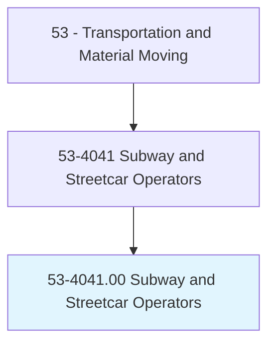
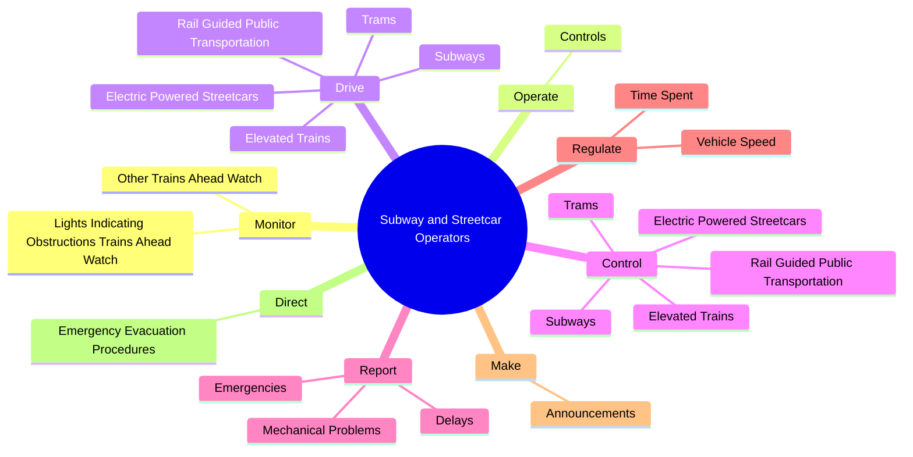
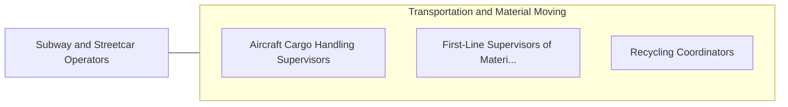

# Subway and Streetcar Operators

> Operate subway or elevated suburban trains with no separate locomotive, or electric-powered streetcar, to transport passengers. May handle fares.

## Overview

Subway and Streetcar Operators is an occupation within the Transportation and Material Moving category. Operate subway or elevated suburban trains with no separate locomotive, or electric-powered streetcar, to transport passengers. 

## Classification Hierarchy

## Key Statistics

| Metric | Value |
|--------|-------|
| SOC Code | 53-4041.00 |
| Category | [Transportation and Material Moving](/occupations/Transportation/index) |
| Task Count | 42 |
| Source | O*NET |

## Core Tasks

### monitor.LightsIndicatingObstructionsTrainsAheadWatch

Subway and Streetcar Operators monitor lights indicating obstructions trains ahead watch as part of their core responsibilities.

**Actions:**
- `monitor.LightsIndicatingObstructionsTrainsAheadWatch.for.CarTrafficAtCrossings.to.stay.AlertToPotentialHazards`
- `monitor.LightsIndicatingObstructionsTrainsAheadWatch.for.TruckTrafficAtCrossings.to.stay.AlertToPotentialHazards`
- `monitor.OtherTrainsAheadWatch.for.CarTrafficAtCrossings.to.stay.AlertToPotentialHazards`
- `monitor.OtherTrainsAheadWatch.for.TruckTrafficAtCrossings.to.stay.AlertToPotentialHazards`

### operate.Controls

Subway and Streetcar Operators operate controls as part of their core responsibilities.

**Actions:**
- `operate.Controls.to.open.TransitVehicleDoors`
- `operate.Controls.to.close.TransitVehicleDoors`

### drive.RailGuidedPublicTransportation

Subway and Streetcar Operators drive rail guided public transportation as part of their core responsibilities.

**Actions:**
- `drive.RailGuidedPublicTransportation.to.transport.Passengers`
- `drive.Subways.to.transport.Passengers`
- `drive.ElevatedTrains.to.transport.Passengers`
- `drive.ElectricPoweredStreetcars.to.transport.Passengers`

## Skills & Competencies

### Technical Skills
- **Vehicle Operation** - Advanced
- **Logistics** - Advanced
- **Safety Compliance** - Advanced

### Soft Skills
- **Communication** - Essential
- **Problem Solving** - Essential
- **Critical Thinking** - Important
- **Teamwork** - Important
- **Adaptability** - Important

## Related Occupations

## Industries

This occupation is found across multiple industries. See [Industries](/industries) for sector-specific employment data.

## Career Progression

---

*Source: O*NET 53-4041.00 - ONETOccupation*
