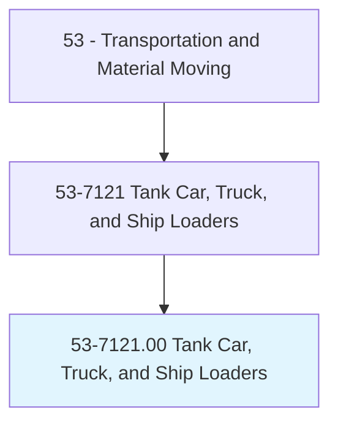
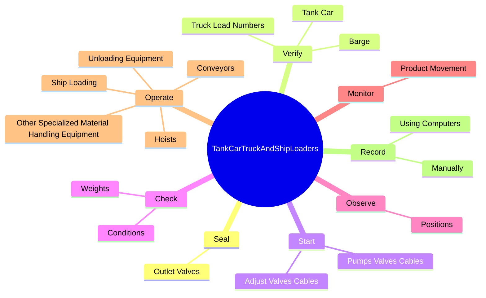
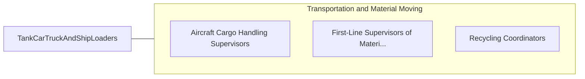

# Tank Car, Truck, and Ship Loaders

> Load and unload chemicals and bulk solids, such as coal, sand, and grain, into or from tank cars, trucks, or ships, using material moving equipment. May perform a variety of other tasks relating to shipment of products. May gauge or sample shipping tanks and test them for leaks.

## Overview

Tank Car, Truck, and Ship Loaders is an occupation within the Transportation and Material Moving category. Load and unload chemicals and bulk solids, such as coal, sand, and grain, into or from tank cars, trucks, or ships, using material moving equipment. May perform a variety of other tasks relating to shipment of products.

## Classification Hierarchy

## Key Statistics

| Metric | Value |
|--------|-------|
| SOC Code | 53-7121.00 |
| Category | [Transportation and Material Moving](/occupations/Transportation/index) |
| Task Count | 92 |
| Source | O*NET |

## Core Tasks

### seal.OutletValves

Tank Car, Truck, and Ship Loaders seal outlet valves as part of their core responsibilities.

**Actions:**
- `seal.OutletValves.on.TankCars`
- `seal.OutletValves.on.Barges`
- `seal.OutletValves.on.Trucks`

### verify.TankCar

Tank Car, Truck, and Ship Loaders verify tank car as part of their core responsibilities.

**Actions:**
- `verify.TankCar.to.ensure.CarPlacementAccuracyBasedOnWrittenInstructions`
- `verify.TankCar.to.VerbalInstructions`
- `verify.Barge.to.ensure.CarPlacementAccuracyBasedOnWrittenInstructions`
- `verify.Barge.to.VerbalInstructions`

### start.PumpsValvesCables

Tank Car, Truck, and Ship Loaders start pumps valves cables as part of their core responsibilities.

**Actions:**
- `start.PumpsValvesCables.to.regulate.FlowOfProductsToVessels`
- `start.PumpsValvesCables.to.UsingKnowledgeOfLoadingProcedures`
- `start.AdjustValvesCables.to.regulate.FlowOfProductsToVessels`
- `start.AdjustValvesCables.to.UsingKnowledgeOfLoadingProcedures`

## Skills & Competencies

### Technical Skills
- **Vehicle Operation** - Advanced
- **Logistics** - Advanced
- **Safety Compliance** - Advanced

### Soft Skills
- **Communication** - Essential
- **Problem Solving** - Essential
- **Critical Thinking** - Important
- **Teamwork** - Important
- **Adaptability** - Important

## Related Occupations

## Industries

This occupation is found across multiple industries. See [Industries](/industries) for sector-specific employment data.

## Career Progression

---

*Source: O*NET 53-7121.00 - ONETOccupation*
