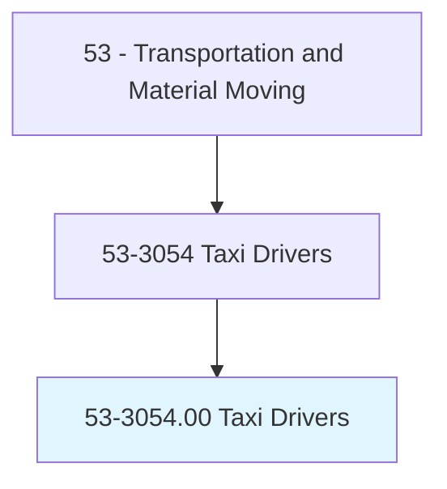
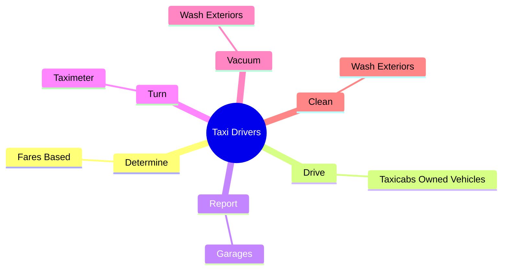
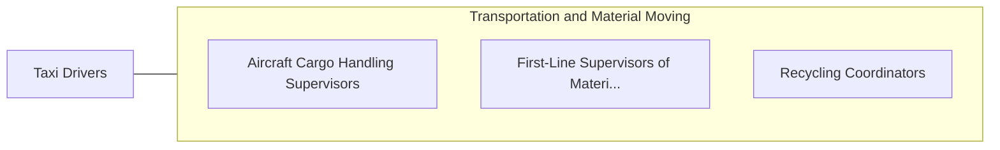

# Taxi Drivers

> Drive a motor vehicle to transport passengers on an unplanned basis and charge a fare, usually based on a meter.

## Overview

Taxi Drivers is classified under Transportation and Material Moving (SOC 53). Drive a motor vehicle to transport passengers on an unplanned basis and charge a fare, usually based on a meter.

## Classification Hierarchy

## Key Statistics

| Metric | Value |
|--------|-------|
| SOC Code | 53-3054.00 |
| Category | [Transportation and Material Moving](/occupations/Transportation/index) |
| Task Count | 11 |
| Source | O*NET |

## Core Tasks

### determine.FaresBased

Taxi Drivers determine fares based as part of their core responsibilities.

**Actions:**
- `determine.FaresBased.on.TripDistances`
- `determine.FaresBased.on.Times`
- `determine.FaresBased.on.UsingTaximeters`
- `determine.FaresBased.on.FeeSchedules`

### drive.TaxicabsOwnedVehicles

Taxi Drivers drive taxicabs owned vehicles as part of their core responsibilities.

**Actions:**
- `drive.TaxicabsOwnedVehicles.to.transport.Passengers`

### report.Garages

Taxi Drivers report garages as part of their core responsibilities.

**Actions:**
- `report.Garages.to.receive.VehicleAssignments`

## Skills & Competencies

### Technical Skills
- **Vehicle Operation** - Advanced
- **Logistics** - Advanced
- **Safety Compliance** - Advanced

### Soft Skills
- **Communication** - Essential
- **Problem Solving** - Essential
- **Critical Thinking** - Important
- **Teamwork** - Important
- **Adaptability** - Important

## Related Occupations

## Industries

This occupation is found across multiple industries. See [Industries](/industries) for sector-specific employment data.

## Career Progression

---

*Source: O*NET 53-3054.00 - ONETOccupation*
