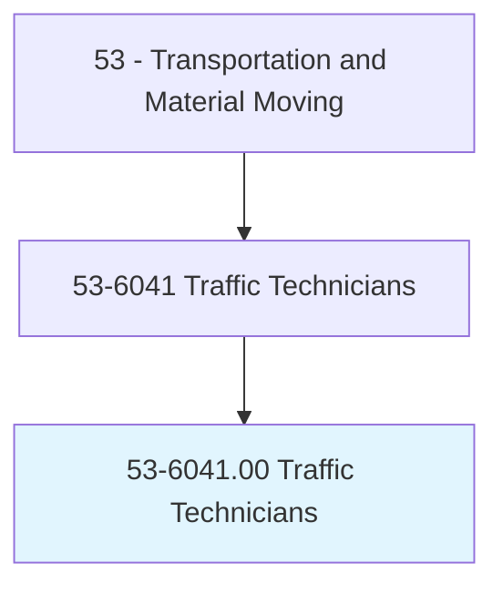
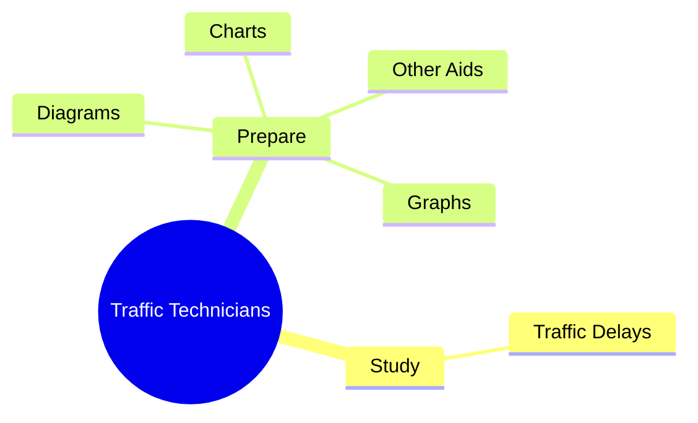
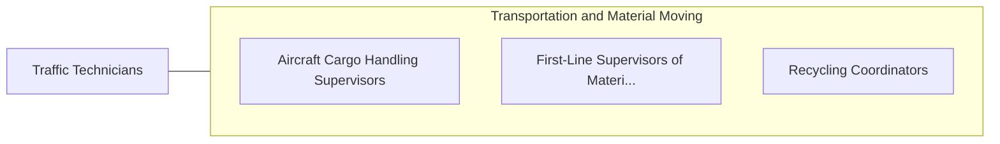

# Traffic Technicians

> Conduct field studies to determine traffic volume, speed, effectiveness of signals, adequacy of lighting, and other factors influencing traffic conditions, under direction of traffic engineer.

## Overview

Traffic Technicians is classified under Transportation and Material Moving (SOC 53). Conduct field studies to determine traffic volume, speed, effectiveness of signals, adequacy of lighting, and other factors influencing traffic conditions, under direction of traffic engineer.

## Classification Hierarchy

## Key Statistics

| Metric | Value |
|--------|-------|
| SOC Code | 53-6041.00 |
| Category | [Transportation and Material Moving](/occupations/Transportation/index) |
| Task Count | 100 |
| Source | O*NET |

## Core Tasks

### study.TrafficDelays

Traffic Technicians study traffic delays as part of their core responsibilities.

**Actions:**
- `study.TrafficDelays.by.NotingTimes.of.Delays`
- `study.TrafficDelays.by.Numbers.of.VehiclesAffected`
- `study.TrafficDelays.by.VehicleSpeedThroughDelayArea`

### prepare.Graphs

Traffic Technicians prepare graphs as part of their core responsibilities.

**Actions:**
- `prepare.Graphs.to.illustrate.Observations`
- `prepare.Graphs.to.Conclusions`
- `prepare.Charts.to.illustrate.Observations`
- `prepare.Charts.to.Conclusions`

## Skills & Competencies

### Technical Skills
- **Vehicle Operation** - Advanced
- **Logistics** - Advanced
- **Safety Compliance** - Advanced

### Soft Skills
- **Communication** - Essential
- **Problem Solving** - Essential
- **Critical Thinking** - Important
- **Teamwork** - Important
- **Adaptability** - Important

## Related Occupations

## Industries

This occupation is found across multiple industries. See [Industries](/industries) for sector-specific employment data.

## Career Progression

---

*Source: O*NET 53-6041.00 - ONETOccupation*
