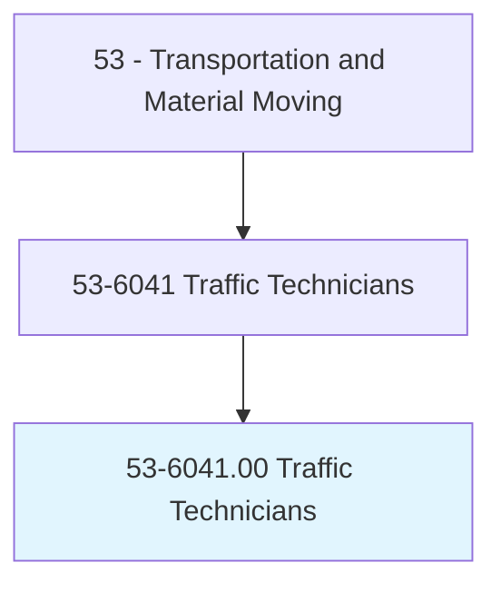
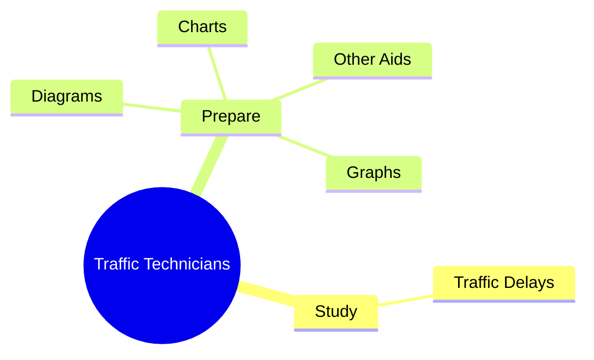
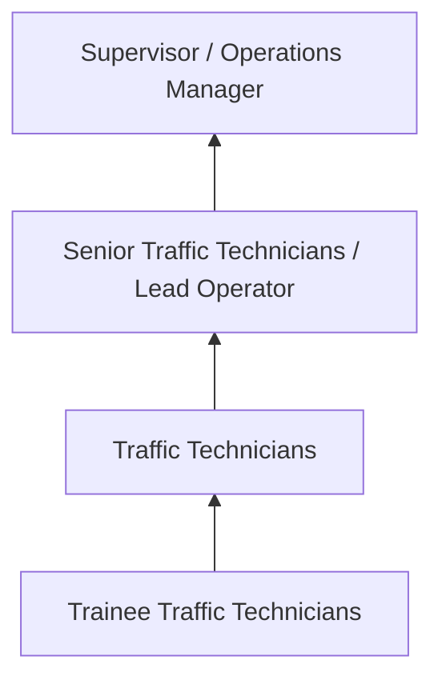
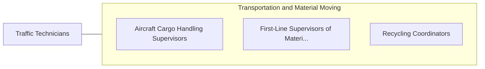

# Traffic Technicians

> Conduct field studies to determine traffic volume, speed, effectiveness of signals, adequacy of lighting, and other factors influencing traffic conditions, under direction of traffic engineer.

## Overview

Traffic Technicians professionals conduct field studies to determine traffic volume, speed, effectiveness of signals, adequacy of lighting, and other factors influencing traffic conditions, under direction of traffic engineer.. This occupation falls within the Transportation and Material Moving category and requires a combination of specialized knowledge, technical skills, and practical experience.

These professionals work across diverse settings and organizational contexts, applying their expertise to meet the demands of their field. They must stay current with industry standards, emerging practices, and regulatory requirements that affect their work. The role demands both independent judgment and collaborative skills, as practitioners regularly interact with colleagues, stakeholders, and the public.

As the field continues to evolve, Traffic Technicians professionals increasingly leverage technology and data-driven approaches to enhance their effectiveness. Career opportunities span the public and private sectors, with demand influenced by economic conditions, demographic shifts, and technological advancement.

## Classification Hierarchy



## Key Statistics

| Metric | Value |
|--------|-------|
| SOC Code | 53-6041.00 |
| Job Zone | N/A |
| Category | [Transportation and Material Moving](/occupations/Transportation/index) |
| Core Tasks | 100+ |
| Salary Range | $30,000 - $75,000 |
| Median Salary | $45,000 |
| Growth Outlook | 6% (As fast as average) |
| Source | O*NET |

## Core Tasks



### prepare.Graphs

Traffic Technicians prepare graphs as part of their core responsibilities.

**Actions:**
- `prepare.Graphs.to.illustrate.Observations` - Prepare graphs, charts, diagrams, or other aids to illustrate observations or...
- `prepare.Graphs.to.Conclusions` - Prepare graphs, charts, diagrams, or other aids to illustrate observations or...
- `prepare.Charts.to.illustrate.Observations` - Prepare graphs, charts, diagrams, or other aids to illustrate observations or...
- `prepare.Charts.to.Conclusions` - Prepare graphs, charts, diagrams, or other aids to illustrate observations or...
- `prepare.Diagrams.to.illustrate.Observations` - Prepare graphs, charts, diagrams, or other aids to illustrate observations or...

### review.TrafficControlPlans

Traffic Technicians review traffic control plans as part of their core responsibilities.

**Actions:**
- `review.TrafficControlPlans.to.issue.PermitsForParadesSpecialEventsForConstructionWorkAffectsRightsOfWay` - Review traffic control or barricade plans to issue permits for parades or oth...
- `review.TrafficControlPlans.to.OtherSpecialEventsForConstructionWorkAffectsRightsOfWay` - Review traffic control or barricade plans to issue permits for parades or oth...
- `review.TrafficControlPlans.to.ProvidingAssistanceWithPlanPreparation` - Review traffic control or barricade plans to issue permits for parades or oth...
- `review.TrafficControlPlans.to.Revision` - Review traffic control or barricade plans to issue permits for parades or oth...
- `review.TrafficControlPlans.to.AsNecessary` - Review traffic control or barricade plans to issue permits for parades or oth...

### operate.Counters

Traffic Technicians operate counters as part of their core responsibilities.

**Actions:**
- `operate.Counters.to.assess.Volume` - Operate counters and record data to assess the volume, type, and movement of ...
- `operate.Counters.to.type` - Operate counters and record data to assess the volume, type, and movement of ...
- `operate.Counters.to.MovementOfVehicularTrafficAtSpecifiedTimes` - Operate counters and record data to assess the volume, type, and movement of ...
- `operate.Counters.to.PedestrianTrafficAtSpecifiedTimes` - Operate counters and record data to assess the volume, type, and movement of ...
- `operate.RecordData.to.assess.Volume` - Operate counters and record data to assess the volume, type, and movement of ...

### study.TrafficDelays

Traffic Technicians study traffic delays as part of their core responsibilities.

**Actions:**
- `study.TrafficDelays.by.NotingTimes.of.Delays` - Study traffic delays by noting times of delays, the numbers of vehicles affec...
- `study.TrafficDelays.by.Numbers.of.VehiclesAffected` - Study traffic delays by noting times of delays, the numbers of vehicles affec...
- `study.TrafficDelays.by.VehicleSpeedThroughDelayArea` - Study traffic delays by noting times of delays, the numbers of vehicles affec...
- `study.FactorsAffectingTrafficConditions.to.assess.Effectiveness` - Study factors affecting traffic conditions, such as lighting or sign and mark...
- `study.Lighting.to.assess.Effectiveness` - Study factors affecting traffic conditions, such as lighting or sign and mark...


## Skills & Competencies

### Technical Skills
- **Equipment Operation** - Advanced
- **Safety Procedures** - Advanced
- **Navigation Systems** - Proficient
- **Load Management** - Proficient
- **Vehicle Inspection** - Proficient
- **Regulatory Compliance** - Proficient

### Soft Skills
- **Situational Awareness** - Critical
- **Reliability** - Critical
- **Time Management** - Essential
- **Communication** - Essential
- **Physical Stamina** - Essential

## Education & Certifications

| Requirement | Details |
|-------------|---------|
| Typical Education | High school diploma or equivalent; some positions require post-secondary training |
| Work Experience | 0-2 years on-the-job experience |
| On-the-Job Training | Moderate - safety and equipment operation training |
| Certifications | CDL, hazmat endorsements, or transportation-specific licenses |

## Career Progression



## Industry Variations

### Freight and Logistics
Commercial transportation of goods. Traffic Technicians professionals focus on efficiency, safety, and timely delivery across supply chains.

### Public Transit
Passenger transportation services. Emphasis on schedules, safety, and customer service in public-facing roles.

### Warehousing and Distribution
Material handling and storage operations. Focus on inventory management and order fulfillment efficiency.

### Specialized Transport
Hazardous materials, oversized loads, or temperature-controlled transport requiring additional certifications and safety protocols.

## Technology & Tools

- **GPS and navigation systems**
- **Fleet management software**
- **Electronic logging devices (ELD)**
- **Warehouse management systems (WMS)**
- **Transportation management systems (TMS)**

## Related Occupations



## Industries

- [Trucking and Freight](/industries/Trucking) - High Employment
- [Warehousing and Storage](/industries/Warehousing) - High Employment
- [Air Transportation](/industries/AirTransportation) - Moderate Employment
- [Rail Transportation](/industries/RailTransportation) - Moderate Employment

## Departments

This occupation typically works in:
- [Operations](/departments/Operations/index)
- [Logistics](/departments/SupplyChain)
- Fleet Management

## GraphDL Semantic Structure

```graphdl
Traffic Technicians perform:
- study.TrafficDelays.by.NotingTimes.of.Delays
- study.TrafficDelays.by.Numbers.of.VehiclesAffected
- study.TrafficDelays.by.VehicleSpeedThroughDelayArea
- prepare.Graphs.to.illustrate.Observations
- prepare.Graphs.to.Conclusions
- prepare.Charts.to.illustrate.Observations
```

---

*Source: O*NET 53-6041.00 - ONETOccupation*
