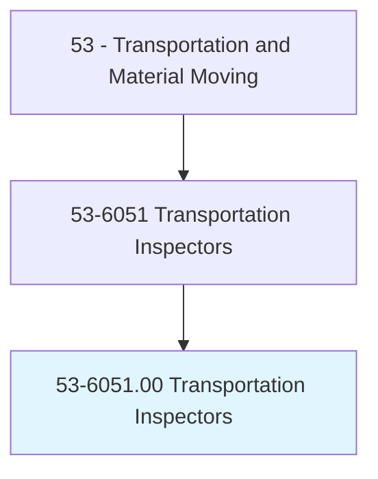
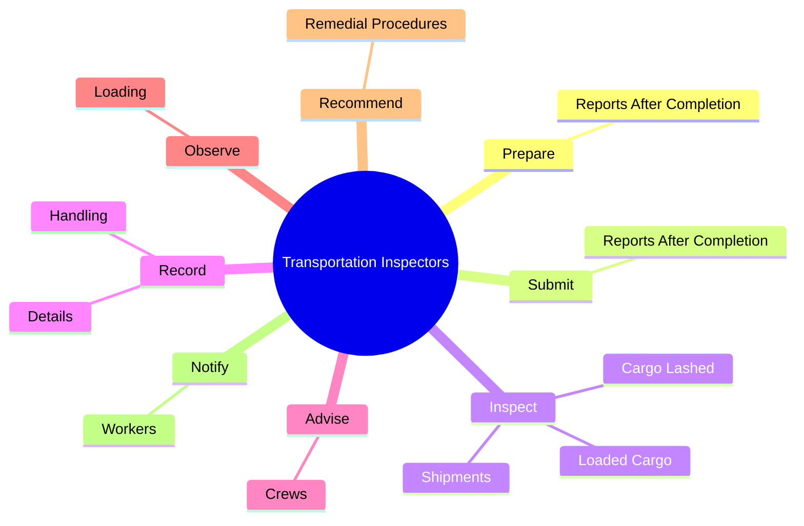
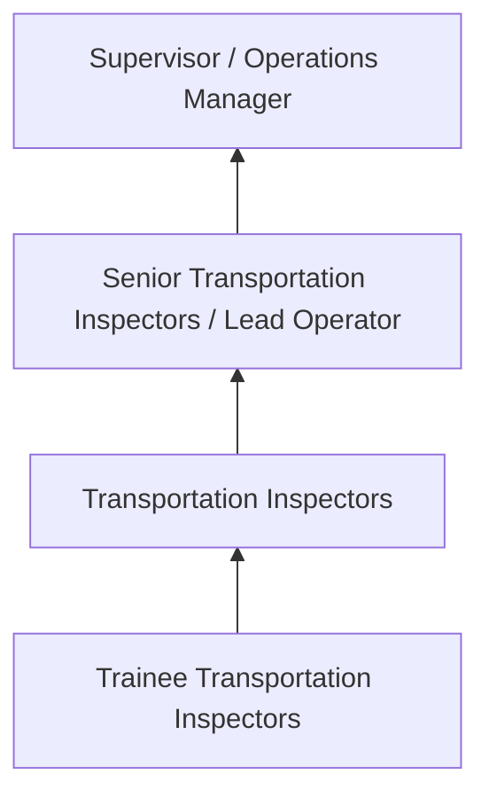
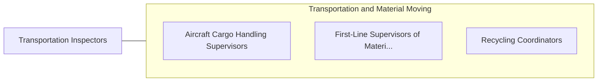

# Transportation Inspectors

> Inspect equipment or goods in connection with the safe transport of cargo or people. Includes rail transportation inspectors, such as freight inspectors, rail inspectors, and other inspectors of transportation vehicles not elsewhere classified.

## Overview

Transportation Inspectors professionals inspect equipment or goods in connection with the safe transport of cargo or people. This occupation falls within the Transportation and Material Moving category and requires a combination of specialized knowledge, technical skills, and practical experience.

These professionals work across diverse settings and organizational contexts, applying their expertise to meet the demands of their field. They must stay current with industry standards, emerging practices, and regulatory requirements that affect their work. The role demands both independent judgment and collaborative skills, as practitioners regularly interact with colleagues, stakeholders, and the public.

As the field continues to evolve, Transportation Inspectors professionals increasingly leverage technology and data-driven approaches to enhance their effectiveness. Career opportunities span the public and private sectors, with demand influenced by economic conditions, demographic shifts, and technological advancement.

## Classification Hierarchy



## Key Statistics

| Metric | Value |
|--------|-------|
| SOC Code | 53-6051.00 |
| Job Zone | N/A |
| Category | [Transportation and Material Moving](/occupations/Transportation/index) |
| Core Tasks | 60+ |
| Salary Range | $30,000 - $75,000 |
| Median Salary | $45,000 |
| Growth Outlook | 6% (As fast as average) |
| Source | O*NET |

## Core Tasks



### inspect.Shipments

Transportation Inspectors inspect shipments as part of their core responsibilities.

**Actions:**
- `inspect.Shipments.to.ensure.FreightIsSecurelyBraced` - Inspect shipments to ensure that freight is securely braced and blocked.
- `inspect.Shipments.to.blocked` - Inspect shipments to ensure that freight is securely braced and blocked.
- `inspect.LoadedCargo.to.DecksStorageFacilities` - Inspect loaded cargo, cargo lashed to decks or in storage facilities, and car...
- `inspect.LoadedCargo.to.InStorageFacilities` - Inspect loaded cargo, cargo lashed to decks or in storage facilities, and car...
- `inspect.LoadedCargo.to.CargoHandlingDevicesToDetermineComplianceWithHealth` - Inspect loaded cargo, cargo lashed to decks or in storage facilities, and car...

### measure.Heights

Transportation Inspectors measure heights as part of their core responsibilities.

**Actions:**
- `measure.Heights.of.Loads.to.ensure.TheyWillPassOverBridgesTunnelsOnScheduledRoutes` - Measure heights and widths of loads to ensure they will pass over bridges or ...
- `measure.Heights.of.ThroughTunnels.on.ScheduledRoutes` - Measure heights and widths of loads to ensure they will pass over bridges or ...
- `measure.Widths.of.Loads.to.ensure.TheyWillPassOverBridgesTunnelsOnScheduledRoutes` - Measure heights and widths of loads to ensure they will pass over bridges or ...
- `measure.Widths.of.ThroughTunnels.on.ScheduledRoutes` - Measure heights and widths of loads to ensure they will pass over bridges or ...
- `measure.VesselsHolds.of.Fuel` - Measure vessels' holds and depths of fuel and water in tanks, using sounding ...

### calculate.GrossTonnageHoldCapacitiesVolumes

Transportation Inspectors calculate gross tonnage hold capacities volumes as part of their core responsibilities.

**Actions:**
- `calculate.GrossTonnageHoldCapacitiesVolumes.of.StoredFuel` - Calculate gross and net tonnage, hold capacities, volumes of stored fuel and ...
- `calculate.GrossTonnageHoldCapacitiesVolumes.of.Water` - Calculate gross and net tonnage, hold capacities, volumes of stored fuel and ...
- `calculate.GrossTonnageHoldCapacitiesVolumes.of.CargoWeights` - Calculate gross and net tonnage, hold capacities, volumes of stored fuel and ...
- `calculate.GrossTonnageHoldCapacitiesVolumes.of.VesselStabilityFactors` - Calculate gross and net tonnage, hold capacities, volumes of stored fuel and ...
- `calculate.GrossTonnageHoldCapacitiesVolumes.of.UsingMathematicalFormulas` - Calculate gross and net tonnage, hold capacities, volumes of stored fuel and ...

### record.Details

Transportation Inspectors record details as part of their core responsibilities.

**Actions:**
- `record.Details.about.FreightConditions.of.Freight` - Record details about freight conditions, handling of freight, and any problem...
- `record.Details.about.FreightConditions.of.ProblemsEncountered` - Record details about freight conditions, handling of freight, and any problem...
- `record.Handling.of.Freight` - Record details about freight conditions, handling of freight, and any problem...
- `record.Handling.of.ProblemsEncountered` - Record details about freight conditions, handling of freight, and any problem...


## Skills & Competencies

### Technical Skills
- **Equipment Operation** - Advanced
- **Safety Procedures** - Advanced
- **Navigation Systems** - Proficient
- **Load Management** - Proficient
- **Vehicle Inspection** - Proficient
- **Regulatory Compliance** - Proficient

### Soft Skills
- **Situational Awareness** - Critical
- **Reliability** - Critical
- **Time Management** - Essential
- **Communication** - Essential
- **Physical Stamina** - Essential

## Education & Certifications

| Requirement | Details |
|-------------|---------|
| Typical Education | High school diploma or equivalent; some positions require post-secondary training |
| Work Experience | 0-2 years on-the-job experience |
| On-the-Job Training | Moderate - safety and equipment operation training |
| Certifications | CDL, hazmat endorsements, or transportation-specific licenses |

## Career Progression



## Industry Variations

### Freight and Logistics
Commercial transportation of goods. Transportation Inspectors professionals focus on efficiency, safety, and timely delivery across supply chains.

### Public Transit
Passenger transportation services. Emphasis on schedules, safety, and customer service in public-facing roles.

### Warehousing and Distribution
Material handling and storage operations. Focus on inventory management and order fulfillment efficiency.

### Specialized Transport
Hazardous materials, oversized loads, or temperature-controlled transport requiring additional certifications and safety protocols.

## Technology & Tools

- **GPS and navigation systems**
- **Fleet management software**
- **Electronic logging devices (ELD)**
- **Warehouse management systems (WMS)**
- **Transportation management systems (TMS)**

## Related Occupations



## Industries

- [Trucking and Freight](/industries/Trucking) - High Employment
- [Warehousing and Storage](/industries/Warehousing) - High Employment
- [Air Transportation](/industries/AirTransportation) - Moderate Employment
- [Rail Transportation](/industries/RailTransportation) - Moderate Employment

## Departments

This occupation typically works in:
- [Operations](/departments/Operations/index)
- [Logistics](/departments/Logistics)
- [Fleet Management](/departments/FleetManagement)

## GraphDL Semantic Structure

```
Transportation Inspectors perform:
- prepare.ReportsAfterCompletion.of.FreightShipments
- submit.ReportsAfterCompletion.of.FreightShipments
- inspect.Shipments.to.ensure.FreightIsSecurelyBraced
- inspect.Shipments.to.blocked
- record.Details.about.FreightConditions.of.Freight
- record.Details.about.FreightConditions.of.ProblemsEncountered
```

---

*Source: O*NET 53-6051.00 - ONETOccupation*
