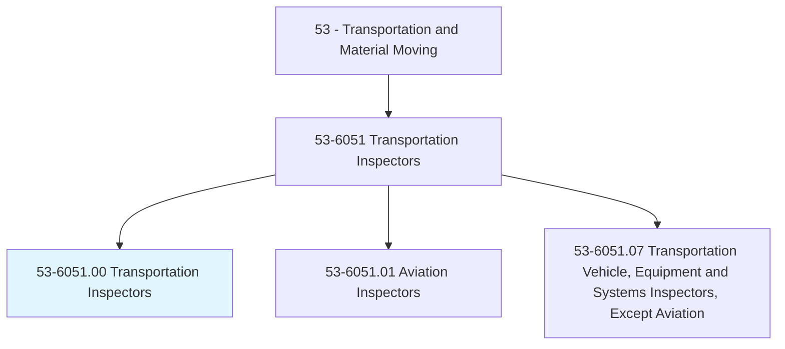
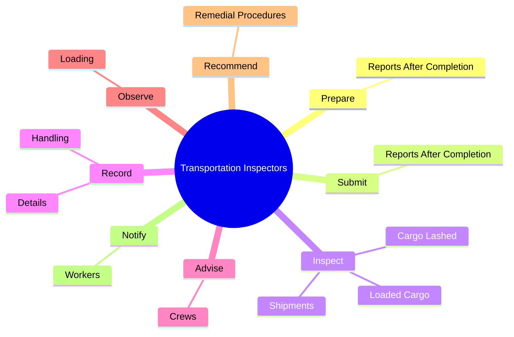
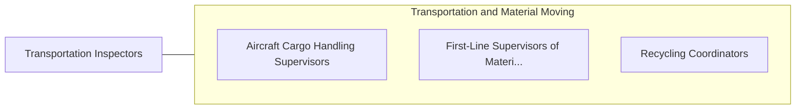

# Transportation Inspectors

> Inspect equipment or goods in connection with the safe transport of cargo or people. Includes rail transportation inspectors, such as freight inspectors, rail inspectors, and other inspectors of transportation vehicles not elsewhere classified.

## Overview

Transportation Inspectors is an occupation within the Transportation and Material Moving category. Inspect equipment or goods in connection with the safe transport of cargo or people. 

## Classification Hierarchy

## Key Statistics

| Metric | Value |
|--------|-------|
| SOC Code | 53-6051.00 |
| Category | [Transportation and Material Moving](/occupations/Transportation) |
| Task Count | 60 |
| Source | O*NET |

## Core Tasks

### prepare.ReportsAfterCompletion

Transportation Inspectors prepare reports after completion as part of their core responsibilities.

**Actions:**
- `prepare.ReportsAfterCompletion.of.FreightShipments`

### submit.ReportsAfterCompletion

Transportation Inspectors submit reports after completion as part of their core responsibilities.

**Actions:**
- `submit.ReportsAfterCompletion.of.FreightShipments`

### inspect.Shipments

Transportation Inspectors inspect shipments as part of their core responsibilities.

**Actions:**
- `inspect.Shipments.to.ensure.FreightIsSecurelyBraced`
- `inspect.Shipments.to.blocked`
- `inspect.LoadedCargo.to.DecksStorageFacilities`
- `inspect.LoadedCargo.to.InStorageFacilities`

## Skills & Competencies

### Technical Skills
- **Vehicle Operation** - Advanced
- **Logistics** - Advanced
- **Safety Compliance** - Advanced

### Soft Skills
- **Communication** - Essential
- **Problem Solving** - Essential
- **Critical Thinking** - Important
- **Teamwork** - Important
- **Adaptability** - Important

## Related Occupations

## Industries

This occupation is found across multiple industries. See [Industries](/industries) for sector-specific employment data.

## Career Progression

---

*Source: O*NET 53-6051.00 - ONETOccupation*
