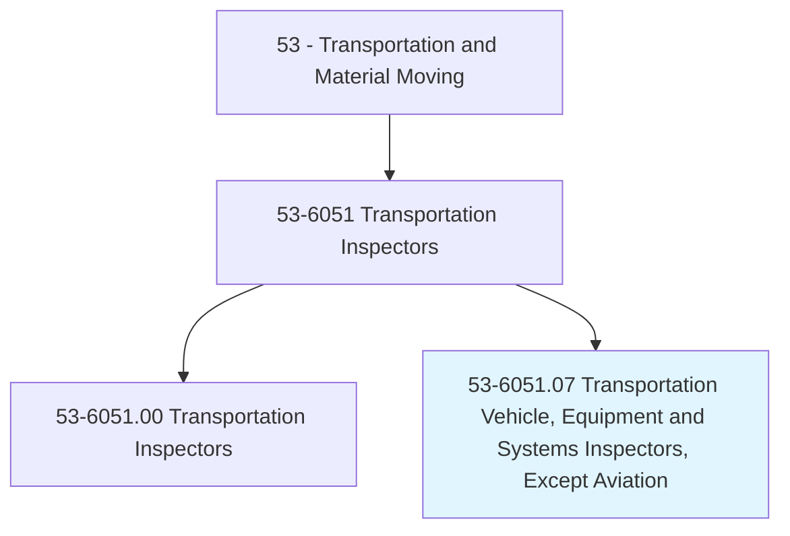
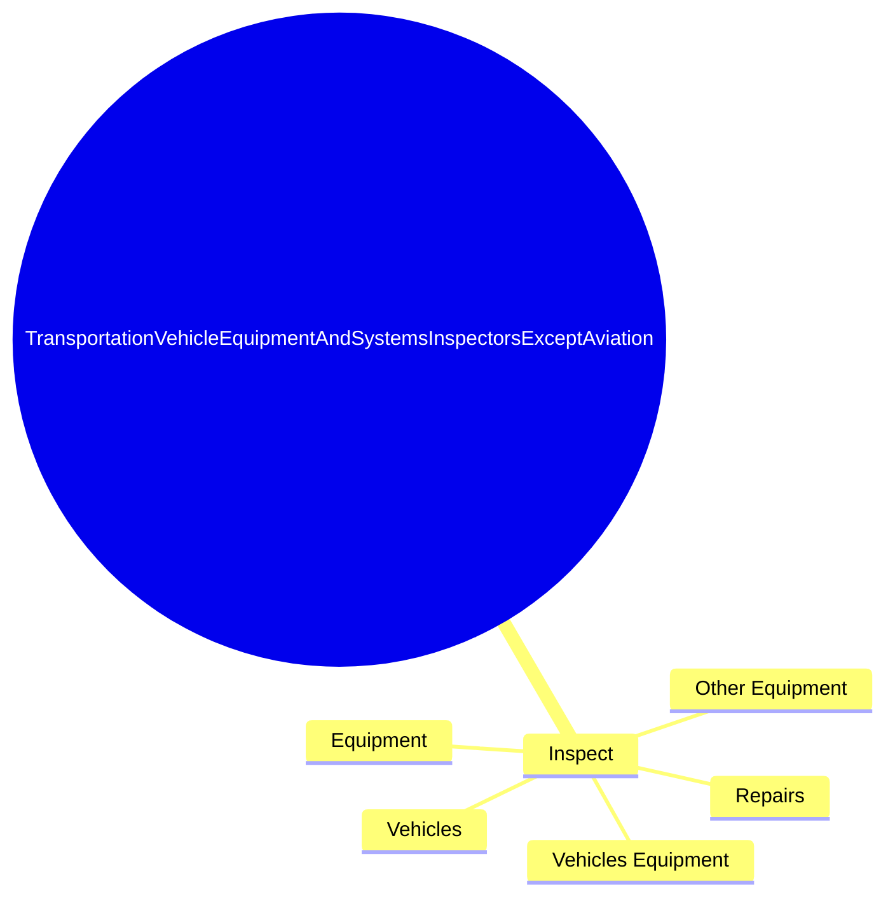
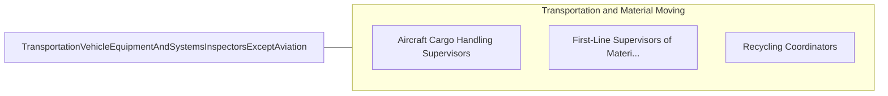

# Transportation Vehicle, Equipment and Systems Inspectors, Except Aviation

> Inspect and monitor transportation equipment, vehicles, or systems to ensure compliance with regulations and safety standards.

## Overview

Transportation Vehicle, Equipment and Systems Inspectors, Except Aviation is classified under Transportation and Material Moving (SOC 53). Inspect and monitor transportation equipment, vehicles, or systems to ensure compliance with regulations and safety standards.

## Classification Hierarchy

## Key Statistics

| Metric | Value |
|--------|-------|
| SOC Code | 53-6051.07 |
| Category | [Transportation and Material Moving](/occupations/Transportation/index) |
| Task Count | 54 |
| Source | O*NET |

## Core Tasks

### inspect.VehiclesEquipment

Transportation Vehicle, Equipment and Systems Inspectors, Except Aviation inspect vehicles equipment as part of their core responsibilities.

**Actions:**
- `inspect.VehiclesEquipment.for.Evidence.of.Abuse`
- `inspect.VehiclesEquipment.for.Damage`
- `inspect.VehiclesEquipment.for.MechanicalMalfunction`
- `inspect.OtherEquipment.for.Evidence.of.Abuse`

## Skills & Competencies

### Technical Skills
- **Vehicle Operation** - Advanced
- **Logistics** - Advanced
- **Safety Compliance** - Advanced

### Soft Skills
- **Communication** - Essential
- **Problem Solving** - Essential
- **Critical Thinking** - Important
- **Teamwork** - Important
- **Adaptability** - Important

## Related Occupations

## Industries

This occupation is found across multiple industries. See [Industries](/industries) for sector-specific employment data.

## Career Progression

---

*Source: O*NET 53-6051.07 - ONETOccupation*
