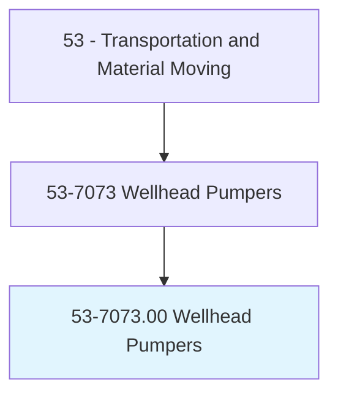
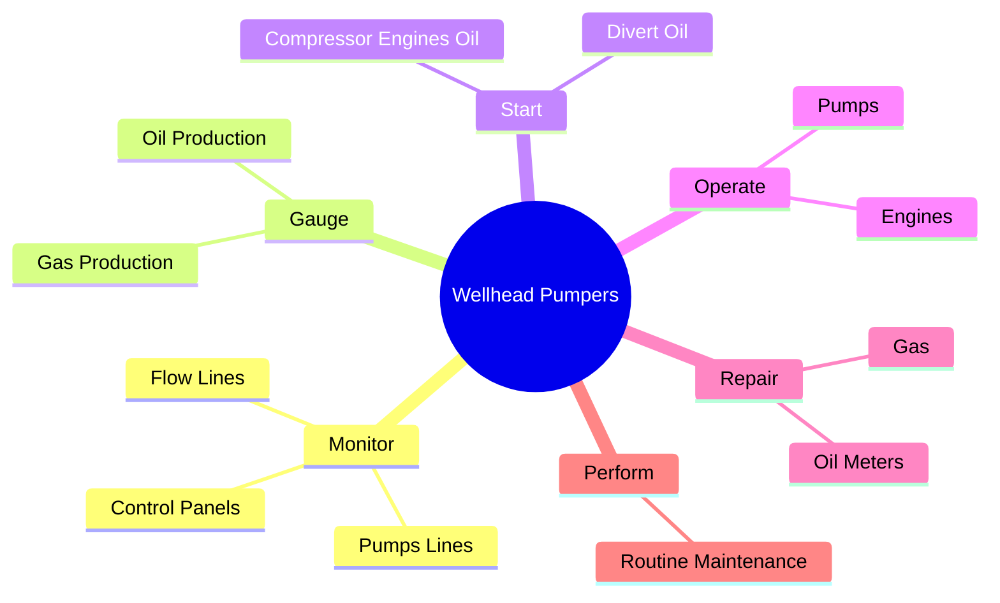
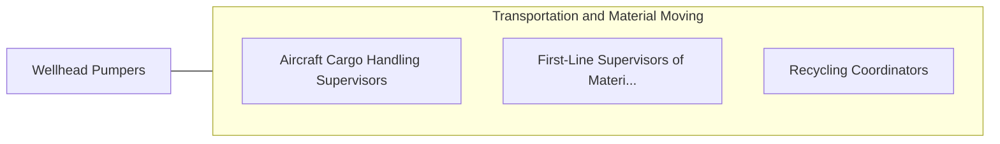

# Wellhead Pumpers

> Operate power pumps and auxiliary equipment to produce flow of oil or gas from wells in oil field.

## Overview

Wellhead Pumpers is classified under Transportation and Material Moving (SOC 53). Operate power pumps and auxiliary equipment to produce flow of oil or gas from wells in oil field.

## Classification Hierarchy

## Key Statistics

| Metric | Value |
|--------|-------|
| SOC Code | 53-7073.00 |
| Category | [Transportation and Material Moving](/occupations/Transportation) |
| Task Count | 37 |
| Source | O*NET |

## Core Tasks

### monitor.PumpsLines

Wellhead Pumpers monitor pumps lines as part of their core responsibilities.

**Actions:**
- `monitor.PumpsLines.for.GasLeaks`
- `monitor.PumpsLines.for.FluidLeaks`
- `monitor.FlowLines.for.GasLeaks`
- `monitor.FlowLines.for.FluidLeaks`

### gauge.OilProduction

Wellhead Pumpers gauge oil production as part of their core responsibilities.

**Actions:**
- `gauge.OilProduction`
- `gauge.GasProduction`

### start.CompressorEnginesOil

Wellhead Pumpers start compressor engines oil as part of their core responsibilities.

**Actions:**
- `start.CompressorEnginesOil.from.StorageTanksIntoCompressorUnitsEquipment.to.recover.NaturalGasFromOil`
- `start.CompressorEnginesOil.from.AuxiliaryEquipment.to.recover.NaturalGasFromOil`
- `start.DivertOil.from.StorageTanksIntoCompressorUnitsEquipment.to.recover.NaturalGasFromOil`
- `start.DivertOil.from.AuxiliaryEquipment.to.recover.NaturalGasFromOil`

## Skills & Competencies

### Technical Skills
- **Vehicle Operation** - Advanced
- **Logistics** - Advanced
- **Safety Compliance** - Advanced

### Soft Skills
- **Communication** - Essential
- **Problem Solving** - Essential
- **Critical Thinking** - Important
- **Teamwork** - Important
- **Adaptability** - Important

## Related Occupations

## Industries

This occupation is found across multiple industries. See [Industries](/industries) for sector-specific employment data.

## Career Progression

---

*Source: O*NET 53-7073.00 - ONETOccupation*
