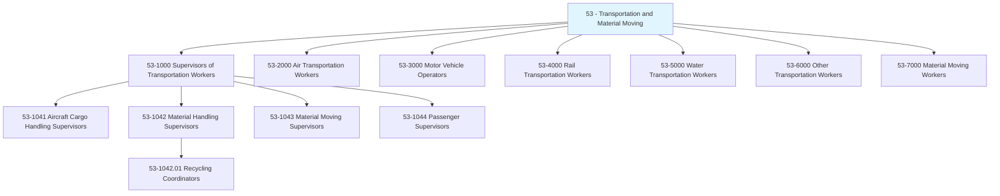
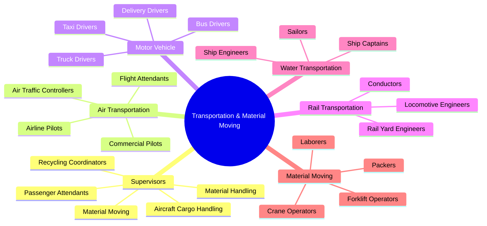
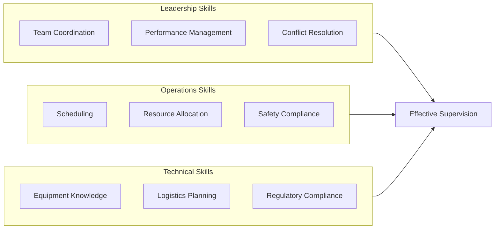
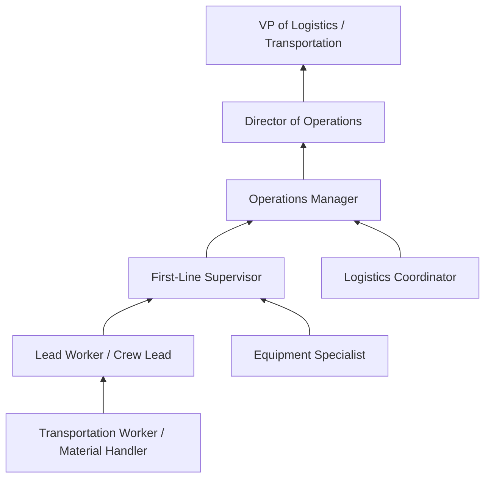

# Transportation and Material Moving Occupations

> Category 53 - Transportation and Material Moving occupations include workers who move people or materials by road, rail, air, and water. This category also includes related supervisory positions and material handling roles.

## Overview

Transportation and Material Moving Occupations encompass a diverse range of roles responsible for the movement of people, goods, and materials across all modes of transportation. This category includes first-line supervisors who coordinate transportation workers and material handlers, vehicle operators across air, land, and water, as well as material moving workers who load, unload, and transport materials within facilities. These occupations form the backbone of supply chains, logistics networks, and passenger transportation systems that keep the economy moving.

## Classification Hierarchy

## Key Statistics

| Metric | Value |
|--------|-------|
| SOC Category Code | 53 |
| Major Groups | 7 |
| Detailed Occupations | 50+ |
| Source | O*NET / BLS |

## Supervisory Occupations in this Category

### First-Line Supervisors (53-1000)

| Occupation | Code | Description |
|------------|------|-------------|
| [Aircraft Cargo Handling Supervisors](./AircraftCargoHandlingSupervisors.mdx) | 53-1041.00 | Supervise ground crew in loading, unloading, securing, and staging aircraft cargo |
| [Material Handling Supervisors](./MaterialHandlingSupervisors.mdx) | 53-1042.00 | Supervise helpers, laborers, and manual material movers |
| [Recycling Coordinators](./RecyclingCoordinators.mdx) | 53-1042.01 | Supervise recycling programs for municipal or private organizations |
| [Material Moving Supervisors](./MaterialMovingSupervisors.mdx) | 53-1043.00 | Supervise material-moving machine and vehicle operators |
| [Passenger Supervisors](./PassengerSupervisors.mdx) | 53-1044.00 | Supervise and coordinate passenger attendants |

## Category Overview Diagram

## Skills Common to Transportation Supervisory Occupations

### Core Competencies

## Career Pathways

## Industries Employing Transportation Occupations

- [Transportation and Warehousing](/industries/TransportationWarehousing) - Highest concentration
- [Manufacturing](/industries/Manufacturing) - High employment
- [Retail Trade](/industries/RetailTrade) - High employment
- [Wholesale Trade](/industries/WholesaleTrade) - Significant presence
- [Government](/industries/Government) - Public transit and postal services
- [Construction](/industries/Construction) - Material moving roles

## Education & Training Trends

| Level | Percentage of Supervisors |
|-------|--------------------------|
| High School Diploma/GED | 50-60% |
| Some College/Associate's | 25-30% |
| Bachelor's Degree | 10-15% |
| Specialized Training/Certifications | 40-50% |

## Industry Variations

### Aviation Industry
- Focus on strict FAA compliance and safety protocols
- Weight and balance calculations critical
- Time-sensitive operations with tight turnaround windows

### Logistics and Warehousing
- Emphasis on efficiency metrics and throughput
- Technology integration (WMS, TMS systems)
- Multi-modal coordination

### Public Transit
- Customer service orientation
- Schedule adherence critical
- Accessibility compliance requirements

### Recycling and Waste Management
- Environmental regulations compliance
- Community engagement components
- Sustainability metrics tracking

## Related Categories

- [Production Occupations](/occupations/Production) - Category 51
- [Construction and Extraction](/occupations/Construction) - Category 47
- [Installation, Maintenance, and Repair](/occupations/Maintenance) - Category 49
- [Office and Administrative Support](/occupations/Administrative) - Category 43

---

*Source: O*NET / Bureau of Labor Statistics - SOC Category 53*
