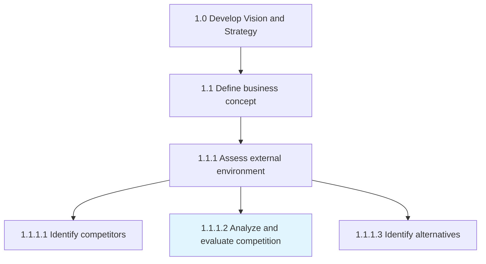
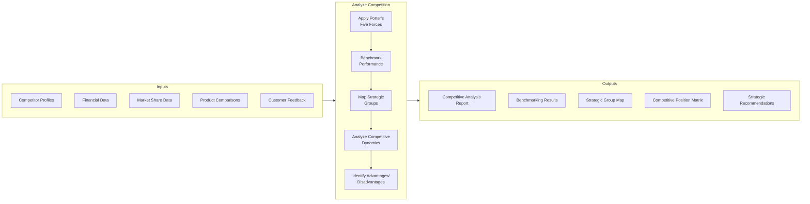
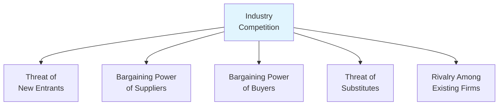
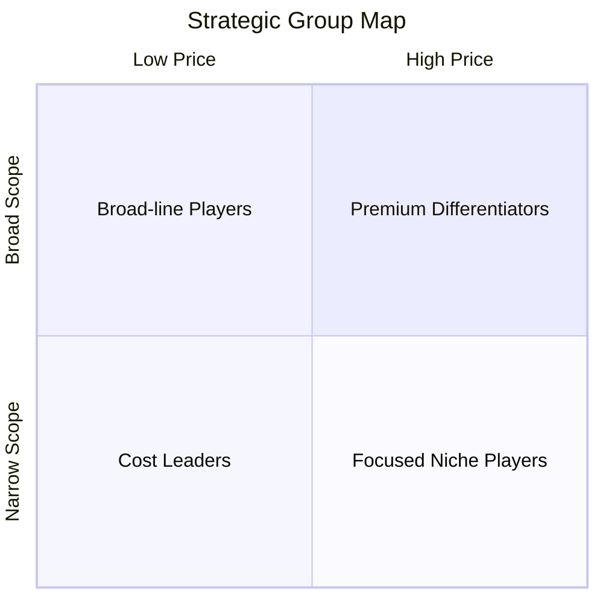
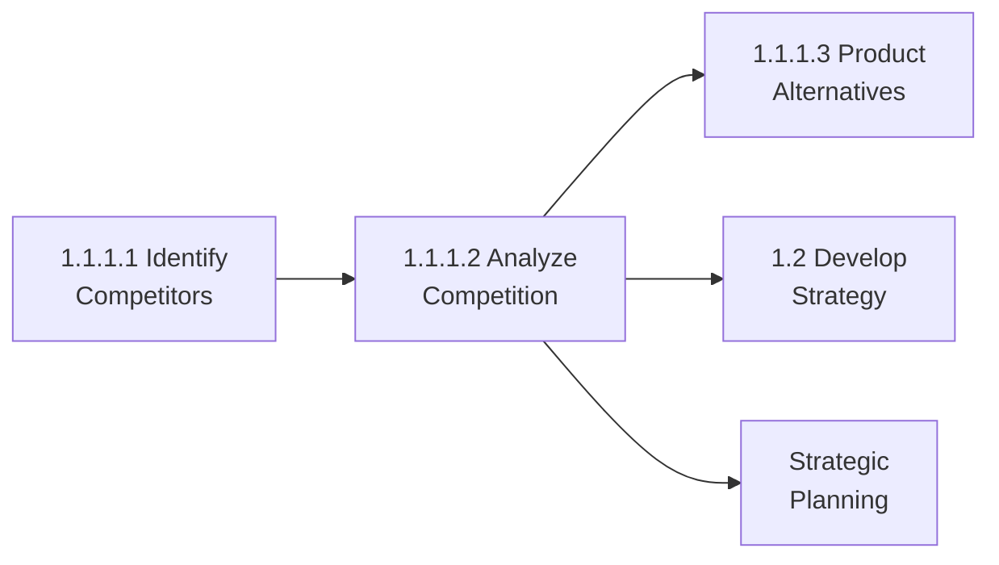

# Analyze and evaluate competition

> Assessing the competitive forces in the marketplace that could potentially affect the organization. Analyze various aspects of business competition including competing firms. Aggregate competitive intelligence, create benchmarks to juxtapose processes and performance metrics, and inject crucial information about the competition into management models to synthesize insights.

## Overview

Activity 1.1.1.2 takes the competitor identification from 1.1.1.1 and performs deep analysis to understand competitive dynamics, positioning, and strategic implications. This activity applies frameworks like Porter's Five Forces, competitive benchmarking, and strategic group mapping to derive actionable insights.

The outputs inform strategic positioning decisions, product development priorities, pricing strategies, and resource allocation. Regular competitive analysis helps organizations anticipate competitor moves and identify sustainable competitive advantages.

## Process Hierarchy



## Key Statistics

| Metric | Value |
|--------|-------|
| APQC Code | 10021 |
| Hierarchy ID | 1.1.1.2 |
| Level | Activity |
| Parent | [1.1.1 Assess external environment](./) |

## Process Flow



## GraphDL Semantic Structure

```
analyze.Competition
```

| Component | Value | Description |
|-----------|-------|-------------|
| Verb | `analyze` | Deep examination and evaluation |
| Object | `Competition` | Competitive forces and dynamics |

**Extended Form:**
```
evaluate.Competition.for.StrategicInsights
```

## Detailed Tasks

### Task 1: Apply Porter's Five Forces Analysis

Systematically evaluate competitive intensity:



| Force | Assessment Factors |
|-------|-------------------|
| New Entrants | Barriers to entry, capital requirements, brand loyalty |
| Supplier Power | Supplier concentration, switching costs, differentiation |
| Buyer Power | Buyer concentration, price sensitivity, switching costs |
| Substitutes | Availability, price-performance, switching costs |
| Rivalry | Number of competitors, industry growth, differentiation |

### Task 2: Conduct Competitive Benchmarking

Compare performance metrics across key dimensions:

| Dimension | Metrics |
|-----------|---------|
| Financial | Revenue, margin, growth rate, ROI |
| Market | Share, growth, customer satisfaction |
| Operational | Cost structure, cycle time, quality |
| Innovation | R&D spend, patents, product launches |
| People | Talent acquisition, retention, productivity |

### Task 3: Create Strategic Group Maps

Visualize competitive positioning along key dimensions:



### Task 4: Analyze Competitive Dynamics

Evaluate competitive behavior patterns:
- Attack/defense patterns
- Market share trends
- Strategic intent signals
- Resource commitment levels
- Potential competitive moves

### Task 5: Identify Sustainable Advantages

Determine sources of competitive advantage:
- Cost advantages
- Differentiation advantages
- Focus/niche advantages
- Resource-based advantages
- Capability-based advantages

## RACI Matrix

| Task | Responsible | Accountable | Consulted | Informed |
|------|-------------|-------------|-----------|----------|
| Five Forces analysis | Strategy Team | CSO | Marketing | Exec Team |
| Benchmarking | CI Team | Strategy Dir | Finance | All BUs |
| Strategic groups | Strategy Team | CSO | Marketing | Product |
| Competitive dynamics | CI Team | CSO | Sales | Exec Team |
| Advantage identification | Strategy Team | CEO | All Leaders | Board |

## Industry Variations

### Banking

Analyze competition across:
- Interest rate positioning
- Digital capabilities comparison
- Branch network vs. digital-only models
- Fee structures and transparency
- Regulatory compliance costs

### Healthcare Provider

Competitive analysis focuses on:
- Quality metrics and rankings
- Payer mix and reimbursement rates
- Service line strength
- Physician network comparison
- Technology adoption rates

### Aerospace and Defense

Unique analytical considerations:
- Win rate on government contracts
- Technology readiness levels
- Security clearance capacity
- Supply chain resilience
- International market access

### Retail

Competition evaluated through:
- Omnichannel capabilities
- Fulfillment speed and cost
- Private label penetration
- Customer loyalty program effectiveness
- Store experience vs. digital experience

## Related Occupations

- [Strategic Planning Managers](/occupations/StrategicPlanningManagers)
- [Competitive Intelligence Analysts](/occupations/CompetitiveIntelligence)
- [Management Consultants](/occupations/ManagementConsultants)
- [Business Analysts](/occupations/BusinessAnalysts)
- [Market Research Analysts](/occupations/MarketResearchAnalysts)

## Analytical Frameworks

| Framework | Purpose |
|-----------|---------|
| Porter's Five Forces | Industry attractiveness |
| SWOT Analysis | Internal/external position |
| Value Chain Analysis | Cost/value comparison |
| Strategic Group Mapping | Competitive clustering |
| Game Theory | Competitive move analysis |
| War Gaming | Scenario planning |

## Related Processes



## Metrics & KPIs

| Metric | Description | Target |
|--------|-------------|--------|
| Analysis Depth | Dimensions analyzed per competitor | >10 |
| Benchmarking Coverage | % of key metrics benchmarked | >80% |
| Insight Actionability | % of insights driving decisions | >50% |
| Prediction Accuracy | Competitor move prediction success | >60% |
| Analysis Frequency | Major update cycle | Quarterly |

---

*Source: APQC PCF 10021 (1.1.1.2) - Cross-Industry*
