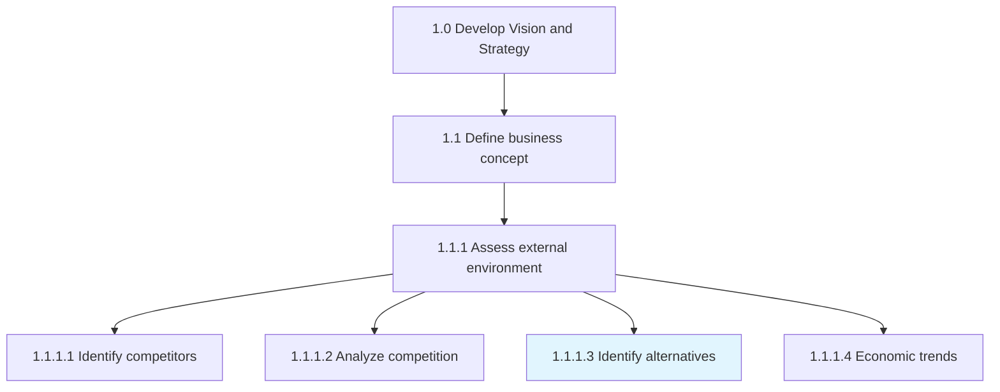
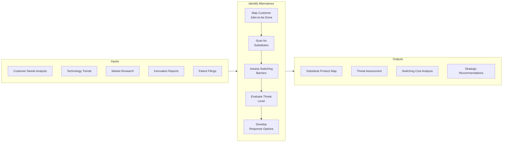
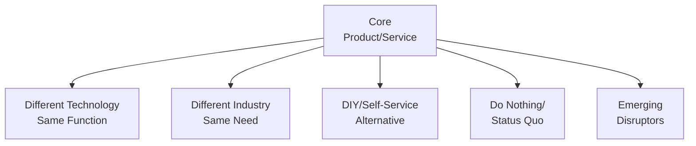
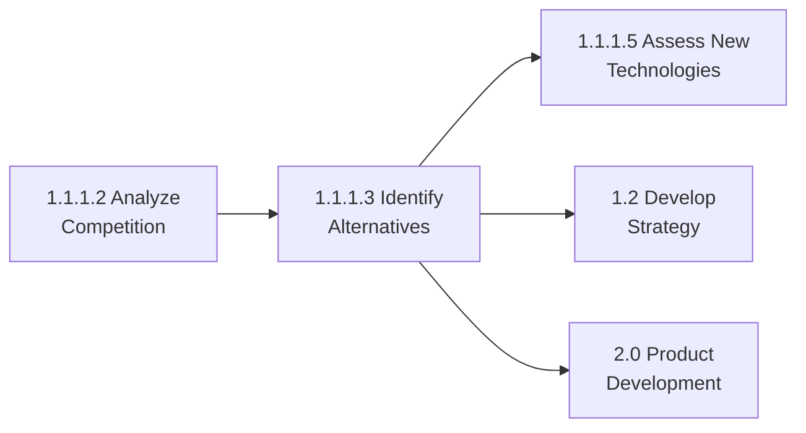

# Identify potential product or service alternatives

> Examining if there are other existing products or services in the marketplace, and building the business case to make a go/no go decision based upon substitutions.

## Overview

Activity 1.1.1.3 focuses on identifying substitute products and services that could meet the same customer needs through different means. This extends competitive analysis beyond direct competitors to include potential disruptors and alternative solutions that customers might choose instead of the organization's offerings.

Understanding substitutes is critical for strategic planning as it helps organizations anticipate market disruptions, identify innovation opportunities, and develop defensive strategies against emerging alternatives.

## Process Hierarchy



## Key Statistics

| Metric | Value |
|--------|-------|
| APQC Code | 21421 |
| Hierarchy ID | 1.1.1.3 |
| Level | Activity |
| Parent | [1.1.1 Assess external environment](./) |

## Process Flow



## GraphDL Semantic Structure

```
identify.ProductServiceAlternatives
```

| Component | Value | Description |
|-----------|-------|-------------|
| Verb | `identify` | Discover and catalog |
| Object | `ProductServiceAlternatives` | Substitute offerings in the market |

**Extended Form:**
```
identify.Alternatives.for.ProductsAndServices
```

## Detailed Tasks

### Task 1: Map Jobs-to-be-Done

Understand the fundamental customer needs:

| Customer Job | Functional | Emotional | Social |
|-------------|------------|-----------|--------|
| Get work done | Task completion | Confidence | Status |
| Save time | Efficiency | Peace of mind | Approval |
| Reduce risk | Protection | Security | Trust |

### Task 2: Scan for Substitutes

Categories of potential substitutes:



### Task 3: Assess Switching Barriers

Evaluate factors that influence customer switching:

| Barrier Type | High = Less Threat | Low = Higher Threat |
|-------------|-------------------|---------------------|
| Financial | High switching costs | Low/no costs |
| Technical | Integration required | Plug-and-play |
| Learning | Steep learning curve | Easy to adopt |
| Contractual | Long-term contracts | No commitment |
| Emotional | Brand loyalty | No attachment |

### Task 4: Evaluate Threat Level

Rate substitute threat using standardized criteria:

| Factor | Weight | Score (1-5) |
|--------|--------|-------------|
| Price-performance ratio | 25% | - |
| Customer switching propensity | 25% | - |
| Technology maturity | 20% | - |
| Market adoption rate | 15% | - |
| Strategic fit with trends | 15% | - |

### Task 5: Develop Response Options

Strategic responses to substitute threats:

- **Differentiate** - Emphasize unique value
- **Integrate** - Adopt substitute capabilities
- **Acquire** - Purchase substitute providers
- **Partner** - Collaborate with complementors
- **Divest** - Exit threatened markets

## RACI Matrix

| Task | Responsible | Accountable | Consulted | Informed |
|------|-------------|-------------|-----------|----------|
| Jobs-to-be-Done mapping | Product Team | CMO | Customers | Strategy |
| Substitute scanning | Market Research | Strategy Dir | R&D | Exec Team |
| Switching barrier assessment | Product Team | CMO | Sales | Strategy |
| Threat evaluation | Strategy Team | CSO | All BUs | Board |
| Response development | Strategy Team | CEO | All Leaders | All Depts |

## Industry Variations

### Banking

Substitute identification includes:
- Cryptocurrency and blockchain solutions
- Peer-to-peer lending platforms
- Buy-now-pay-later services
- Big tech financial services
- Embedded finance in non-financial apps

### Healthcare Provider

Alternative care delivery models:
- Retail clinics (CVS, Walgreens)
- Telehealth platforms
- Concierge medicine
- Medical tourism
- Home health technology
- AI-based diagnostic tools

### Aerospace and Defense

Substitute technologies:
- Unmanned systems replacing manned
- Commercial space alternatives
- Satellite vs. terrestrial solutions
- Cyber capabilities vs. kinetic
- Commercial off-the-shelf components

### Education

Alternative learning models:
- Online learning platforms (Coursera, Khan)
- Corporate training programs
- Micro-credentials and badges
- Apprenticeship programs
- AI-powered personalized learning

### Retail

Shopping alternatives:
- Direct-to-consumer brands
- Subscription services
- Rental/sharing economy
- Second-hand marketplaces
- 3D printing/local manufacturing

## Related Occupations

- [Product Managers](/occupations/ProductManagers)
- [Market Research Analysts](/occupations/MarketResearchAnalysts)
- [Innovation Managers](/occupations/InnovationManagers)
- [Strategic Planners](/occupations/StrategicPlanners)
- [Business Development Managers](/occupations/BusinessDevelopment)

## Disruption Watch Areas

| Technology Trend | Potential Substitute Impact |
|-----------------|---------------------------|
| AI/Machine Learning | Automation of services |
| Blockchain | Disintermediation |
| IoT | Product-as-a-service models |
| 3D Printing | Distributed manufacturing |
| AR/VR | Remote experiences |
| Platform Economy | Aggregation and matching |

## Related Processes



## Metrics & KPIs

| Metric | Description | Target |
|--------|-------------|--------|
| Substitute Coverage | % of customer needs with alternatives | >90% mapped |
| Threat Detection Time | Lead time on emerging substitutes | >12 months |
| Response Readiness | % of threats with response plans | >80% |
| Disruption Impact Assessment | Accuracy of impact forecasts | >70% |
| Strategic Response Rate | Threats addressed proactively | >60% |

---

*Source: APQC PCF 21421 (1.1.1.3) - Cross-Industry*
