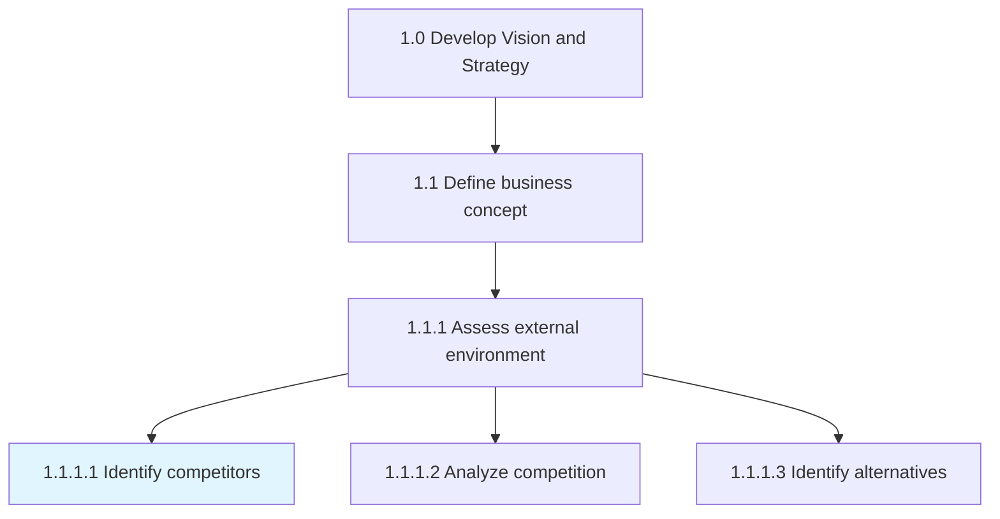
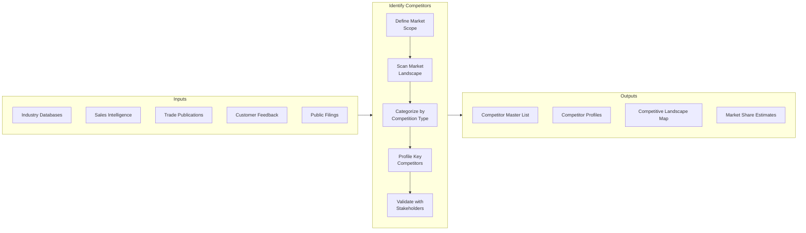
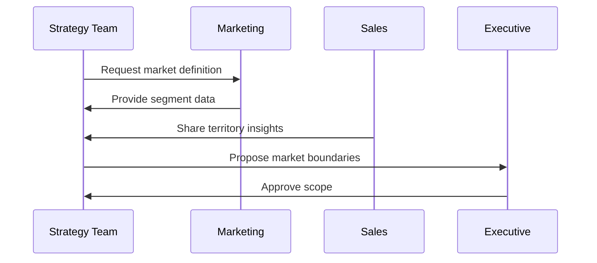
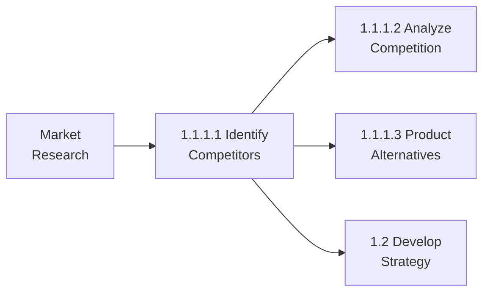

# Identify competitors

> Identifying your competitors, their service and/or product. Evaluating competitors' strategies to determine their strengths and weaknesses relative to those of your own product or service.

## Overview

Activity 1.1.1.1 is the foundational competitive intelligence activity that systematically discovers and catalogs organizations competing for the same customers, market share, or resources. This activity goes beyond simple competitor listing to include understanding their product/service offerings, market positioning, strategic approaches, and relative strengths and weaknesses.

Effective competitor identification requires a multi-source approach combining industry databases, sales team intelligence, customer feedback, and market research. The output provides the foundation for all subsequent competitive analysis activities.

## Process Hierarchy



## Key Statistics

| Metric | Value |
|--------|-------|
| APQC Code | 19945 |
| Hierarchy ID | 1.1.1.1 |
| Level | Activity |
| Parent | [1.1.1 Assess external environment](./) |

## Process Flow



## GraphDL Semantic Structure

```
identify.Competitors
```

| Component | Value | Description |
|-----------|-------|-------------|
| Verb | `identify` | Discover, catalog, and document |
| Object | `Competitors` | Organizations competing in the same market |

## Detailed Tasks

### Task 1: Define Market Scope

Establish the boundaries for competitor identification by defining:
- Geographic markets (local, regional, national, global)
- Product/service categories
- Customer segments served
- Channel coverage



### Task 2: Scan Market Landscape

Systematically search for competitors using multiple sources:
- Industry databases and directories
- Trade association membership lists
- Patent and trademark databases
- Investment analyst reports
- Job posting analysis
- Social media monitoring

### Task 3: Categorize Competitors

Classify identified competitors into strategic categories:

| Category | Definition | Example |
|----------|------------|---------|
| Direct | Same products, same customers | Core competitor |
| Indirect | Different products, same needs | Substitute provider |
| Potential | May enter market | Adjacent industry player |
| Aspirational | Market leader to benchmark | Industry best practice |

### Task 4: Profile Key Competitors

Create comprehensive profiles including:
- Company overview and history
- Products/services offered
- Target markets and positioning
- Financial performance
- Key personnel
- Recent strategic moves
- Strengths and weaknesses

### Task 5: Validate and Update

Establish ongoing processes to:
- Review with sales team for accuracy
- Update quarterly or as needed
- Track competitor exits and entries
- Monitor for strategic changes

## RACI Matrix

| Task | Responsible | Accountable | Consulted | Informed |
|------|-------------|-------------|-----------|----------|
| Define market scope | Strategy | CSO | Marketing, Sales | Exec Team |
| Scan landscape | Competitive Intel | Strategy Director | IT, Sales | Product |
| Categorize competitors | Market Research | CMO | Strategy | Sales |
| Profile competitors | Competitive Intel | CSO | All BUs | Board |
| Validate and update | Strategy | CSO | Sales | All Depts |

## Industry Variations

### Aerospace and Defense

Focus on companies competing for:
- Government contracts by program/agency
- Prime contractor vs. subcontractor roles
- International defense market presence
- Specific technology domains

### Banking

Competitor categories include:
- Traditional banks (national, regional, community)
- Credit unions
- Fintech startups
- Big tech financial services
- Non-bank lenders

### Healthcare Provider

Identify competitors across:
- Acute care hospitals
- Ambulatory surgery centers
- Urgent care clinics
- Telehealth providers
- Retail health clinics

### Education

Competition sources include:
- Neighboring school districts
- Charter schools
- Private schools
- Virtual/online schools
- Homeschool programs

### Retail

Competitor landscape spans:
- Direct retail competitors
- E-commerce pure plays
- Marketplace platforms
- Direct-to-consumer brands
- Subscription services

## Related Occupations

- [Market Research Analysts](/occupations/MarketResearchAnalysts)
- [Competitive Intelligence Analysts](/occupations/CompetitiveIntelligence)
- [Business Development Managers](/occupations/BusinessDevelopment)
- [Sales Representatives](/occupations/SalesRepresentatives)
- [Product Managers](/occupations/ProductManagers)

## Tools and Techniques

| Tool/Technique | Purpose |
|----------------|---------|
| Industry databases | Systematic competitor discovery |
| Web scraping tools | Monitor competitor websites |
| Social listening | Track competitor mentions |
| Patent databases | Identify technology competitors |
| Financial databases | Access public company information |
| CRM win/loss data | Understand sales competition |

## Related Processes



## Metrics & KPIs

| Metric | Description | Target |
|--------|-------------|--------|
| Competitor Coverage | % of market competitors identified | >95% |
| Profile Completeness | Data fields populated per competitor | >85% |
| Intelligence Freshness | Age of competitor information | <90 days |
| New Entrant Detection | Time to identify new competitors | <30 days |
| Category Accuracy | Correct classification rate | >90% |

---

*Source: APQC PCF 19945 (1.1.1.1) - Cross-Industry*
