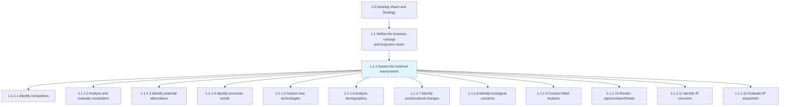
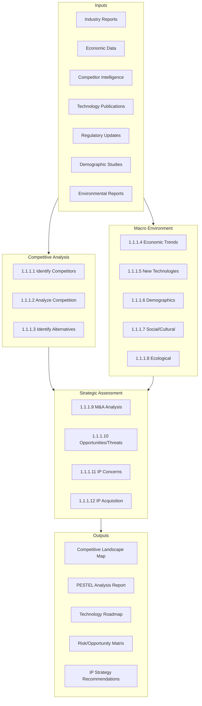
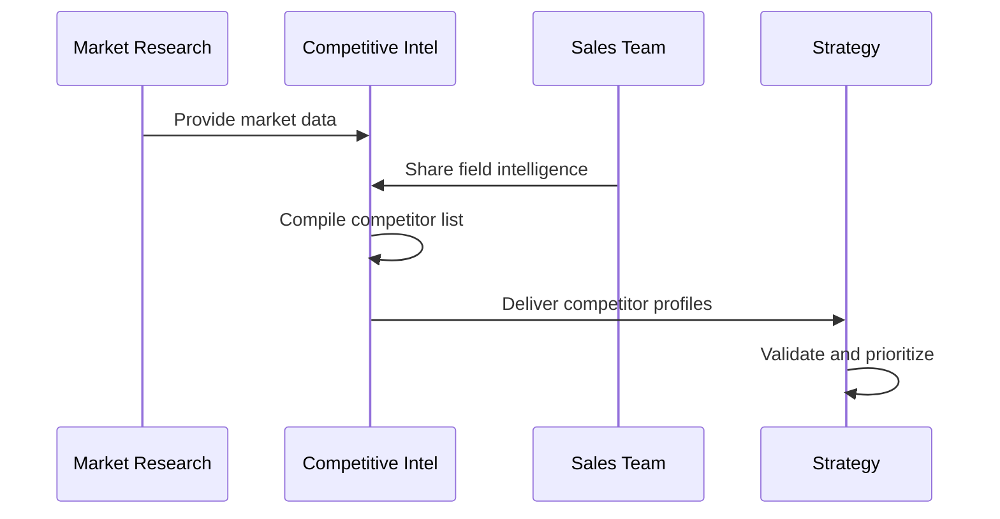
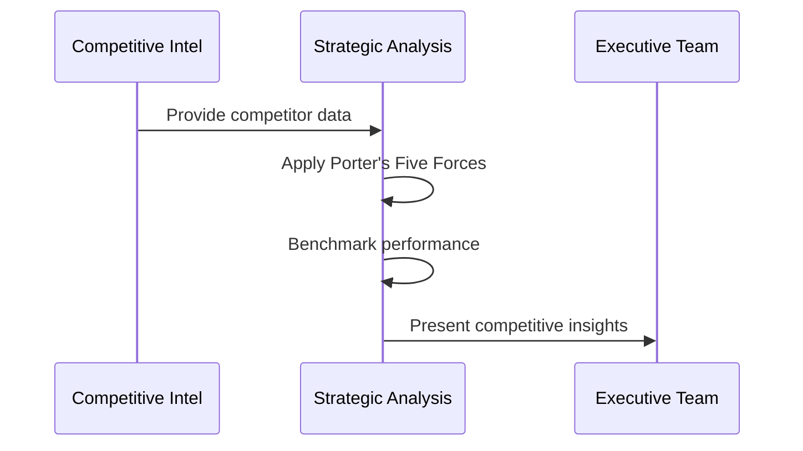
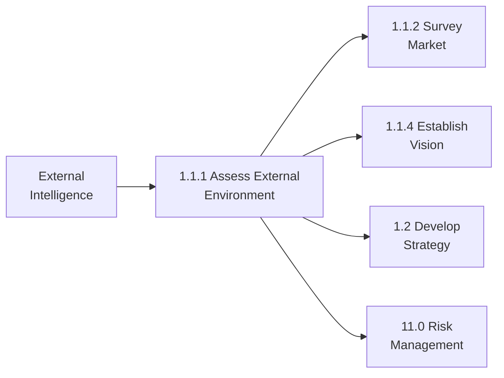

# Assess the external environment

> Assessing all forces, entities, and systems that are external to an organization but can affect its operation. Analyze far-reaching currents in the macroeconomic situation, assess the competition, evaluate technological changes, and identify societal as well as ecological issues of concern. Create a big-picture understanding of externalities, with sufficient depth across individual aspects.

## Overview

Process 1.1.1 is the cornerstone of strategic environmental scanning. It encompasses twelve distinct activities that collectively provide organizations with a comprehensive understanding of their operating environment. This process typically employs frameworks like PESTEL (Political, Economic, Social, Technological, Environmental, Legal) analysis and Porter's Five Forces to systematically evaluate external factors.

The outputs from this process directly inform strategic vision development, competitive positioning, and risk management strategies. Organizations that excel at external environment assessment can anticipate market shifts, identify emerging opportunities, and proactively address threats.

## Process Hierarchy



## Key Statistics

| Metric | Value |
|--------|-------|
| APQC Code | 10017 |
| Hierarchy ID | 1.1.1 |
| Level | Process |
| Parent | [1.1 Define business concept and long-term vision](../) |
| Activities | 12 |
| Metrics Available | Yes |

## Process Flow



## GraphDL Semantic Structure

```
assess.ExternalEnvironment
```

| Component | Value | Description |
|-----------|-------|-------------|
| Verb | `assess` | Systematic evaluation and analysis |
| Object | `ExternalEnvironment` | All external forces affecting the organization |
| Preposition | - | N/A |
| PrepObject | - | N/A |

### Activity-Level GraphDL

| Activity | Hierarchy | GraphDL |
|----------|-----------|---------|
| Identify competitors | 1.1.1.1 | `identify.Competitors` |
| Analyze competition | 1.1.1.2 | `analyze.Competition` |
| Identify alternatives | 1.1.1.3 | `identify.ProductServiceAlternatives` |
| Economic trends | 1.1.1.4 | `identify.EconomicTrends` |
| Assess technologies | 1.1.1.5 | `assess.NewTechnologies` |
| Analyze demographics | 1.1.1.6 | `analyze.Demographics` |
| Social changes | 1.1.1.7 | `identify.SocialCulturalChanges` |
| Ecological concerns | 1.1.1.8 | `identify.EcologicalConcerns` |
| M&A analysis | 1.1.1.9 | `conduct.MergersAcquisitionsAnalysis` |
| Monitor opportunities | 1.1.1.10 | `monitor.ExternalOpportunitiesThreats` |
| IP concerns | 1.1.1.11 | `identify.IntellectualPropertyConcerns` |
| IP acquisition | 1.1.1.12 | `evaluate.IPAcquisitionOptions` |

## Activities

### 1.1.1.1 - Identify competitors



**APQC Code:** 19945

Identifying your competitors, their service and/or product. Evaluating competitors' strategies to determine their strengths and weaknesses relative to those of your own product or service.

[View detailed activity documentation](./IdentifyCompetitors.mdx)

### 1.1.1.2 - Analyze and evaluate competition



**APQC Code:** 10021

Assessing the competitive forces in the marketplace that could potentially affect the organization. Aggregate competitive intelligence, create benchmarks, and inject crucial information about the competition into management models.

[View detailed activity documentation](./AnalyzeCompetition.mdx)

### 1.1.1.3 - Identify potential product or service alternatives

**APQC Code:** 21421

Examining if there are other existing products or services in the marketplace, and building the business case to make a go/no go decision based upon substitutions.

[View detailed activity documentation](./IdentifyAlternatives.mdx)

### 1.1.1.4 - Identify economic trends

**APQC Code:** 10022

Determining large-scale macroeconomic shifts and trends, with medium to long-term relevance for the organization. Analyze factors such as interest rates, taxation structures, oil prices, and unemployment rates.

[View detailed activity documentation](./IdentifyEconomicTrends.mdx)

### 1.1.1.5 - Assess new technology innovations

**APQC Code:** 10024

Assessing developments in technologies presently being used by the business, new technologies that have potential for the business, and any disruptive innovations.

[View detailed activity documentation](./AssessNewTechnologies.mdx)

### 1.1.1.6 - Analyze demographics

**APQC Code:** 10025

Analyzing statistical data relating to the size, distribution, and composition of relevant populations, as well as their characteristics.

[View detailed activity documentation](./AnalyzeDemographics.mdx)

### 1.1.1.7 - Identify social and cultural changes

**APQC Code:** 10026

Distinguishing changes in societal makeup, as well as the cultural composite. Isolate shifts in societal composition and value systems.

[View detailed activity documentation](./IdentifySocialChanges.mdx)

### 1.1.1.8 - Identify ecological concerns

**APQC Code:** 10027

Identifying changes in ecological ecosystems that can be directly or indirectly detrimental to the organization.

[View detailed activity documentation](./IdentifyEcologicalConcerns.mdx)

### 1.1.1.9 - Conduct mergers and acquisitions (M&A) analysis

**APQC Code:** 11301

Analyzing potential M&A opportunities and threats in the competitive landscape.

[View detailed activity documentation](./ConductMAAnalysis.mdx)

### 1.1.1.10 - Monitor external opportunities and threats

**APQC Code:** 11302

Continuous monitoring of the external environment for emerging opportunities and threats.

[View detailed activity documentation](./MonitorOpportunitiesThreats.mdx)

### 1.1.1.11 - Identify intellectual property concerns

**APQC Code:** 16790

Establishing measures and procedures for identifying various intellectual property threats and concerns.

[View detailed activity documentation](./IdentifyIPConcerns.mdx)

### 1.1.1.12 - Evaluate IP acquisition options

**APQC Code:** 16791

Establishing and defining measures and methods for valuation and acquisitions of IP.

[View detailed activity documentation](./EvaluateIPAcquisition.mdx)

## RACI Matrix

| Activity | Responsible | Accountable | Consulted | Informed |
|----------|-------------|-------------|-----------|----------|
| 1.1.1.1 Identify competitors | Competitive Intel | CSO | Sales, Marketing | Exec Team |
| 1.1.1.2 Analyze competition | Strategy Team | CSO | All BUs | Board |
| 1.1.1.3 Identify alternatives | Product Team | CMO | R&D | Strategy |
| 1.1.1.4 Economic trends | Economics/Strategy | CFO | Finance | Exec Team |
| 1.1.1.5 New technologies | R&D/IT | CTO | Product | Strategy |
| 1.1.1.6 Demographics | Marketing | CMO | Sales | Strategy |
| 1.1.1.7 Social changes | Marketing | CMO | HR | Strategy |
| 1.1.1.8 Ecological concerns | Sustainability | COO | Legal | Board |
| 1.1.1.9 M&A analysis | Corp Dev | CEO | Finance, Legal | Board |
| 1.1.1.10 Monitor opportunities | Strategy | CSO | All Depts | Exec Team |
| 1.1.1.11 IP concerns | Legal | CLO | R&D | Strategy |
| 1.1.1.12 IP acquisition | Legal/Corp Dev | CLO | Finance | Board |

## Industry Variations

### Banking

- Heavy focus on regulatory environment monitoring (Basel III, Dodd-Frank)
- Fintech competitor and disruptor identification
- Interest rate and monetary policy trend analysis
- Cybersecurity threat landscape assessment

### Healthcare Provider

- Regulatory changes (CMS, state health departments)
- Competitor health system consolidation tracking
- Technology assessment (telehealth, AI diagnostics)
- Population health demographic analysis

### Aerospace and Defense

- Defense budget and procurement cycle analysis
- International competitor assessment
- Technology export control considerations
- Long-range economic trend forecasting (10-20 years)

### Retail

- E-commerce competitor monitoring
- Consumer behavior and demographic shifts
- Supply chain disruption risk assessment
- Sustainability and ESG trend analysis

### Education

- Competing school/district analysis
- Demographic enrollment projections
- EdTech adoption and disruption
- Policy and funding trend analysis

## Related Occupations

- [Market Research Analysts](/occupations/MarketResearchAnalysts)
- [Competitive Intelligence Analysts](/occupations/CompetitiveIntelligence)
- [Economists](/occupations/Science/Economists)
- [Strategic Planning Managers](/occupations/StrategicPlanningManagers)
- [Business Intelligence Analysts](/occupations/Technology/BusinessIntelligenceAnalysts)

## Related Processes



## Metrics & KPIs

| Metric | Description | Target |
|--------|-------------|--------|
| Competitor Coverage | % of market competitors identified | >95% |
| Trend Detection Lead Time | Days ahead of public awareness | >60 days |
| Analysis Refresh Cycle | Frequency of environmental updates | Quarterly |
| Source Diversity Index | Number of unique intelligence sources | >15 |
| Threat Identification Rate | Threats identified before impact | >80% |
| Opportunity Capture Rate | Opportunities identified and acted upon | >50% |

---

*Source: APQC PCF 10017 (1.1.1) - Cross-Industry Process Classification Framework*
