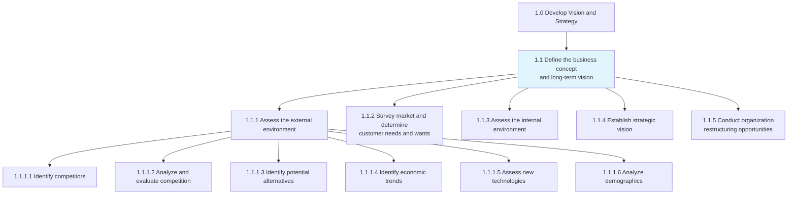
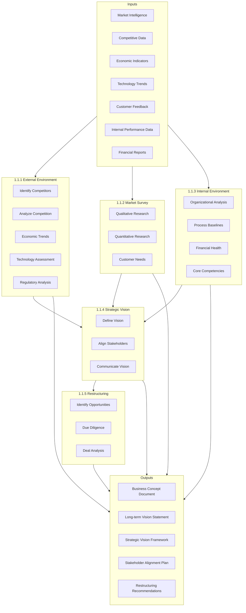
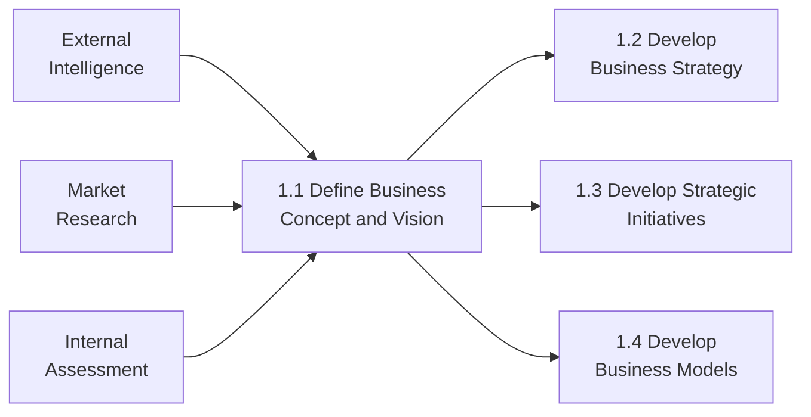

# Define the business concept and long-term vision

> Creating a conceptual framework of the organization's business activity and strategic vision with long-term applicability. Scout the organization's internal capabilities, as well as the customer's needs and desires, to identify a fit that can be used to advance a conceptual structure of the organization's business activity. Conduct analysis in light of relevant externalities and large-scale shifts in the market landscape.

## Overview

Process Group 1.1 represents the foundational strategic planning activities that establish an organization's identity, market position, and long-term direction. This process group encompasses comprehensive environmental scanning (both external and internal), market research, vision establishment, and evaluation of restructuring opportunities.

The outputs from this process group feed directly into business strategy development (1.2), strategic initiative planning (1.3), and business model creation (1.4). Organizations typically revisit these processes annually or when significant market changes occur.

## Process Hierarchy



## Key Statistics

| Metric | Value |
|--------|-------|
| APQC Code | 17040 |
| Hierarchy ID | 1.1 |
| Level | Process Group |
| Category | [1.0 Develop Vision and Strategy](../) |
| Child Processes | 5 |
| Total Activities | 30+ |

## Process Flow



## GraphDL Semantic Structure

```
define.BusinessConceptAndLongTermVision
```

| Component | Value | Description |
|-----------|-------|-------------|
| Verb | `define` | Primary action of establishing and articulating |
| Object | `BusinessConceptAndLongTermVision` | The conceptual framework and strategic direction |
| Preposition | - | Not applicable at process group level |
| PrepObject | - | Not applicable at process group level |

### Decomposed Actions

| Process | GraphDL Structure |
|---------|-------------------|
| 1.1.1 | `assess.ExternalEnvironment` |
| 1.1.2 | `survey.Market.to.DetermineCustomerNeeds` |
| 1.1.3 | `assess.InternalEnvironment` |
| 1.1.4 | `establish.StrategicVision` |
| 1.1.5 | `conduct.RestructuringOpportunities` |

## Child Processes

### [1.1.1 Assess the external environment](./1.1.1-ExternalEnvironment/)

Assessing all forces, entities, and systems that are external to an organization but can affect its operation. Analyze far-reaching currents in the macroeconomic situation, assess the competition, evaluate technological changes, and identify societal as well as ecological issues of concern.

**APQC Code:** 10017 | **Activities:** 12

### [1.1.2 Survey market and determine customer needs](./1.1.2-MarketSurvey/)

Examining the market to identify customer required solutions. Assess the relevant market(s) to determine the products/services that are needed or wanted by customers.

**APQC Code:** 10018 | **Activities:** 3

### [1.1.3 Assess the internal environment](./1.1.3-InternalEnvironment/)

Undertaking a review of the organization's in-house skills and resources in order to create a big-picture understanding of internal capacities.

**APQC Code:** 10019 | **Activities:** 6

### [1.1.4 Establish strategic vision](./1.1.4-StrategicVision/)

Establishing the organization's long-term vision as a strategic positioning and engagement of stakeholders.

**APQC Code:** 10020 | **Activities:** 3

### [1.1.5 Conduct organization restructuring opportunities](./1.1.5-Restructuring/)

Examining the scope and contingencies for restructuring based on market situation and internal realities.

**APQC Code:** 16792 | **Activities:** 7

## RACI Matrix

| Process | Responsible | Accountable | Consulted | Informed |
|---------|-------------|-------------|-----------|----------|
| 1.1.1 Assess external environment | Strategy Team | CSO | Marketing, R&D, Sales | Executive Team |
| 1.1.2 Survey market needs | Marketing | CMO | Sales, Customer Service | Product Team |
| 1.1.3 Assess internal environment | Operations | COO | All Departments | Board |
| 1.1.4 Establish strategic vision | Executive Team | CEO/Board | All Leaders | All Employees |
| 1.1.5 Restructuring opportunities | M&A Team | CEO | Legal, Finance | Board |

## Industry Variations

### Banking

Focus on regulatory landscape analysis, fintech disruption assessment, and digital transformation vision development.

### Healthcare Provider

Emphasis on value-based care model development, population health considerations, and telehealth integration.

### Aerospace and Defense

Extended planning horizons (10-20 years), government contract pipeline analysis, and technology roadmap development.

### Education

District context analysis, alternative education provider competition, and technology-enhanced learning vision.

### City Government

Comprehensive planning focus, regional competition analysis, and public-private partnership evaluation.

## Related Occupations

- [Chief Executive Officers](/occupations/ChiefExecutives) - Vision accountability
- [Chief Strategy Officers](/occupations/StrategyOfficers) - Process leadership
- [Market Research Analysts](/occupations/MarketResearchAnalysts) - Market analysis
- [Management Consultants](/occupations/ManagementConsultants) - External perspective
- [Financial Analysts](/occupations/FinancialAnalysts) - Financial assessment

## Related Processes



## Metrics & KPIs

| Metric | Description | Target |
|--------|-------------|--------|
| Vision Clarity Index | Stakeholder understanding of business concept | >85% |
| Environmental Scan Coverage | Completeness of external/internal analysis | >90% |
| Market Research Depth | Coverage of customer segments analyzed | >80% |
| Stakeholder Alignment Rate | Agreement with strategic vision | >80% |
| Time to Vision Approval | Duration from analysis to board approval | <90 days |

---

*Source: APQC PCF 17040 (1.1) - Cross-Industry Process Classification Framework*
