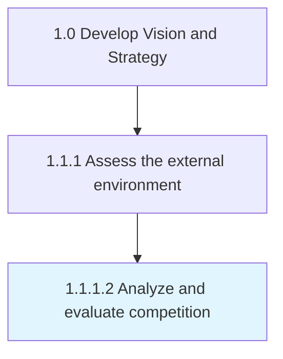

# Analyze and evaluate competition

> Assessing the competitive forces in the marketplace that could potentially affect the organization.

## Overview

Activity 1.1.1.2 is an activity within the Develop Vision and Strategy framework. 

Assessing the competitive forces in the marketplace that could potentially affect the organization. Analyze various aspects of business competition including competing firms. Aggregate competitive intelligence, create benchmarks to juxtapose processes and performance metrics, and inject crucial information about the competition into management models to synthesize insights.

## Process Hierarchy



## Key Statistics

| Metric | Value |
|--------|-------|
| APQC Code | 10021 |
| Hierarchy ID | 1.1.1.2 |
| Level | Activity |
| Parent | [1.1.1](../) |
| Sub-Processes | 0 |


## GraphDL Semantic Structure

```
analyze.AndEvaluateCompetition
```

| Component | Value | Description |
|-----------|-------|-------------|
| Verb | `analyze` | Primary action |
| Object | `and evaluate competition` | Direct object |


## Related Concepts

- [Competition](/concepts/Competition)
- [Competition](/concepts/Competition)


---

*Source: APQC PCF 10021 (1.1.1.2) - APQC*
