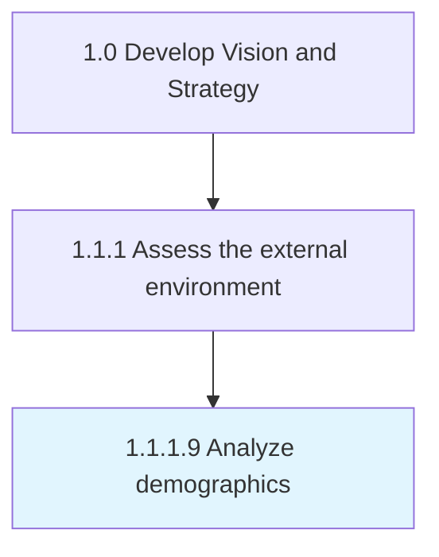

# Analyze demographics

> Analyzing statistical data relating to the size, distribution, and composition of relevant populations, as well as their characteristics.

## Overview

Activity 1.1.1.9 is an activity within the Develop Vision and Strategy framework. 

Analyzing statistical data relating to the size, distribution, and composition of relevant populations, as well as their characteristics. Perform quantitative analysis over raw data-sets gathered from well-founded sources such as government census or large, private databases. Consider employing primary research in collecting required statistics. Use comprehensive studies (reports, briefs, and articles) to assist with the analysis, in place of raw data.

## Process Hierarchy



## Key Statistics

| Metric | Value |
|--------|-------|
| APQC Code | 10025 |
| Hierarchy ID | 1.1.1.9 |
| Level | Activity |
| Parent | [1.1.1](../) |
| Sub-Processes | 0 |


## GraphDL Semantic Structure

```
analyze.Demographics
```

| Component | Value | Description |
|-----------|-------|-------------|
| Verb | `analyze` | Primary action |
| Object | `demographics` | Direct object |


## Related Concepts

- Demographics


---

*Source: APQC PCF 10025 (1.1.1.9) - APQC*
