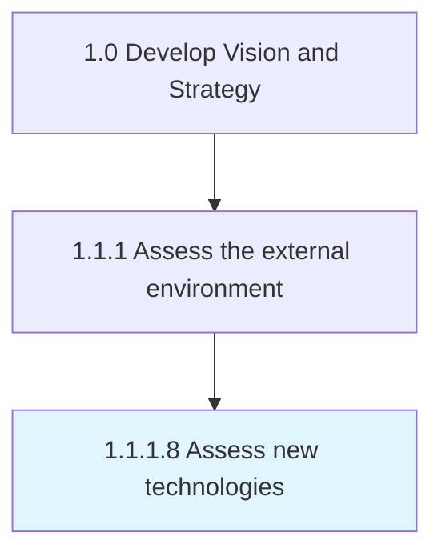

# Assess new technologies

> Assessing developments in technologies presently being used by the business, new technologies that have a potential for the business, and any disruptive innovations.

## Overview

Activity 1.1.1.8 is an activity within the Develop Vision and Strategy framework. 

Assessing developments in technologies presently being used by the business, new technologies that have a potential for the business, and any disruptive innovations. Conduct a survey of advancement in technologies that are already deployed with inputs from the personnel closely working with them, tracking utility and feasibility for deployment. Arrange for mid- to senior-level management personnel who explore contingent uses to assess new and disruptive technologies. Follow up with desk research, involving physical scoping and viability assessment.

## Process Hierarchy



## Key Statistics

| Metric | Value |
|--------|-------|
| APQC Code | 10024 |
| Hierarchy ID | 1.1.1.8 |
| Level | Activity |
| Parent | [1.1.1](../) |
| Sub-Processes | 0 |


## GraphDL Semantic Structure

```
assess.NewTechnologies
```

| Component | Value | Description |
|-----------|-------|-------------|
| Verb | `assess` | Primary action |
| Object | `new technologies` | Direct object |


## Related Concepts

- NewTechnologies


---

*Source: APQC PCF 10024 (1.1.1.8) - APQC*
