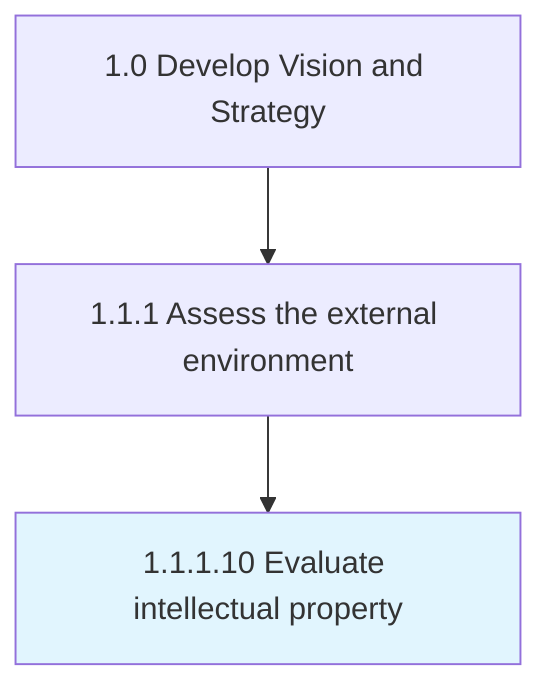

# Evaluate intellectual property

> Establishing measures and procedures for identifying various intellectual property threats and concerns.

## Overview

Activity 1.1.1.10 is an activity within the Develop Vision and Strategy framework. 

Establishing measures and procedures for identifying various intellectual property threats and concerns.

## Process Hierarchy



## Key Statistics

| Metric | Value |
|--------|-------|
| APQC Code | 16790 |
| Hierarchy ID | 1.1.1.10 |
| Level | Activity |
| Parent | [1.1.1](../) |
| Sub-Processes | 0 |


## GraphDL Semantic Structure

```
evaluate.IntellectualProperty
```

| Component | Value | Description |
|-----------|-------|-------------|
| Verb | `evaluate` | Primary action |
| Object | `intellectual property` | Direct object |


## Related Concepts

- IntellectualProperty


---

*Source: APQC PCF 16790 (1.1.1.10) - APQC*
