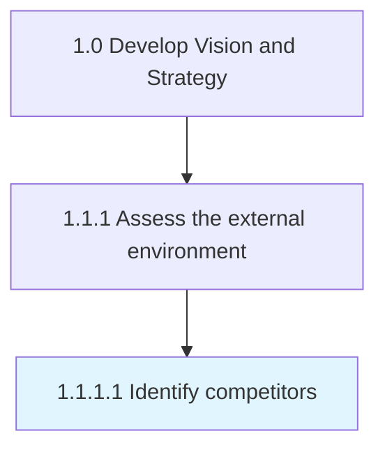

# Identify competitors

> Identifying your competitors, their service and/or product.

## Overview

Activity 1.1.1.1 is an activity within the Develop Vision and Strategy framework. 

Identifying your competitors, their service and/or product. Evaluating competitors strategies to determine their strengths and weaknesses relative to those of your own product or service.

## Process Hierarchy



## Key Statistics

| Metric | Value |
|--------|-------|
| APQC Code | 19945 |
| Hierarchy ID | 1.1.1.1 |
| Level | Activity |
| Parent | [1.1.1](../) |
| Sub-Processes | 0 |


## GraphDL Semantic Structure

```
identify.Competitors
```

| Component | Value | Description |
|-----------|-------|-------------|
| Verb | `identify` | Primary action |
| Object | `competitors` | Direct object |


## Related Concepts

- Competitors


---

*Source: APQC PCF 19945 (1.1.1.1) - APQC*
