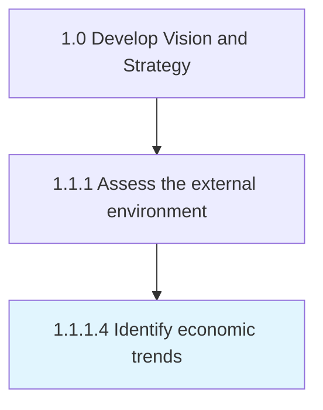

# Identify economic trends

> Determining large-scale macroeconomic shifts and trends, with medium to long-term relevance for the organization.

## Overview

Activity 1.1.1.4 is an activity within the Develop Vision and Strategy framework. 

Determining large-scale macroeconomic shifts and trends, with medium to long-term relevance for the organization. Vet the immediate and the larger economic ecosystem to identify broad-based movements that affect the organization. In the immediate vicinity, for example, examine the stock price of key vendors/suppliers in the organizational value-chain. In the larger economic ecosystem, analyze according to geographical distribution where factors such as interest rates, taxation structures, oil prices, and unemployment rates are explored.

## Process Hierarchy



## Key Statistics

| Metric | Value |
|--------|-------|
| APQC Code | 10022 |
| Hierarchy ID | 1.1.1.4 |
| Level | Activity |
| Parent | [1.1.1](../) |
| Sub-Processes | 0 |


## GraphDL Semantic Structure

```
identify.EconomicTrends
```

| Component | Value | Description |
|-----------|-------|-------------|
| Verb | `identify` | Primary action |
| Object | `economic trends` | Direct object |


## Related Concepts

- EconomicTrends


---

*Source: APQC PCF 10022 (1.1.1.4) - APQC*
