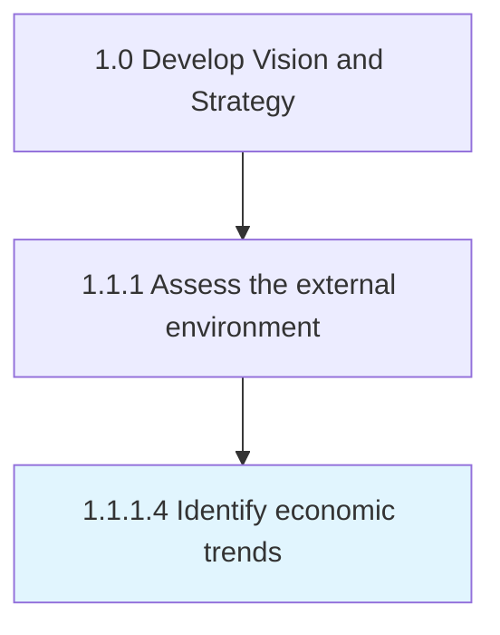
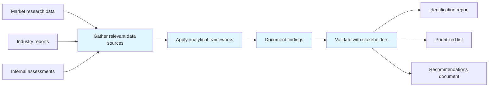
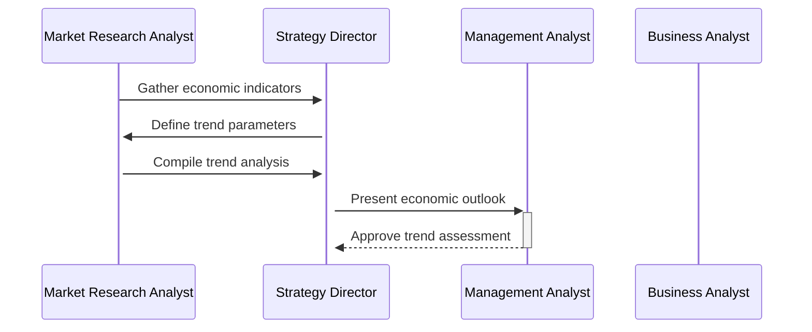

# Identify economic trends

> Determining large-scale macroeconomic shifts and trends, with medium to long-term relevance for the organization.

## Overview

Activity 1.1.1.4 is an activity within the Develop Vision and Strategy framework. 

Determining large-scale macroeconomic shifts and trends, with medium to long-term relevance for the organization. Vet the immediate and the larger economic ecosystem to identify broad-based movements that affect the organization. In the immediate vicinity, for example, examine the stock price of key vendors/suppliers in the organizational value-chain. In the larger economic ecosystem, analyze according to geographical distribution where factors such as interest rates, taxation structures, oil prices, and unemployment rates are explored.

This process plays a critical role within the broader "Develop Vision and Strategy" capability area (APQC Category 1.0). By systematically executing this activity, organizations ensure that strategic decisions are grounded in thorough analysis and aligned with overall business objectives. The outputs of this process feed into downstream strategy development and execution activities, creating a foundation for informed decision-making across the enterprise.

## Process Hierarchy



## Key Statistics

| Metric | Value |
|--------|-------|
| APQC Code | 10022 |
| Hierarchy ID | 1.1.1.4 |
| Level | Activity |
| Parent | [1.1.1](../) |
| Sub-Processes | 0 |
| Estimated Duration | 1-4 weeks |
| Complexity | Medium |

## GraphDL Semantic Structure

```graphdl
identify.EconomicTrends
```

| Component | Value | Description |
|-----------|-------|-------------|
| Verb | `identify` | Primary action |
| Object | `economic trends` | Direct object |

## Process Flow



## Process Sequence



## RACI Matrix

| Activity | Responsible | Accountable | Consulted | Informed |
|----------|-------------|-------------|-----------|----------|
| Gather data and intelligence | Market Research Analyst | Strategy Director | Business Unit Leaders | Executive Team |
| Conduct analysis | Management Analyst | Strategy Director | Subject Matter Experts | Department Heads |
| Document findings | Business Analyst | Strategy Director | Market Research Team | Stakeholders |
| Present to leadership | Strategy Director | Chief Strategy Officer | Executive Sponsors | Board of Directors |

## Related Occupations

| Occupation | Role in Process |
|------------|----------------|
| [Chief Executives](/occupations/Management/ChiefExecutives) | Primary strategic oversight and decision authority |
| [Market Research Analysts](/occupations/MarketResearchAnalysts) | Executes analysis and produces deliverables |
| [Management Analysts](/occupations/Business/Operations/ManagementAnalysts) | Provides analytical frameworks and recommendations |
| [Business Intelligence Analysts](/occupations/Technology/BusinessIntelligenceAnalysts) | Supports data gathering and insight generation |
| [Strategic Planners](/occupations/StrategicPlanners) | Coordinates strategic alignment and planning |

## Related Departments

| Department | Involvement |
|------------|-------------|
| Strategy & Planning | Primary owner and executor of this process |
| Market Research | Provides supporting data, resources, and coordination |
| Executive Leadership | Provides governance, approval, and strategic direction |

## Industry Variations

| Industry | Variation | Reference |
|----------|-----------|-----------|
| Manufacturing | Emphasizes supply chain and operational efficiency metrics in strategic planning | [manufacturing](/industries/manufacturing) |
| Financial Services | Focuses on regulatory compliance and risk management within strategy processes | [banking](/industries/banking) |
| Technology | Prioritizes innovation velocity and digital transformation in strategic initiatives | [consumer-electronics](/industries/consumer-electronics) |

## KPIs & Metrics

| KPI | Description | Target |
|-----|-------------|--------|
| Completeness Rate | Percentage of relevant items identified vs. total known | > 85% |
| Time to Identification | Average time from initiation to completion | < 2 weeks |
| Stakeholder Satisfaction | Satisfaction score from key stakeholders | > 4.0/5.0 |

## Related Concepts

- EconomicTrends

---

*Source: APQC PCF 10022 (1.1.1.4) - APQC*
