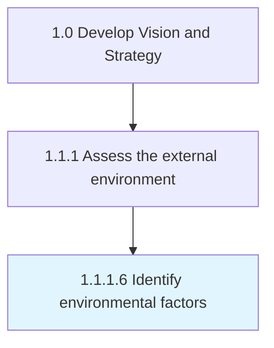

# Identify environmental factors

> Identifying changes in ecological ecosystems that can be directly or indirectly detrimental to the organization.

## Overview

Activity 1.1.1.6 is an activity within the Develop Vision and Strategy framework. 

Identifying changes in ecological ecosystems that can be directly or indirectly detrimental to the organization. Analyze ecological factors within the immediate ecosystem for near to middle-term impact. Analyze the ecology, at large, to get a sense of long-term shifts and concerns. Gather analyses from research publications. Speak to subject matter experts. Engage with advocacy groups, lawyers, journalists, and the active populations.

## Process Hierarchy



## Key Statistics

| Metric | Value |
|--------|-------|
| APQC Code | 10027 |
| Hierarchy ID | 1.1.1.6 |
| Level | Activity |
| Parent | [1.1.1](../) |
| Sub-Processes | 0 |


## GraphDL Semantic Structure

```
identify.EnvironmentalFactors
```

| Component | Value | Description |
|-----------|-------|-------------|
| Verb | `identify` | Primary action |
| Object | `environmental factors` | Direct object |


## Related Concepts

- EnvironmentalFactors


---

*Source: APQC PCF 10027 (1.1.1.6) - APQC*
